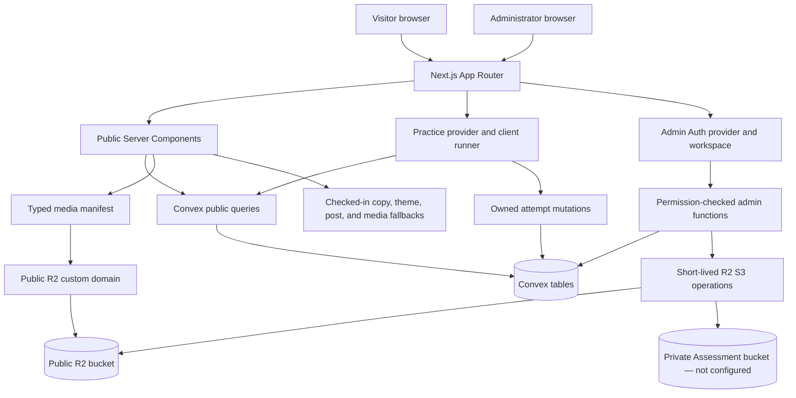
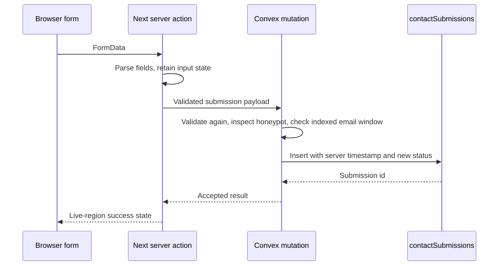

# English Club Technical Blueprint

Status: integrated implementation contract
Date: 26 August 2026
Primary stack: Next.js App Router, TypeScript, Convex, Cloudflare R2 Standard, plain CSS

## 1. System shape

The product combines a server-rendered organisation profile, scoped reactive Practice and administration applications, and small public interactive islands. Next.js owns routes, metadata, image optimization, server HTML, and the visitor's light/dark preference. Convex owns published content, contact submissions, member consent records, administrator authorization, immutable theme and journal versions, Assessment definitions/attempts/results, and the metadata that points to R2 objects. Cloudflare R2 Standard owns media bytes. A separate 15-profile Member showcase appears only after a successful empty member query and remains outside Convex.



Boundary rules:

- Server Components are the default.
- Browser JavaScript is limited to explicit interaction boundaries: public controls, the contact form, the Practice runner, and authenticated admin tools. The whole public route tree is not converted into a Client Component.
- Core headings, copy, journal links, and contact intents exist in server HTML. JavaScript changes selection and presentation, not access.
- No pointer-coordinate subscription drives React state. Journal Relay uses one desktop-only `IntersectionObserver` plus a passive, requestAnimationFrame-throttled scroll/resize scheduler; it performs at most one reading-line check per frame and changes state only when the selected story changes.
- Checked-in public-copy defaults and the fixed brand/documentary media manifest are versioned with the app. Published copy may replace known keys through Convex; dynamic Journal, Member, CMS, and Assessment media use reviewed `mediaAssets` records. Production bytes remain immutable/versioned in R2.
- Published page copy and public colour tokens may replace checked-in defaults only through immutable Convex publication pointers.
- `NEXT_PUBLIC_MEDIA_BASE_URL` selects the exact R2 custom-domain prefix. When absent, the same object keys resolve to local QA derivatives.
- R2 API credentials never enter the browser. The current public read path needs no R2 token.
- General CMS browser uploads receive a short-lived presigned PUT and exact required headers. Assessment source media uses separate private-bucket credentials; missing private configuration blocks reservation and upload.
- Published journal data comes from Convex when configured; the fallback is explicit in source and uses the same seed records.
- Published real-member data comes only from Convex. A successful empty result activates the 15-profile source-only showcase; a failed query remains unavailable and never activates it.
- Convex providers are scoped: `/practice` gets the Auth/Convex provider needed for Anonymous-owned attempts, and `/admin` gets the Auth/Convex provider needed for reactive protected work. Static organisation routes keep server adapters and discrete client leaves.
- Raw HTML is disabled in Markdown rendering.
- Admin route visibility is a UX gate only. Every protected Convex query, mutation, and action derives the signed identity, resolves an active `adminUsers` row through its stable Auth-account binding (with a legacy token fallback), and checks a server-owned permission.
- Assessment results report exact outcomes for the published English Club bank. The four-skill profile may add a clearly labelled fixed-form estimate; legacy profiles remain raw-only. Official, predicted, calibrated, equivalent, CEFR, certificate, and admission claims are outside the contract.

## 2. Route contract

| Route | Rendering | Data | Main composition | Failure behavior |
| --- | --- | --- | --- | --- |
| `/` | Static Server Component with client leaves | Local copy, R2-or-local media manifest, local seed journal preview | Sentence Playground, Prompt Mixer, Activity Relay, documentary handoff, Journal Relay, intent close | Complete server default; optional media can disappear |
| `/about` | Static Server Component | Local copy and one optional R2-or-local image | Distinct route sentence, principle composition, evidence boundary | Missing image leaves a complete text composition |
| `/activities` | Static Server Component with client relay | Local activity themes and R2-or-local media | Route phrase, Activity Relay, timetable caution | Default activity renders before hydration |
| `/members` | Server Component with one client role selector | Convex public profiles, code-owned role taxonomy and source-only showcase, generated R2-or-local media | Atmospheric opening, five responsibility channels, role companion, responsive member contact sheet | A successful empty query shows the showcase; failure stays unavailable |
| `/journal` | Dynamic Server Component | Published post summaries, cursor page of 6 | Dense ruled archive with server links and pagination | First-page checked-in fallback; later-page failure stays explicit |
| `/journal/[slug]` | Server | Published post by slug | Article masthead, reviewed cover, Markdown or structured body, return path | `notFound()` for unknown or non-public slug |
| `/contact` | Server shell plus client form | Local copy, query intent, Convex mutation | Intent-aware type field plus existing form cycle | Inline retry; fields remain populated |
| `/practice` | Dynamic Server Component with scoped provider | Reviewed published Assessment catalog, maximum 12 per page | Answer Line overview, full/quick paths, claim boundary | Honest reviewed/unavailable state; never a local question fallback |
| `/practice/full` | Dynamic server briefing plus client Start | First published full-practice definition | Timing/Listening choices, acknowledgement, Start/resume | Useful unavailable state when no reviewed form is published |
| `/practice/quick/[skill]` | Dynamic server briefing plus client Start | Published Listening, Structure, or Reading skill quiz | Skill-specific briefing and Start | Unknown skill is not found; missing content stays unavailable |
| `/practice/attempt/[attemptId]` | Scoped authenticated client resolver/runner | Owned attempt/player DTO | Current section, stimulus, answer state, timer, navigator | Malformed, missing, and cross-owner IDs share one unavailable state; `noindex` |
| `/practice/result/[attemptId]` | Scoped authenticated client resolver/result | Owned result and post-submit review pages | Exact bank outcome, optional bounded estimate, mode, section results, paginated review | Same non-disclosing unavailable state; `noindex` |
| `/admin` and children | Protected noindex layout with scoped Auth/Convex provider | Server-authorized admin queries and mutations | Rounded operational workspace | Sign-in, access-pending, configuration, conflict, and permission states remain explicit |
| `/sitemap.xml` | Server metadata route | Static routes plus published slugs | XML | Static routes still emit if journal is unavailable |
| `/robots.txt` | Static metadata route | Configuration | Text | Always available |
| `/opengraph-image` | Edge-compatible image route | Design tokens and text only | Branded graphic without participant photography | Next.js generated response |

Deferred public routes do not appear in navigation or sitemap: `/events`, `/team` as an alias, `/gallery`, member accounts, and assessment history. `/members` is the canonical public people route. Administration is implemented under `/admin`, excluded from public navigation, canonical discovery, and indexing.

## 3. Page compositions

### Homepage

1. **Sentence Playground:** the complete heading `English grows in company.` remains server rendered. Speak, Listen, Ask, and Try again buttons change one response line and selected word state. Join and About remain visible above the fold. A generated decorative room scene sits behind the stage and fades into the theme canvas.
2. **Prompt Mixer:** one authored prompt and a bounded `New prompt` control demonstrate a conversation without collecting input.
3. **Activity Relay:** speaking, cultural exchange, shared making, and community participation share one companion field. Selection changes a real prompt, explanation, evidence note, and optional small media fragment.
4. **Documentary handoff:** one approved room image confirms the social setting. It supports the composition and is not required for comprehension.
5. **Journal Relay:** up to three published posts appear as linked titles and metadata. On wide screens, `IntersectionObserver` bounds the work and a passive frame scheduler selects the story crossing a stable reading line; keyboard focus selects explicitly and mobile keeps content inline.
6. **Programme quiz:** four untimed questions are assembled from the reviewed Activities copy and timetable caveat. It keeps local state, creates no identity, and routes every explanation to Activities.
7. **Intent close:** three normal links carry join, partner, or ask into the existing Contact query contract.

### About

The route begins with a large sentence whose second thought is carried by the principle sequence. One readable essay explains the club as a working community. Principles share one compositional field rather than cards. At most one offset image supports the evidence boundary. The page closes with a route to Activities.

### Activities

Four activity themes use one keyboard-operable relay. Each selectable state has:

- a concrete title;
- one plain description;
- an evidence note that states what an approved image shows;
- an authored practice prompt;
- at most one active image;
- an optional route to a related journal story.

The page never claims recurrence, learning outcomes, fixed facilitators, or a schedule.

### Members

One generated adult group scene sits behind an asymmetric opening and fades into the page canvas. It is decorative and does not identify or represent a real member.

The main body contains a native exclusive role selector with `All roles` and codes `0` through `4`. Five equal-height channels keep every public label and scope sentence visible. Selection updates one companion field and filters a separately labelled public roster. All role panels and supplied subtype labels remain in server HTML; without JavaScript, they all become visible.

The roster receives the public Convex view model first. A successful empty result activates 15 source-only fictional profiles with generated portrait cells, Heroicon role symbols, names, assignments, and short biographies. They are never written to Convex. One real returned profile removes the complete showcase. A failed adapter says that the directory could not be reached and does not use the showcase.

### Journal

Published items render newest first as a dense ruled editorial list. Category, date, title, excerpt, and optional reviewed cover remain scannable. The archive requests six summary records per cursor page; bodies and inline media load only on detail. Cursor pages link back to the newest page and stay `noindex, follow`. Home retains the separate three-story Journal Relay preview.

### Contact

The URL query may preselect `join`, `partner`, or `ask`; the form still exposes all choices. The page explains expected reply handling without promising a response time. Indonesian helper text appears only around consent and submission purpose, marked with `lang="id"`.

### Practice

`/practice` explains English Club Assessment Lab and offers only published definitions. The current development bank has one fixed four-skill form with 50 Reading, 47 Listening, 12 Writing, and 11 Speaking tasks, plus one quick form per skill. Legacy ITP-shaped definitions remain supported but cannot use the estimate policy.

Browsing never creates an identity. After the visitor acknowledges the claim boundary and presses Start, the scoped provider creates an Anonymous Convex Auth identity when needed and starts one owned attempt with an idempotency key. The runner begins each section explicitly, saves bounded response shapes with optimistic revisions, keeps the current-section navigator bounded, and never receives an answer key before submission. Transcript support may be enabled at any time and persists as a result label.

The result reports exact bank outcomes, mode, time, ordered section rows, and cursor-paginated review. Four-skill results may include a deterministic band and comparable-total estimate; quick forms may include only their section estimate. The interface identifies these as uncalibrated English Club fixed-form values, never an official score, exact prediction, equivalence, CEFR band, certificate, or admission recommendation.

### Administration

`/admin` uses its own noindex layout, rounded operational visual system, and scoped Convex Auth provider. Pages edits manifest-bound public copy. Journal stores immutable reviewed Tiptap-compatible revisions with image media IDs and bounded map coordinates. Members maintains role, joined year, publication, profile consent, portrait consent, and reviewed portrait selection. Media verifies browser-to-R2 uploads. Appearance publishes structured theme versions. Assessments manages definitions, versions, ordered sections/stimuli/items, protected keys, validation, four human reviews, publication, retirement, and next-draft cloning. Activity exposes the bounded owner audit trail.

The browser never creates Password identities. The deployment operator runs one internal provisioning action that creates or verifies the Password account and binds its stable issuer/Auth-user identity to a reviewed admin role. Every protected function repeats permission checks inside Convex.

## 4. Component map

```text
RootLayout
├── SkipLink
├── SiteHeader
│   ├── Wordmark
│   ├── DesktopNav
│   ├── ThemeToggle [client]
│   └── MobileNavDialog [client]
├── main#main-content
│   └── route page
└── SiteFooter

HomePage
├── SentencePlayground [client]
├── PromptMixer [client]
├── ActivityRelay [client]
├── DocumentaryHandoff
├── JournalRelay [client preview]
├── ProgrammeQuiz [client, local state]
└── IntentClose

ActivitiesPage
└── ActivityRelay [client]

MembersPage
├── MemberHero
└── MemberRelay [client]
    ├── NativeRoleGroup
    ├── RoleCompanion
    └── PublishedRoster

JournalPage
├── JournalIntro
└── JournalRelay [client preview]

JournalDetailPage
├── ArticleHeader
├── DocumentaryImage
├── MarkdownBody
└── ArticleReturn

ContactPage
└── ContactForm [client]
    └── submitContact [server action]

PracticeLayout
└── PracticeProvider [client, Convex Auth]
    ├── PracticeOverview
    ├── PracticeBriefing
    │   └── StartAssessment [client]
    ├── AttemptRouteResolver [client]
    │   └── AttemptRunner [client]
    │       ├── QuestionRenderer
    │       ├── CurrentSectionNavigator [dialog]
    │       └── Section/SubmitConfirmation [dialog]
    └── ResultView [client]
        └── PaginatedReview

AdminLayout
└── AdminProvider [client, Convex Auth]
    └── AdminAccessGate
        └── AdminShell
            ├── ContentManager
            ├── JournalWorkspace + RichJournalEditor
            ├── AssessmentWorkspace + SectionManager + MediaManager
            ├── MemberManager
            ├── MediaManager
            ├── AppearanceManager
            └── ActivityLog
```

Public shared primitives stay few: `PageContainer`, `ButtonLink`, `TextLink`, `DocumentaryImage`, and the small interaction leaves. Administration adds a deliberate reusable product kit for headings, sections, fields, status, errors, pagination, custom selects, order controls, and confirmation dialogs. A component is extracted only when it carries shared behavior or a stable design rule.

## 5. Selected implemented file tree

```text
.
├── convex/
│   ├── _generated/                 # generated by Convex CLI
│   ├── schema.ts
│   ├── auth.ts
│   ├── auth.config.ts
│   ├── adminContent.ts
│   ├── adminPosts.ts
│   ├── adminMembers.ts
│   ├── adminMedia.ts
│   ├── adminThemes.ts
│   ├── adminAssessments.ts
│   ├── adminAssessmentItems.ts
│   ├── assessmentAttempts.ts
│   ├── assessmentReviews.ts
│   ├── assessmentMedia.ts
│   ├── assessmentMediaNode.ts
│   ├── members.ts
│   ├── posts.ts
│   ├── submissions.ts
│   ├── seed.ts
│   └── validators.ts
├── content/
│   ├── member-roles.ts
│   ├── public-content.ts            # public-copy manifest
│   ├── seed-posts.ts
│   ├── theme-contract.ts
│   └── theme-presets.ts
├── public/
│   └── images/                     # consent-gated local QA derivatives
├── src/
│   ├── actions/
│   │   └── contact.ts
│   ├── app/
│   │   ├── (site)/                  # organisation, journal, contact, Practice
│   │   │   ├── journal/[slug]/page.tsx
│   │   │   ├── members/page.tsx
│   │   │   └── practice/
│   │   │       ├── page.tsx
│   │   │       ├── full/page.tsx
│   │   │       ├── quick/[skill]/page.tsx
│   │   │       ├── attempt/[attemptId]/page.tsx
│   │   │       └── result/[attemptId]/page.tsx
│   │   ├── (admin)/admin/           # protected CMS and Assessment authoring
│   │   ├── error.tsx
│   │   ├── globals.css
│   │   ├── layout.tsx
│   │   ├── not-found.tsx
│   │   ├── opengraph-image.tsx
│   │   ├── page.tsx
│   │   ├── robots.ts
│   │   └── sitemap.ts
│   ├── components/
│   │   ├── admin/
│   │   │   ├── editor/
│   │   │   └── assessments/
│   │   ├── practice/
│   │   ├── forms/select-field.tsx
│   │   ├── contact-form.tsx         # client
│   │   ├── mobile-nav.tsx           # client
│   │   ├── play/
│   │   │   ├── activity-relay.tsx   # client
│   │   │   ├── journal-relay.tsx    # client
│   │   │   ├── prompt-mixer.tsx     # client
│   │   │   ├── sentence-playground.tsx # client
│   │   │   └── theme-toggle.tsx     # client
│   │   ├── members/
│   │   │   ├── member-relay.module.css
│   │   │   └── member-relay.tsx     # client
│   │   ├── documentary-image.tsx
│   │   ├── site-footer.tsx
│   │   ├── site-header.tsx
│   │   ├── story-row.tsx
│   │   └── ui.tsx
│   ├── content/
│   │   ├── media.ts
│   │   └── site-copy.ts
│   └── lib/
│       ├── assessment.ts
│       ├── convex.ts
│       ├── journal.ts
│       ├── markdown.tsx
│       ├── members.ts
│       ├── public-content.ts
│       ├── public-theme.ts
│       ├── seo.ts
│       └── structured-data.ts
├── tests/
│   ├── convex/
│   ├── unit/
│   └── e2e/
├── next.config.ts
├── package.json
├── playwright.config.ts
├── R2-SETUP.md
├── tsconfig.json
└── vitest.config.ts
```

## 6. Data flow and rendering

### Journal read

1. A Server Component calls the six-summary cursor adapter, a bounded preview adapter, or `getPublishedPost(slug)`.
2. The adapter resolves server-owned `CONVEX_URL`. The server passes that public deployment URL into the two scoped browser providers, so `NEXT_PUBLIC_CONVEX_URL` is not required.
3. When configured, it calls Convex with the generated `api` object. The query uses a declared index and a hard limit.
4. When absent or unreachable on the first archive page, the adapter logs a development warning and returns the framework-neutral seed content. A failed later cursor page stays unavailable instead of repeating the first page.
5. The page maps `coverKey` through the typed media manifest. The manifest resolves each object key against `NEXT_PUBLIC_MEDIA_BASE_URL`, or a local `/images/...` URL backed by `public/` when the variable is absent. Unknown keys return no image rather than a guessed file.
6. Legacy article Markdown renders through `react-markdown`; a reviewed published journal revision renders through the fixed structured-node allowlist. Neither path accepts raw HTML.

The fallback is not a silent editorial path. Production logging identifies it, and the release checklist calls it out if Convex was not reached.

### Member read

1. `/members` calls `getPublishedMembers(limit)` in a Server Component.
2. When the server Convex URL is absent, or the query fails, the adapter returns `{ state: "unavailable", members: [] }` and logs a development warning without personal data.
3. When Convex responds, the adapter returns `{ state: "ready", members }`, including a successful empty list when no reviewed profile is public.
4. `members.listPublished` reads an index constrained to `published` plus cleared profile consent and a hard limit.
5. The public projection validates the role/subtype combination again, strips every status and consent field, and includes portrait metadata only when photo consent is separately cleared.
6. The client island filters the already loaded public array. Role selection causes no extra network request and creates no Convex record.

### Contact write



The action never logs message bodies or email addresses. Convex remains the authority for consent and rate checks.

### Media read

1. A route requests a stable media key such as `club-room-group`.
2. The manifest supplies WebP and AVIF object keys, dimensions, focal point, alt text, rights, and consent state.
3. With `NEXT_PUBLIC_MEDIA_BASE_URL=https://r2.mukhtada.my.id`, `images/member-directory-portraits-v1.webp` resolves to `https://r2.mukhtada.my.id/images/member-directory-portraits-v1.webp`.
4. `next.config.ts` restricts remote image optimization to that exact host and prefix.
5. Without the env variable, it resolves to `/images/club-room-group.webp` for local QA.
6. R2 stores bytes only. Convex posts retain `coverKey`; no R2 secret or signed URL is written to Convex.

### Reviewed media write

1. The CLI operator helper remains available for reviewed checked-in derivatives with an immutable key and exact MIME type.
2. An authenticated CMS editor may reserve a server-generated UUID object key through a permission-checked Convex action.
3. Convex returns a PUT URL valid for 300 seconds and exact `Content-Type` plus `Cache-Control` headers. The CLI or browser sends bytes directly to the R2 S3 API.
4. `HeadObject` must match content type, byte size, and immutable cache control before the media row becomes ready.
5. A ready public record projects `https://r2.mukhtada.my.id/<objectKey>`. The signed URL and credentials are never stored in Convex, application logs, analytics, or screenshots.

### Public copy and theme read

1. A public Server Component asks for one known page in the checked-in manifest.
2. `siteContent.getPublishedPage` reads at most 201 indexed rows. More than 200 is an explicit contract error; saving a new key at 200 is rejected.
3. The adapter accepts only a known key, expected kind, valid revision, valid publication time, field length, plain text, and safe control-character shape. Everything else keeps the checked-in value.
4. The root layout separately reads `publicThemes.getPublished`. A safe numeric serializer emits only the supported semantic variables. Missing or invalid data uses the checked-in Relay Cobalt snapshot.

### Admin identity and publication

1. The `/admin` server layout resolves `CONVEX_URL` and passes it to `ConvexAuthProvider`.
2. `/admin` exposes Password sign-in only; direct browser `signUp` requests are rejected by the provider.
3. A deployment operator announces the target and runs `adminProvisioning:provisionPasswordAdmin` through the terminal helper.
4. The action creates or verifies the Password account, verifies its Auth user, and binds the requested role. Later access changes require an active owner or another internal provisioning run.
5. Every admin function derives the signed identity, resolves the stable issuer/Auth-user binding with a legacy complete-token fallback, rejects disabled/unknown identities, and checks the exact permission before reading or writing.
6. Draft writes use optimistic revisions. Publish inserts immutable content, journal, or theme versions and updates the public pointer only after server validation.

### Assessment attempt

```mermaid
sequenceDiagram
  participant B as Browser
  participant A as Convex Auth
  participant C as Convex assessment API
  participant D as Assessment tables
  B->>C: Read reviewed public briefing
  B->>A: Anonymous sign-in only after Start
  B->>C: start with idempotency key and declared modes
  C->>D: Insert owned attempt and bounded section rows
  B->>C: begin section, save response, move or enable transcript
  C->>D: Validate ownership, version, section, deadline, and revisions
  B->>C: finalize current section; submit only from final section
  C->>D: Score from private keys and insert immutable result
  B->>C: Read owned result and paginated post-submit review
```

The browser never supplies an owner, deadline, score, reviewer, or publication actor. `resolveMine` normalizes route strings before a typed attempt ID reaches any player or result function.

### Assessment media

1. The admin UI calls `assessmentMediaNode.getConfigStatus` before offering an upload.
2. Confidential reservation checks the separate private-bucket environment before inserting a media row. There is no public-bucket fallback.
3. The browser computes SHA-256 and audio duration or image dimensions, reserves a version-bound private key, then sends every exact signed header to the private S3 endpoint.
4. Convex verifies bytes and metadata before a short-lived private preview becomes available.
5. A publisher creates or reuses an immutable public derivative. Stimuli reference the ready public media ID, not the private source ID.
6. The private Assessment bucket is not configured. Steps 2–5 remain a release gate until a real Cloudflare smoke test passes.

## 7. Content and media contracts

### Media manifest

```ts
type PublicMedia = {
  key: string;
  sourceFile: string;
  objectKey: `images/${string}.webp`;
  avifObjectKey: `images/${string}.avif`;
  src: string;
  avifSrc: string;
  width: number;
  height: number;
  focalPoint: `${number}% ${number}%`;
  alt: string;
  rights: "supplied-unverified" | "cleared";
  consent: "pending" | "cleared" | "held";
  captureDateVerified: boolean;
};
```

Only `consent: "cleared"` may be uploaded to the production R2 prefix. Until the organisation confirms consent, the working build uses a separate `pending` status and local derivatives; deployment remains blocked. Held files never enter R2.

### Journal record

Page code receives a stable view model rather than raw Convex documents:

```ts
type PublicPost = {
  slug: string;
  title: string;
  excerpt: string;
  body: string;
  category: string;
  authorName: string;
  coverKey?: string;
  publishedAt: number;
  updatedAt: number;
  featured: boolean;
};
```

This strips internal IDs and status fields from the UI layer.

### Member record

Page code receives a public projection rather than a raw profile:

```ts
type PublicMember = {
  slug: string;
  displayName: string;
  roleLevel: 0 | 1 | 2 | 3 | 4;
  division?: MemberDivision;
  position?: MemberPosition;
  shortBio?: string;
  photo?: {
    objectKey: string;
    width: number;
    height: number;
    alt: string;
    focalPoint: string;
  };
  sortOrder: number;
  updatedAt: number;
};
```

The stored record also contains publication state, separate profile and portrait consent states, consent audit timestamps, and creation/update timestamps. Those administrative fields never cross the public query boundary.

### Journal editor record

`postRevisions` is immutable. It stores bounded structured JSON, derived plain text, public metadata, reviewed cover media ID, authoring actor, revision, and creation time. The allowlist supports paragraphs, H2/H3, quotes, ordered/bullet lists, hard breaks, bold/italic text, HTTPS or email links, reviewed image media IDs with alt/caption, and finite coordinate map nodes. It rejects raw HTML, arbitrary embeds, script URLs, unknown nodes, unbounded nesting, and more than 40 unique inline images.

Archive DTOs contain summaries and at most one reviewed cover projection. They do not contain body, editor JSON, inline media, status, or consent metadata. Detail follows only `publishedRevisionId`; draft media and content cannot leak through a current draft pointer.

### Assessment contracts

Published catalog and briefing DTOs contain definition/version identity, titles, instructions, declared modes, section summaries, and reviewed public media only. The pre-submit Player DTO contains one current public item, optional stimulus, saved response, response/attempt revisions, deadline state, and at most 50 current-section navigator entries. It contains no answer key, explanation, provenance, draft media URL, approval note, author ID, or score.

Result DTOs contain raw `correct`, `possible`, and `omitted` counts; ordered section rows; timing and Listening modes; and a fixed claim disclaimer. Answer projections and explanations are available only through the owned, post-submit, section-ordered review query with a 20-item cursor page.

### Public theme contract

An administrator edits seven structured OKLCH anchors for both modes. Convex derives a complete 16-token snapshot, maps it into a safe gamut, checks required contrast and focus pairs, and stores immutable versions. The public query returns only `{ name, publicRevision, contractVersion, snapshot }`. Drafts, recipes, actor IDs, notes, and audit events remain protected.

## 8. SEO and structured data

- `metadataBase` reads `NEXT_PUBLIC_SITE_URL`, falling back to `http://localhost:3987` only in local development.
- Titles follow `%s | English Club`; homepage uses a standalone title.
- Every route has a distinct plain-language description and canonical URL.
- The homepage emits `WebSite` and a conservative `Organization`. It includes working name and URL only. Unknown address, logo, telephone, founding date, member count, and partner data are omitted.
- Article routes emit `BlogPosting` and `BreadcrumbList` matching visible text.
- Editor-controlled JSON-LD strings replace `<` with `\u003c` before insertion.
- The Open Graph image uses type and colour only. Participant photography remains out until explicit social-card consent exists.
- Sitemap contains canonical public index routes, including `/practice`, and at most 100 published journal slugs. Owned attempt/result and every `/admin` route remain `noindex` and out of the sitemap.

## 9. States

| State | Required behavior |
| --- | --- |
| Theme before hydration | Saved light or dark value is applied before visible paint; invalid storage value falls back to light |
| Sentence default | Complete heading, response, controls, and links render before hydration |
| Sentence selection | Response text and selected state update after explicit activation; no automatic cycle |
| Prompt default | One authored prompt is readable in server HTML |
| Prompt update | Next authored prompt appears and is politely announced without moving focus |
| Activity default | First activity and its complete description render before hydration |
| Activity selection | Focus, selected control, prompt, evidence note, and optional image remain synchronised |
| Member default | `All roles` is checked, all five channels are visible, and the complete taxonomy remains in server HTML |
| Member role selection | Native checked state, companion copy, and roster filter update together without moving focus |
| Member directory empty | The complete 15-profile source-only organisation showcase appears in the real responsive grid; no fixture or QA disclosure enters public copy |
| Member directory unavailable | Role atlas remains useful and the roster states that the service could not be reached |
| Member portrait withheld | A verified text monogram replaces the image; no pending object key reaches the browser |
| Journal loading | Route-level skeleton uses final row dimensions and no pulsing wall of grey cards |
| Journal empty | Plain heading, one sentence, route back to Activities |
| Journal query failure | Development log plus seed fallback; if both fail, route error with retry |
| Unknown story | Branded not-found page with Journal and Home links |
| Missing story image | Text composition expands; no broken placeholder rectangle |
| Form pending | Button label changes, inputs remain readable, duplicate submit blocked |
| Form field error | Specific text linked to the field; first invalid field receives focus after submit |
| Form backend error | Message and entered values remain; retry stays available |
| Form success | Live-region confirmation, form replaced by a concise next-state panel |
| Offline | Static pages remain readable; form reports that it was not sent |
| Admin signed out | Password sign-in only; initial identity creation appears only when the server-controlled setup flag allows it |
| Admin identity without access | Token identifier and access-pending guidance appear; no CMS query or navigation becomes available |
| Admin optimistic conflict | Preserve unsaved work, name the conflict, and offer a deliberate reload/retry path; never overwrite silently |
| Public theme absent/invalid | Checked-in complete light/dark Relay Cobalt snapshot renders before paint |
| Assessment catalog empty | Honest reviewed-content state with public explanation and normal navigation; no synthetic question fallback |
| Assessment before Start | No participant identity or attempt exists |
| Assessment route ID invalid/cross-owner | One non-disclosing unavailable state; no typed attempt query or mutation fires until `resolveMine` succeeds |
| Assessment save conflict | Keep the local selection visible, report that it is not saved, and reload the current server revision before retry |
| Section deadline | Server finalises only the active section; an unstarted later section cannot be submitted |
| Transcript enabled | The attempt remains transcript-supported and every later player/result payload reflects it |
| Private Assessment R2 absent | Confidential reservation and upload stay disabled; existing public media ledger remains readable |
| Assessment result | Raw counts, ordered sections, mode, time, fixed disclaimer, and paginated post-submit review only |

## 10. Test seams

### Unit

- Query-string intent parsing.
- Contact payload parsing and normalisation.
- JSON-LD escaping.
- Media manifest uniqueness, consent gating, and dimension validity.
- Local and R2 media URL resolution from the same object key.
- Journal adapter mapping and fallback ordering.
- Sentence, prompt, and activity data has stable unique keys and complete accessible copy.
- Member taxonomy contains exactly role codes `0` through `4`, every supplied subtype, and no invented UPA expansion.
- Member labels and assignment formatting preserve the user-supplied public vocabulary.
- Member showcase contains 15 unique slugs, names, and portrait cells, covers all five role codes and every supplied assignment, and passes the same assignment guard.
- Public content manifest has unique keys, valid defaults, and every page remains at or below the 200-entry backend ceiling.
- Theme normalization accepts finite structured OKLCH only, serializes an allowlist, and reports blocking contrast pairs.
- Programme quiz is derived from Activities copy and creates no identity.
- Assessment question renderers, result labels, dialogs, elapsed-time formatting, and malformed route handling remain accessible and bounded.

### Convex

- Draft and archived posts never enter public results.
- Published results order by `publishedAt` descending and respect the hard limit.
- Slug lookup returns one public record or `null`.
- Seed mutation is idempotent.
- Contact field bounds, consent, honeypot, and repeated-email window are enforced.
- Member write validation enforces role/subtype combinations and slug uniqueness.
- Member public query excludes draft, archived, pending, revoked, and structurally invalid records.
- Portrait metadata appears only with separately cleared photo consent.
- Every admin read/write rejects unauthenticated, unknown, disabled, and insufficient roles; the final active owner is protected.
- Content conflicts preserve the stored revision; publication exposes only the immutable selected version.
- Journal revision/media projection follows only published pointers and caps inline media at 40.
- Assessment attempts isolate two Anonymous identities, keep keys private before submit, enforce section deadlines/revisions/idempotency, and delete only the owned bounded graph.
- Assessment publication requires current validation plus academic, rights, accessibility, and bias approvals; published versions remain immutable.
- Missing private Assessment R2 configuration rejects reservation before insertion; wrong access, purpose, MIME, version, key, or status never receives a public URL.
- Growing Assessment, admin, journal, review, and audit lists use indexes plus cursor or documented hard bounds.

### Browser

- Every public route returns a useful heading and no console error.
- Header, theme persistence, phone dialog, active route, Escape, focus containment, focus return, and background scroll behavior.
- Keyboard selection for Sentence Playground and Activity Relay, plus native radio behavior for Member Relay.
- Prompt Mixer updates only after activation and announces the new output.
- Optional preview state never removes a journal link.
- Keyboard completion of the contact form and announced errors.
- `@axe-core/playwright` checks on Home, Members, Journal, story, and Contact.
- Reflow at `320x800`, common phone at `390x844`, tablet at `768x1024`, header stress widths at 880, 900, and 1024, plus desktop at `1440x1000`.
- Explicit light, explicit dark, no saved theme, and reduced-motion modes.
- Practice overview, Home programme quiz, dialogs, touch input, route-ID unavailable state, and 320/412px heading bounds.
- Authenticated data-isolated admin harness at desktop, Pixel 7, and 320px, including Assessment order/delete dialogs and private-media configuration state.
- Screenshot review checks type wrapping, interactive state, image restraint, spacing rhythm, distinct route silhouettes, and accidental template patterns.

## 11. Build sequence

1. Freeze the passing route, Convex, R2, SEO, and contact contracts.
2. Replace tokens, base CSS, theme boot script, header, footer, and mobile focus behavior.
3. Build Sentence Playground, Prompt Mixer, Activity Relay, and Journal Relay as isolated client leaves.
4. Recompose Home, About, Activities, Journal, story, and Contact without changing their route or data contract.
5. Remove retired image-gallery, repeated masthead, image-copy, and duplicate close selectors.
6. Update browser assertions from the retired photo strip to the new language controls.
7. Run lint, typecheck, unit/backend tests, and production build.
8. Run route, keyboard, theme, reduced-motion, responsive, contact, and Axe checks against the production server.
9. Capture light, dark, phone, and selected-interaction screenshots; inspect and repair.
10. Re-run every affected gate and record exact evidence in `PLAN.md`, `docs/WORKLOG.md`, and `docs/QA-REPORT.md`.

Member extension sequence:

1. Freeze the confirmed role taxonomy and privacy boundary in Markdown.
2. Add validators, schema, reviewed internal upsert, public query, and Convex tests.
3. Add the server adapter and taxonomy unit tests.
4. Build `/members`, the generated faded hero, the native role selector, roster rows, and honest service states.
5. Wire navigation, footer, sitemap, metadata, R2 guidance, and setup instructions.
6. Run static and Convex gates, then responsive browser, Axe, reduced-motion, theme, and visual inspection.

Admin and Assessment integration sequence:

1. Add Convex Auth, server permission checks, admin/CMS/media/theme tables, and a protected reusable admin shell.
2. Add public manifest delivery, structured journal revisions, reviewed browser uploads, theme versioning, and the 200-entry page ceiling.
3. Add the assessment schema, Anonymous ownership, participant lifecycle, authoring/review/publish flow, and strict media projections.
4. Add `/practice`, full/quick briefings, runner, result/review, Home programme quiz, and the Assessment admin workspaces.
5. Keep confidential upload disabled until a separate private R2 bucket and exact-origin CORS are available.
6. Push the stable integrated schema/functions to the announced cloud development deployment, then run the complete static, backend, browser, Axe, reduced-motion, responsive, and visual gate.

## 12. Release boundaries

The application may be code-complete while public deployment remains blocked by photo consent, missing organisation facts, account policy, retention decisions, content review, or production-domain inputs. The generated placeholder derivatives are verified in the public bucket, but documentary photographs remain local because their consent is pending. The private Assessment bucket is not configured; confidential uploads must stay disabled and no public-bucket fallback is permitted.

A release is valid only when the organisation confirms public consent for each included participant image, supplies the canonical public URL, uploads any newly cleared derivatives under immutable keys, configures separate production Auth keys and `SITE_URL`, proves the first-owner and recovery-owner path, approves attempt retention/cleanup, configures and smoke-tests the private Assessment R2 bucket/CORS, and publishes only original assessment content with current academic, rights, accessibility, and bias approvals. Follow `SETUP.md` and `R2-SETUP.md`; neither document authorizes a production deploy by itself.
