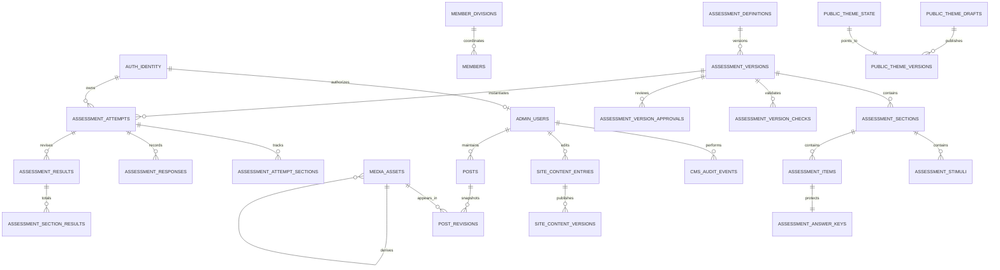

# English Club Database Contract

Status: implemented Convex contract; integrated release verification remains open
Date: 26 August 2026
Backend: Convex Cloud 1.45 line
Object storage: Cloudflare R2 Standard

This document describes the records and boundaries implemented in `convex/schema.ts`. The TypeScript schema, validators, and functions remain normative when a field-level detail changes. R2 stores bytes; Convex stores identity, ownership, publication state, metadata, and immutable object keys.

## 1. Data domains

| Domain | Convex responsibility | Public boundary |
| --- | --- | --- |
| Auth | Convex Auth accounts and sessions for Password administrators and Anonymous Practice participants | No Auth row is a public profile |
| Journal | Post state, immutable structured revisions, published pointer, category, cover, optional map data inside the validated editor document | Published view model only |
| Organisation | Events, contact submissions, and consent-gated Member profiles | Events remain unpublished; contact records are private; Members require cleared profile consent |
| CMS | Administrator authorization, page-copy drafts and versions, audit events | Only published values keyed by the code-owned manifest |
| Media | Reviewed object metadata, access class, verification state, Assessment linkage, and public derivative lineage | Only an explicitly reviewed public object may resolve to a browser URL |
| Assessment authoring | Definition, immutable version, checks, approvals, sections, stimuli, items, and protected answer keys | Only a published, validated version is projected to Practice |
| Assessment participation | Owned attempts, per-section state, responses, result revisions, and per-section raw totals | Only the owning identity; answer keys remain absent before submit |
| Public theme | Saved recipe, immutable derived snapshot, active pointer, previous pointer, and audit events | One validated light/dark CSS-variable snapshot |

The database does not store image or audio bytes, browser-only Sentence Playground state, Prompt Mixer responses, Activity Relay selection, the four-question Home programme quiz, Journal companion-image focus, visitor theme preference, analytics events, payments, attendance, credentials, certificates, or official/predicted language scores.

## 2. Core rules

1. Every public Convex function uses object syntax, complete argument validators, and a return validator.
2. Identity comes from `ctx.auth.getUserIdentity()`. Client arguments never choose the active administrator or Assessment owner.
3. Authorization is enforced before protected reads or writes.
4. Public list state is constrained by an index, not filtered from an unbounded collection in JavaScript.
5. Every list is bounded or cursor-paginated. A limit is also a data-integrity assertion where noted.
6. Draft, published, archived, verified, and consent state are distinct fields; the UI cannot turn one into another.
7. Immutable revision records survive publication and rollback. Mutable pointer records say which immutable version is live.
8. `Date.now()` in the mutation is authoritative for operational timestamps.
9. R2 credentials and presigned URLs never become database fields.
10. Seed data is idempotent and does not fabricate organisation facts, Member identities, or Assessment claims.

## 3. Relationship map



`AUTH_IDENTITY` represents the tables supplied by `@convex-dev/auth`; their internal shape is owned by that component, not duplicated here.

## 4. Table catalogue

### 4.1 Organisation and editorial

| Table | Purpose | Principal indexes |
| --- | --- | --- |
| `posts` | Mutable journal identity and draft/published revision pointers; retains legacy safe body fields for compatible public projection | slug; status + publication time; status + featured + publication time; status/update; update |
| `postRevisions` | Immutable Tiptap JSON, plain text, title metadata, cover media, author, and revision number | post + revision |
| `events` | Schema-ready verified event record; no first-release public route | slug; status + start |
| `contactSubmissions` | Private join, partner, and question enquiries with internal follow-up status | normalized email + creation; creation; intent + creation; status + creation; intent + status + creation |
| `memberDivisions` | Managed working-division catalogue with stable slug, public name, summary, lifecycle status, and order | slug; status + order; order |
| `members` | Public-role record with consent gates, optional portrait, optional joined year, managed division link, and stable order | slug; public consent/order; public role/order; division + role; status/update; update |

Important Member fields and rules:

- `roleLevel` is exactly `0 | 1 | 2 | 3 | 4`; it classifies responsibility and is not a score.
- Role `2` requires one active managed division (or a compatible legacy division during migration) and no position.
- A managed division has at most one Coordinator; changing coordinators restores the former coordinator's saved Member/Pioneer role.
- A division with member references cannot be deleted, and an archived division cannot be newly assigned.
- Role `3` requires Secretary, Treasury, Vice President, or President and no division.
- Role `4` requires Mentor or Head of UPA and no division.
- Roles `0` and `1` have neither division nor position.
- `joinedYear`, when present, is a validated year used by the public filter.
- Public projection requires `profileStatus: "published"` and `profileConsentStatus: "cleared"`.
- Portrait projection additionally requires cleared photo consent and a complete reviewed media object.
- Personal email, telephone, student number, private social data, internal notes, and consent timestamps are not public Member fields.

The development seed contains 15 fictional public-facing profiles and the five initial managed divisions so the complete role and grid contracts can be exercised before reviewed identities replace them. The seed command is development-gated, idempotent, labelled by batch, and must never target production.

### 4.2 Administration and CMS

| Table | Purpose | Key invariant |
| --- | --- | --- |
| `adminUsers` | Maps a stable Auth issuer + `users` ID (plus a legacy token field) to display data, `editor | publisher | owner`, and `active | disabled` access | Stable binding is unique by issuer/user ID; the last active owner cannot be demoted or disabled |
| `cmsAuditEvents` | Append-only actor, area, action, resource, summary, and timestamp | Written by protected mutations after authorization |
| `siteContentEntries` | One draft value per page, locale, and code-owned content key | Field kind and key come from the source manifest |
| `siteContentVersions` | Immutable published value for an entry revision | Published pointer lives on the entry |
| `mediaAssets` | R2 object key, purpose, content type, bytes, status, alt text, dimensions, access, duration, checksum, Assessment version, and source derivative linkage | One object key; no signed URL or credential |

The CMS limit is 200 entries per `pageKey`/locale page. Reads take 201 and fail if storage already violates the contract; new writes read 200 and reject the 201st entry. This is a deliberate integrity ceiling, not a pagination size.

Journal editor content is validated structured JSON, not HTML. A revision stores the editor JSON and a plain-text projection. It may reference at most 40 unique reviewed inline media records. Optional maps are stored as validated structured data in the document rather than executable embed markup.

### 4.3 Assessment authoring

| Table | Purpose | Public rule |
| --- | --- | --- |
| `assessmentDefinitions` | Stable slug, kind/profile, administrative title, draft/published pointers, visibility, next version, and an optional internal-only marker | A public definition is discoverable only through its published pointer and visibility; the Question Bank authoring ledger never appears in the catalogue |
| `assessmentVersions` | Immutable-version candidate with timing, resume, review, score policy, mode, attempt-limit, revision, checksum, and publication data | Published projection uses one reviewed revision; profile and score policy must be a supported pair |
| `assessmentVersionChecks` | Validation run tied to a content revision, with blocking/warning counts and report JSON | A stale check cannot approve a newer revision |
| `assessmentVersionApprovals` | Academic, rights, accessibility, and bias review decision by reviewer and revision | All four current-revision approvals must pass; original-content/provenance is enforced by validation and the content ledger |
| `assessmentSections` | Ordered skill section with timer/replay policy, fixed or random-bank delivery, and item count | The active paper profile permits Listening, Structure, and Reading in that order; historical versions retain their original skills |
| `assessmentStimuli` | Passage, audio, image, transcript, alt text, provenance, and optional media link | Protected/private media never resolves publicly |
| `assessmentItems` | Ordered prompt and choices linked to version/section/stimulus | Bounded to 200 per version |
| `assessmentAnswerKeys` | Correct answer and scoring data | Never included in a pre-submit public DTO |
| `assessmentQuestionBank` | Reusable inventory with skill, task family, difficulty, global state, source lineage, origin, optional illustration media ID, and content fingerprint | A new admin-authored row starts paused and outside full practice; a ready row is still ineligible unless the active published format version allows it |
| `assessmentVersionQuestionRules` | Optional allow/disable override for one bank question in one format version | A rule change increments the working content revision and makes earlier checks/approvals stale; published rules never change in place |
| `assessmentQuestionFlagSignals` | Aggregate current/total learner flag counts and editorial review state per format/question | Admin projections omit participant, attempt, response, and answer-key data; a later flag reopens review |

Full-form validation follows the definition profile. The active `ec-itp-level-1-aligned-v1` full form requires 50 Listening, 40 Structure and Written Expression, and 50 Reading items, section limits of 35/25/55 minutes, random-bank delivery, and `paper-estimate-v1`. Its three quick definitions use one matching eight-item section and `raw-objective`. Cross-paired profile, policy, quota, or timing values fail server validation.

`ec-paper-linear-v1` stores optional section estimates and one total constrained to 310–677. The conversion is deterministic but uncalibrated; official ETS forms use statistical equating. Historical `ec-ibt-style-2026-v1` records stay immutable and render through their original result fields.

The authoring lifecycle is:

```text
fixed definition -> working version -> content revision -> pool/validation check
           -> four current-revision approvals -> publish immutable version
           -> optional clone to a new working revision -> retire when replaced
```

A publisher can review and publish Assessments but cannot edit Assessment content. An editor can author but cannot approve or publish. An owner can do both. This separation is intentional.

### 4.4 Assessment attempts and results

| Table | Purpose | Ownership rule |
| --- | --- | --- |
| `assessmentAttempts` | Version snapshot, owner token, idempotency keys, mode, timer, lifecycle, current cursor, result pointer, and activity timestamps | `ownerTokenIdentifier` must equal the current Auth identity |
| `assessmentAttemptSections` | Per-section start, deadline, completion, elapsed, answered, and flagged state | Parent attempt ownership is checked first |
| `assessmentAttemptItems` | Structured random draw pinned at Start: bank question, delivered item, optional illustration media ID, target section, and stable order | The attempt never redraws during resume/navigation; later bank metadata edits cannot replace its selected question or illustration reference |
| `assessmentResponses` | One selected answer/flag state per owned item | Indexed by attempt and item |
| `assessmentResults` | Immutable result revision with objective totals, optional weighted points and fixed-form estimates, status, completion, supersession, and claim contract | Available only after submit to the owner; legacy raw results project `estimate: null` |
| `assessmentSectionResults` | Skill totals, answered/item counts, elapsed seconds, optional weighted points, and bounded estimate fields | Child of one owned result revision |

Persisted practice creates or reuses Anonymous Convex Auth only after Start. Reading `/practice` or the Home programme quiz does not create an identity.

`resolveMine({ attemptId: string })` normalizes the route string before typed Convex ID access. Malformed, absent, and cross-owner IDs return the same unavailable shape. The browser never chooses an owner token.

Attempt safeguards:

- `startRequestId` and `submitRequestId` make retry-safe transitions idempotent.
- Per-version/day attempt limits are indexed and bounded from 1 through 20.
- At most 200 items and nine sections are accepted for one attempt graph.
- Submit is valid only from the final section after the section lifecycle permits it; it cannot auto-complete unstarted later sections.
- Transcript enablement is explicit and stored as labelled attempt state.
- Post-submit answer review is cursor-paginated at 20 items.
- `deleteMine` bounds responses to 200, sections to nine, and result children before deleting the owned graph. It does not promise deletion of the underlying Anonymous Auth row.
- `listMine` is cursor-paginated at no more than ten rows.
- Each fixed Practice Format selects only ready, source-valid questions that match its profile and skill. A quick format inherits its own source pool; full practice inherits globally reviewed full-practice rows; explicit version rules may narrow or extend that default.
- Format validation fails when any allowed skill pool is smaller than its fixed quota. A rule cannot revive a paused/archived row, missing answer key, invalid source, or unreviewed delivery media.
- Question Bank authoring creates a real `assessmentItems` row, a separate private `assessmentAnswerKeys` row, and a paused `assessmentQuestionBank` row in one mutation. Request IDs and content fingerprints prevent retry duplicates.
- An attached illustration must resolve to a ready public `assessment-image` R2 record with an image MIME type and positive dimensions. Questions without an illustration store no media reference and render no empty frame.

Results expose `correct`, `possible`, and `omitted`, with mode, time, per-section totals, and review. They never store or return percentage-as-level, predicted/official scores, CEFR bands, certificates, placement, or admission advice.

### 4.5 Public theme

| Table | Purpose | Invariant |
| --- | --- | --- |
| `publicThemeDrafts` | One saved public recipe and its source/base version | Local unsaved browser changes are not publishable |
| `publicThemeVersions` | Immutable recipe plus fully derived light/dark snapshot and contract version | Seven anchors per scheme expand to validated semantic tokens |
| `publicThemeState` | Active/previous version pointers, next version, and public revision | One row for `siteKey: "public"` |
| `publicThemeEvents` | Publish/rollback event history | Append-only actor and pointer transition |

The root layout reads one validated public snapshot and serializes only known CSS variables. Invalid or unavailable data falls back to the code-owned theme. Visitor-selected light/dark mode stays in browser storage and does not mutate these records.

## 5. Auth and authorization contract

Convex Auth config enables two providers:

- `Password` for named administrators;
- `Anonymous` for owned Assessment attempts.

Password sign-in is browser-facing; Password identity creation is internal-only. The internal provisioning action validates a normalized email and a 12–128-character password that fits bcrypt's 72-byte limit and contains upper-case, lower-case, and numeric characters, creates or verifies the Password account through Convex Auth, and binds its Auth user record to `adminUsers` in one operator workflow. New or explicitly reset credentials are salted bcrypt cost 10 hashes in `authAccounts.secret`; legacy Scrypt hashes are read only for compatibility until explicit reset. Password accounts have no application-level expiry field, and normal sign-in does not rewrite their hash.

The first-owner sequence is:

1. The operator announces the intended Convex deployment.
2. The operator runs `npm run admin:provision` from a trusted terminal.
3. The internal action creates/verifies the Password account and resolves its `users` ID.
4. The binding mutation verifies the account/user/email relationship and inserts the first active owner.
5. Browser `flow=signUp` calls fail; `/admin` accepts sign-in only.
6. Sign-out and a later sign-in resolve the same owner through issuer + Auth user ID.

Every protected function calls `requireAdmin(permission)`, which resolves the current signed identity, first supports an exact legacy token record and then queries the stable issuer/Auth-user binding, requires `active`, and checks the server-owned role matrix. The client cannot self-assign a role.

| Capability | Editor | Publisher | Owner |
| --- | :---: | :---: | :---: |
| Read/edit page copy, journal, Members, media, and theme draft | Yes | Yes | Yes |
| Publish page copy, journal, and public theme | No | Yes | Yes |
| Author Assessment content | Yes | No | Yes |
| Review/publish Assessment | No | Yes | Yes |
| Manage administrators | No | No | Yes |

## 6. Public and protected function contracts

### Public journal

- `posts.listPublished({ limit })` is bounded to 1–12.
- `posts.listPublishedPage({ paginationOpts })` requires exactly six rows, constrains status through `by_status_published_at`, and returns archive summary fields without the body.
- `posts.getPublishedBySlug({ slug })` returns one safe published view or `null`.
- `posts.listSitemapEntries()` returns at most 100 published slugs and update times.

### Public Members and contact

- `members.listPublished({ roleLevel?, limit? })` uses public consent indexes, validates cross-field assignments again, and returns a bounded safe view model.
- `submissions.create(...)` validates, checks the honeypot, performs a three-record/30-minute normalized-email limit, stores no IP or fingerprint, and returns no record ID.

### Public CMS and theme

- `siteContent.getPublishedPage(...)` returns only published values for recognized keys within the 200-entry contract.
- Public theme queries return the active validated snapshot, never a draft recipe or administrator identity.

### Public Assessment

- Catalogue and briefing queries return published metadata and safe player projections only.
- Attempt queries and mutations require an Auth identity and verify owner token before child reads.
- Player queries omit answer keys. Result review exposes answer correctness only after successful submit and in pages of 20.
- An unavailable published catalogue has no local question fallback.

### Protected administration

Protected pages use cursor pagination: administrators 20, Contact messages exactly 20, Members 20, media no more than 24, Assessment definitions 20, Assessment items no more than 25, and approval history 20. Mutation families are split by domain (`adminContent`, `adminPosts`, `adminSubmissions`, `adminMembers`, `adminMemberDivisions`, `adminMedia`, `adminThemes`, `adminAssessments`, `adminAssessmentItems`, and Assessment review/media modules) so each call has one explicit permission. Contact status writes compare `expectedUpdatedAt`, return a conflict instead of overwriting concurrent work, and append an audit event that contains no PII.

## 7. Media record and R2 boundaries

`mediaAssets` is the authority for dynamically managed media. Fixed brand assets may still use the typed source manifest; CMS and Assessment media must use reviewed Convex records.

Public/general media and confidential Assessment source media use separate R2 buckets and credentials:

| Layer | Access | Credential family | Browser behavior |
| --- | --- | --- | --- |
| Public media bucket | Public reviewed derivatives via `https://r2.mukhtada.my.id` | `R2_BUCKET_NAME`, `R2_ACCESS_KEY_ID`, `R2_SECRET_ACCESS_KEY` | Public immutable URL after review |
| Private Assessment bucket | Confidential source upload and server verification only | `R2_ASSESSMENT_BUCKET_NAME`, `R2_ASSESSMENT_ACCESS_KEY_ID`, `R2_ASSESSMENT_SECRET_ACCESS_KEY` | No public URL or public-bucket fallback |

Both use `R2_ACCOUNT_ID` and the validated `R2_API` endpoint. A reservation checks configuration before insertion, then a short-lived presigned PUT contract moves bytes to R2. General CMS browsers use the validated same-origin streaming relay while the public bucket lacks exact CORS; the private Assessment design uses a direct signed PUT after its separate bucket and CORS exist. `HeadObject` must match object key, MIME, byte size, and required metadata before status becomes verified. Assessment source records may carry `durationMs` and SHA-256 metadata; a public derivative links back through `sourceMediaId` and the same `assessmentVersionId`.

The public bucket/custom domain is working. The separate private Assessment bucket is **not configured**. No confidential Assessment upload is release-ready until the exact bucket environment, CORS policy, and real checksum round trip pass.

## 8. Query and bound ledger

| Need | Index or strategy | Bound |
| --- | --- | ---: |
| Home journal preview | published date index | 3 |
| Journal archive cursor page | published date index | exactly 6 |
| Direct journal detail | slug | 1 |
| Journal sitemap | published date index | 100 |
| Public Member directory | public consent/order index | bounded function limit |
| CMS page integrity | page/locale/update index | 200; 201 only for overflow detection |
| Admin user page | status/update index | 20 |
| Admin Member page | status/update or update index | 20 |
| Admin media page | purpose/access/status indexes | 24 |
| Admin Contact desk | intent/status/creation indexes | exactly 20 per cursor page |
| Assessment catalogue | visibility/update index | 9 public, 20 admin |
| Assessment version children | version/section/order indexes | 9 sections, 200 items/stimuli/keys |
| Assessment answer review | attempt/item indexes | 20 per cursor page |
| Owned attempt history | owner/start index | 10 per cursor page |
| Contact repeat check | normalized email/creation index | 3 |

## 9. Privacy and retention

- Contact records are private and used only to answer the selected intent.
- The admin Contact projection omits normalized email and source-path fields. It returns name, reply address, message, intent, consent time, work status, and timestamps only after `contact:read` authorization.
- Email, message, Auth token identifier, answer selections, transcript state, and raw result totals do not enter analytics, URLs, client storage, or routine logs.
- Member profile consent is separate from contact consent; portrait consent is separate from profile-text consent.
- Revoking portrait consent removes its key from the public projection before any later object cleanup.
- Answer keys and confidential sources remain server-side before submit.
- Administrator audit summaries must identify the operation without copying secrets, signed URLs, answer keys, contact message bodies, or private source content.
- Production retention periods for contact data, Assessment attempts/results, audit events, and private media are organizational decisions still requiring approval. No automatic deletion policy should be invented.

## 10. Migration policy

Use expand, backfill, contract:

1. Add a new field as optional and deploy readers tolerant of both shapes.
2. Run a bounded idempotent migration with progress evidence.
3. Verify counts and representative documents in a non-production deployment.
4. Make the field required only after all rows contain it.
5. Remove legacy fields/readers in a later deployment.

Published immutable revisions are not rewritten in place. A journal slug change gets a redirect before the new slug publishes. An Assessment content change creates a new content revision and invalidates stale checks/approvals. A theme rollback advances the public pointer and records an event; it does not mutate the historical snapshot.

## 11. Verification matrix

| Contract | Required evidence |
| --- | --- |
| Auth boundary | Unauthenticated and identity-only callers cannot read protected data; each role matrix edge is tested |
| First owner | Browser sign-up fails; internal Password provisioning creates one owner and survives a second Auth session |
| Last owner | Demotion/disable fails while only one active owner remains |
| CMS ceiling | Row 200 succeeds, row 201 fails, and an existing 201-row corruption is detected |
| Journal publication | Draft revision remains private; publish pointer updates public detail; archive removes it; six-row cursor pages remain stable |
| Journal document | Unsafe node/attribute, unverified media, raw HTML, and more than 40 unique inline images fail |
| Member privacy | Draft, archived, pending/revoked profile consent, and uncleared portrait fields never cross the public boundary |
| Theme pipeline | Invalid recipes fail; valid snapshot publishes; rollback creates a new pointer event; root serialization accepts only known variables |
| Assessment ownership | Malformed, missing, and cross-owner IDs share one unavailable response; child rows cannot be read by another identity |
| Assessment lifecycle | Unstarted later sections cannot be completed by early submit; only the final eligible section submits |
| Answer-key boundary | No pre-submit DTO contains a correct answer; post-submit review paginates at 20 |
| Raw-result accuracy | Stored overall and section correct/possible/omitted totals reproduce the immutable answer key and responses |
| Attempt deletion | Only the owner can delete; bounded child graph is removed; Auth deletion is not claimed |
| Assessment publication | Current validation/provenance check and all four current-revision approvals are required; stale approval cannot publish |
| Public Assessment media | Only verified, public, correct-purpose, same-version derivatives resolve |
| Private R2 | Separate bucket config, exact CORS, checksum metadata, PUT, `HeadObject`, and no public fallback pass before release |

The private R2 row remains open because that bucket is not configured. Final integrated lint, type, backend, build, browser, accessibility, and cloud round-trip evidence is tracked in `docs/WORKLOG.md` and `docs/INTEGRATION-REVIEW.md`.
