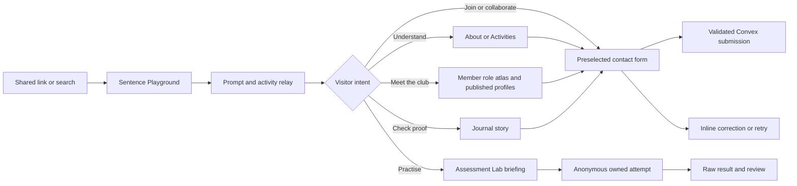

# Product Requirements Document

Status: integrated implementation and release contract
Date: 26 August 2026
Register: brand

## Product statement

English Club needs a public home that makes an informal community legible without sanding away its personality, plus maintainable tools for the people who run it. The product combines a concise organisation profile, a landing path for prospective members and collaborators, a consent-gated Member directory, a journal, an original English Club Assessment Lab, and a protected administration workspace backed by Convex. Cloudflare R2 Standard stores reviewed media bytes.

The public experience demonstrates its subject through interactive language. Real activity remains visible as selective documentary proof. Practice results report reproducible outcomes from original reviewed questions; the complete paper-format practice may add an explicitly limited English Club estimate from 310 through 677. Credibility comes from clear behavior and sourced content, not institutional claims, official-score language, unqualified prediction claims, awards, partner marks, or testimonials.

## Problem

The public organisation profile is working, but the complete product must also remain maintainable as its journal, Member roster, theme, and programme copy grow. Learners need a low-stakes practice path without being misled by unofficial scoring, while administrators need one secure publishing workflow instead of direct dashboard edits or hard-coded copy. Confidential assessment drafts also need a storage boundary separate from the public media domain.

## Goals

- Explain who the club is for and let the visitor try one bounded language interaction within the first viewport and the next scroll.
- Give prospective members one low-friction join path.
- Give partners a separate enquiry intent without building a corporate sales funnel.
- Turn verified archive material into readable journal stories.
- Keep the default experience clean and bright while providing one persistent site-wide dark theme.
- Keep posts and future events maintainable through a typed Convex backend.
- Let authorized staff manage public copy, journal revisions, Member records, media, themes, and Assessments through one protected CMS.
- Offer one original paper-format practice with Listening, Structure and Written Expression, and Reading, plus one short practice for each section under the English Club Assessment Lab name.
- Preserve participant ownership through Anonymous Convex Auth only after Start and keep answer keys private until submission.
- Report correct, possible, omitted, and English Club practice-point values with mode/time context; keep any external-scale estimate visibly fixed-form and non-official.
- Explain all five user-supplied role codes and publish only verified member profiles with explicit consent.
- Keep media bytes in R2 while Convex remains the database authority for product records.
- Preserve privacy and uncertainty in both visible copy and machine-readable metadata.
- Meet WCAG 2.2 AA and modern performance expectations across phone and desktop.

## Non-goals

- Member login, attendance, points, assignments, course delivery, or a public learner profile.
- Public member identities, biographies, or portraits without verified records and the relevant consent.
- Achievements, statistics, testimonials, partner wall, or pricing without verified source material.
- Arbitrary HTML/CSS editing, an unbounded no-code layout builder, or a second administrator identity system.
- Comments, newsletter automation, event ticketing, payment, chat, or social feed embedding.
- Publishing the donation photo or video that contains children.
- A complete Indonesian translation. The architecture must leave room for one later.
- Uploaded speech recordings, automatic speech recognition, camera capture, official or calibrated scores, exact score prediction, CEFR placement, certificates, admission advice, streaks, or personalised learning claims.
- Adaptive routing, remote proctoring, browser lockdown, webcam monitoring, device fingerprinting, or AI-published questions.
- Public Assessment questions before original-content, academic, rights, accessibility, and bias review gates pass.
- WebGL, a canvas-only hero, scroll hijacking, a custom cursor, or decorative pointer physics.

## Audience and jobs

### Prospective member

Context: opens a shared link on a phone, may be unsure about speaking English in public.

Jobs:

- Decide whether the room feels welcoming and socially safe.
- See what members actually do.
- Find a clear way to ask or join.

### Current member or alumnus

Context: wants a linkable record of a session, exchange, or club story.

Jobs:

- Find recent journal entries.
- Share a page that represents the club accurately.
- Recognise the community in the photography and tone.
- Understand the club's role structure and find any profiles approved for public display.

### Partner, speaker, or campus stakeholder

Context: checks the organisation before proposing an activity.

Jobs:

- Understand purpose and visible track record.
- Read a relevant story.
- Send a partnership enquiry with enough context for a reply.

### Content maintainer

Context: uses the protected English Club administration workspace.

Jobs:

- Draft, revise, publish, archive, and retrieve posts by stable slug through the structured editor.
- Keep draft content out of public queries.
- Add an event record without changing the schema.
- Add, update, archive, and withdraw reviewed member profiles without exposing consent records publicly.
- Review contact submissions in explicit Join, Proposal, and Question queues; open the sender's email client and record the internal follow-up status separately.
- Edit manifest-bound public wording without changing layout or script behavior.
- Preview and publish a complete validated light/dark public colour scheme.
- Author, validate, review, publish, retire, and clone immutable Assessment versions without exposing protected keys.

### Learner using Practice

Context: opens the site on a phone, wants an honest practice session, and may not want to create a named account.

Jobs:

- Understand the format, timing, Listening support, privacy boundary, and result limitation before Start.
- Complete one current section with reliable save, resume, timer, transcript, and navigation states.
- See exact correct, possible, omitted, and practice-point values, understand any bounded fixed-form estimate, then review answers after submission.
- Delete the owned attempt when desired without assuming that the Anonymous Auth row is also deleted.

## Experience principles

- **Words are the instrument.** The visitor can act on a sentence before the page asks them to believe a brand claim.
- **Photographs are receipts.** Real participants and rooms confirm the record without becoming the layout engine.
- **One useful action at a time.** A section does not compete with itself.
- **Calm reading, lively state.** Navigation and journal pages remain easy to read; selection and type carry energy.
- **Plain English.** Copy welcomes learners and avoids idioms that demand advanced fluency.
- **Evidence has edges.** The UI never turns a visible clue into a stronger institutional claim.

## Language

The first release is English-first and uses `lang="en"` at the document root. Short Indonesian helper text may clarify the join and contact flow; those spans use `lang="id"`. The site does not show a language switch until full route translations exist.

## Information architecture

```text
Home /
├── About /about
├── Privacy /privacy
├── Activities /activities
├── Practice /practice
│   ├── Full practice /practice/full
│   ├── Quick Listening /practice/quick/listening
│   ├── Quick Reading /practice/quick/reading
│   ├── Quick Writing /practice/quick/writing
│   ├── Quick Speaking /practice/quick/speaking
│   ├── Owned attempt /practice/attempt/[attemptId]
│   └── Owned result /practice/result/[attemptId]
├── Members /members
├── Journal /journal
│   └── Story /journal/[slug]
└── Contact /contact

Administration /admin
├── Pages /admin/pages
├── Journal /admin/journal
├── Assessments /admin/assessments
├── Members /admin/members
├── Media /admin/media
├── Appearance /admin/appearance
└── Activity /admin/activity
```

The logo links home. Desktop navigation shows About, Activities, Members, Practice, Journal, and one `Join` action. Contact and join share one route because the same form can route intent without creating duplicate calls to action. Admin never appears in public navigation or indexing.

## Core journey



## Functional requirements

### FR-01 Global shell

- Render a semantic skip link, header, navigation, main landmark, and footer.
- Keep desktop navigation on one line at 1024 px and above; height is at most 72 px.
- Provide an accessible mobile menu with correct expanded state, focus return, Escape handling, and background-scroll control.
- Use the same action label, `Join`, wherever the join intent repeats.
- Highlight the active route without relying on colour alone.
- Provide complete light and dark token mappings. Light is the unsaved default; a global theme control persists an explicit choice locally and applies it before paint. Content and hierarchy remain equivalent.

Acceptance:

- Keyboard navigation reaches every control in a logical order.
- When the mobile menu behaves as a modal, focus cannot move into page content behind it.
- The sticky header never hides focused content.
- No route causes horizontal scrolling at 320 px.
- A saved dark choice does not flash a light frame before hydration.

### FR-02 Homepage

The homepage contains:

1. A typographic Sentence Playground with the existing maximum two-line heading, one main Join action, one secondary About link, and four native word controls. One generated placeholder room scene sits behind it and fades into the page; the sentence remains the dominant object.
2. A bounded Prompt Mixer that cycles authored conversation prompts after explicit activation and stores no answer.
3. An Activity Relay built from four visible archive themes. One selected activity recomposes its prompt, explanation, evidence note, and optional small image.
4. One documentary handoff image that confirms a real shared room without becoming a gallery.
5. A text-led journal relay with normal story links and one optional companion preview on wide screens.
6. Three practical intent links that carry `join`, `partner`, or `ask` into the existing Contact route.

Acceptance:

- Hero action is visible in the initial desktop viewport and at common phone heights.
- The default server-rendered hero is complete before client JavaScript runs.
- Sentence, prompt, and activity state can be operated by keyboard, pointer, and touch.
- Prompt output is announced only after an explicit action.
- No testimonial, partner logo wall, metric, award, or fake schedule appears.
- Home remains composed when every optional image is removed.
- No more than four simultaneous image roles appear on Home: hero atmosphere, one selected activity image, one documentary handoff, and one journal preview.
- Every displayed image has an approved consent status and factual alt text.

### FR-03 About

- Explain the club as a working community without a fabricated founding story.
- State what the archive proves and what the club values.
- Let the four principles assemble or complete one shared statement instead of appearing as generic cards.
- Use at most one of `IMG_2017`, `IMG_2028`, or `_MG_7702` after consent is marked.
- Publish the confirmed secretariat place, street address, Plus Code, interactive OpenStreetMap position, and Google Maps directions action.
- Publish a sourced institutional record with the formation-record name, formation date, Universitas Jambi emblem, and direct UNJA/library source links. Keep `English Club` as the explained short public name.
- Provide a short principles list and one route onward to Activities.
- Avoid repeating the homepage hero treatment.

Acceptance:

- Reading measure stays at or below 70 characters for prose.
- The full location remains readable if JavaScript or the third-party map fails. The map supports pan and zoom, keeps provider attribution visible, and never replaces the external directions link.
- The page names an institution, responsible unit, or date only when the visible copy links to the approved source. The UNJA emblem identifies the institution record and never replaces the English Club mark.

### FR-04 Members

- Publish `/members` as a Server Component with one bounded interactive role selector.
- Show all five role codes and every supplied Coordinator, Core Member, and Board subtype in server-rendered HTML.
- Treat role codes as classifications, not scores, ranks, or a required progression path.
- Read a bounded public member view model from Convex. The named development deployment may contain the guarded 15-profile fictional seed; production may return only consent-cleared records from its own deployment. Never mask an unavailable backend with local data.
- Require `published` status and cleared profile consent at the indexed query boundary.
- Require separate cleared photo consent before a portrait object key reaches the browser.
- Keep personal email, telephone, student identifiers, private social links, consent notes, and administrative fields out of the public response.
- Use one generated adult group scene as a decorative hero placeholder. It cannot identify or represent real members.
- Provide distinct showcase, published-roster, and backend-unavailable states.

Acceptance:

- Native exclusive controls work with pointer, touch, Tab, Space, and browser-standard arrow behavior.
- Selection changes the role explanation and roster filter without moving focus.
- Every supplied role and subtype remains available without JavaScript.
- Development names, portraits, biographies, assignments, and their seed-batch marker remain non-production Convex data. No count, tenure, achievement, or contact claim is invented.
- Production launch verifies that no development seed batch remains and that every returned profile passes the real consent gates.
- The roster is a true responsive 5/4/3/2-column contact sheet. No org-chart pyramid, floating-card wall, grid/list switch, or scroll-driven active state appears.
- Reduced motion removes travel and stagger without removing state feedback.
- The route is discoverable in primary/mobile navigation, footer, canonical metadata, and sitemap.

### FR-05 Activities

- Organise content around visible behaviours: speaking, meeting across cultures, making together, and community participation.
- Mark these as activity themes, not guaranteed recurring programmes or a timetable.
- Present the themes as one keyboard-operable Activity Relay with a real prompt for each state.
- Pair the selected theme with one evidence note and at most one active photo where available.
- Offer one action to ask about a session.

Acceptance:

- No card wall repeats the same layout more than once.
- Arrow keys and Tab operate the activity controls without hiding content.
- No image caption upgrades an inference into a fact.

### FR-06 Journal index

- Query published posts only.
- Render a typographic editorial list with category, date, title, and short excerpt. On wide screens, a bounded `IntersectionObserver` plus a passive, requestAnimationFrame-throttled scroll/resize scheduler updates one companion cover at a stable reading line; keyboard focus can update it explicitly. The list does not depend on the preview.
- Request exactly six rows per cursor page. Keep archive navigation stable when new stories publish; search waits until archive size proves a need.
- Provide a meaningful empty state if no published posts exist.
- Preserve discoverability through `sitemap.ts` even when pagination hides older rows.

Acceptance:

- Draft and archived posts never appear.
- The row list works without image-dependent labels.
- Every title remains a normal link when preview enhancement is unavailable.
- A failed data request shows a retry path rather than a blank page.
- Previous/next controls expose disabled, pending, current-page, and cursor-error states without replacing the normal story links.

### FR-07 Journal detail

- Resolve by lower-case slug.
- Unknown or unpublished slug returns the route not-found state.
- Render safe Markdown with raw HTML disabled.
- Show title, excerpt or standfirst, publication date, author label, cover image where available, body, and a return path.
- Generate per-story canonical metadata, Open Graph values, `BlogPosting`, and `BreadcrumbList`.

Acceptance:

- Heading structure inside Markdown starts below the route `h1`.
- Long links and words wrap at 320 px.
- JSON-LD escapes editor-controlled `<` characters.

### FR-08 Contact and join

- Offer intent values `join`, `partner`, and `ask`.
- Fields: name, email, intent, message, consent checkbox, and visually hidden honeypot.
- Labels remain visible above fields. Placeholder never acts as a label.
- Validate on client for immediate feedback and on Convex for authority.
- Persist accepted submissions with `new` status and server timestamp.
- Reject repeated submissions by the same normalised email when the indexed time window reaches the configured limit.
- Publish a five-working-day review target, a 180-day maximum retention period, and a privacy-request route.
- Remove expired submissions through a bounded scheduled mutation. Allow an authorized administrator to erase one verified record earlier while keeping the audit summary free of personal data.
- Name the English Club form as the club's working channel. Present library email, telephone, and social details only in a separately labelled institutional block linked to the source.
- Announce pending, success, and error state through an appropriate live region.

Acceptance:

- Empty, invalid email, short message, absent consent, and honeypot states produce specific inline errors.
- Submission works with a keyboard and at 200% zoom.
- Failure preserves user input and exposes retry.
- Privacy and institutional-channel labels remain readable without JavaScript and do not imply that a library account is owned by English Club.

### FR-09 Content backend

- Define tables and indexes in `convex/schema.ts` before query implementation.
- Use object-form functions, complete argument validators, complete return validators, indexed reads, and bounded results.
- Provide idempotent seed content keyed by stable slug.
- Keep seed fixtures honest: visible sample posts use archive-backed details or clearly generic educational copy without invented events.
- Keep future event storage ready while hiding the route until verified records exist.
- Store member profiles in an additive table with role, subtype, profile status, separate profile and photo consent states, optional R2 portrait metadata, sort order, and audit timestamps.
- Provide an internal reviewed upsert and one public bounded query. Enforce role/subtype rules in both the write path and public projection.
- Keep each manifest-bound CMS page at no more than 200 entries. Read 201 rows to detect an invalid overflow and refuse the 201st insert.
- Store immutable post revisions and publish one reviewed revision pointer; journal bodies use validated Tiptap JSON with a plain-text projection, never arbitrary HTML.

Acceptance:

- `tsc --noEmit` passes.
- Convex code pushes to the selected cloud development deployment when an operator deliberately runs the deployment command.
- Tests prove draft and consent exclusion, role/subtype validation, ordering, hard limits, reviewed member upsert behavior, seed idempotency, and submission validation.

### FR-10 SEO and sharing

- Define `metadataBase`, title template, default description, canonical base, Open Graph, and social-card defaults.
- Generate sitemap and robots routes.
- Homepage JSON-LD uses `WebSite` and a conservative `Organization`. About may add the sourced formation date, official-record alternate name, formation article, and official club URL; the UNJA emblem is not declared as the English Club logo.
- Use one generated or code-rendered Open Graph image style that follows the design system and never uses a participant photo without consent.

Acceptance:

- Every public route has a unique title and description.
- Sitemap contains only canonical, public URLs.
- Structured data matches visible text and passes a local syntax test.

### FR-11 Media and privacy

- Keep masters outside `public/`.
- Generate AVIF/WebP derivatives without GPS, camera serial, artist, or device metadata.
- Store reviewed public derivatives in the existing Cloudflare R2 Standard public bucket under immutable versioned object keys.
- Read production assets through an R2 custom domain. Treat `r2.dev` as development-only.
- Maintain a typed media manifest: source ID, R2 object keys, resolved URL, dimensions, focal point, alt text, rights status, consent status, and capture-date verification.
- Use that manifest for fixed brand/documentary assets. Dynamically managed Journal, Member, CMS, and Assessment media use reviewed Convex `mediaAssets` projections instead of hard-coded manifest entries.
- Exclude `_MG_8144` for quality and exclude `IMG_3165` plus `MVI_3166` for child-consent risk.
- Do not treat a third-party logo inside a photograph as a partnership claim.
- Keep R2 credentials server-only. The public read path must not need a token.
- Provide an internal operator-only upload path that validates a reviewed immutable key, exact MIME type, and byte size before issuing a 300-second presigned PUT URL.
- Verify every operator upload with `HeadObject`; never persist or print the signed URL.
- Store reviewed member portraits under a versioned `members/` prefix. Store only stripped AVIF/WebP derivatives and keep portrait consent separate from profile-text consent.
- Keep confidential Assessment source media in a separate private R2 bucket. It has its own bucket name and least-privilege S3 credentials, no public-domain fallback, and no browser read URL.
- Publish only a reviewed public derivative linked to its private source record. The player accepts it only when access, status, purpose, Assessment version, object key, and content type all match the published contract.

Acceptance:

- A metadata scan of every public derivative exposes no GPS or camera serial.
- No raw JPEG or MOV master exists in the served directory.
- With `NEXT_PUBLIC_MEDIA_BASE_URL` set, Next.js resolves images only from the configured R2 custom-domain host and prefix.
- With the variable unset, the same manifest resolves to local QA derivatives.
- Reusing an existing reviewed object key is rejected; replacements use a new versioned key.
- Public CMS upload passes reserve, a validated same-origin relay to the presigned R2 PUT, `HeadObject`, and verification stages before the record becomes selectable. Private Assessment upload keeps its separate direct presigned path and remains disabled until its bucket and exact CORS are configured.
- Private Assessment upload remains a release blocker until its separate bucket, exact CORS policy, credentials, and real SHA-256 round trip have been configured and verified. This bucket is not configured in the current environment.

### FR-12 Resilience

- Provide `not-found.tsx`, route loading UI where data can wait, and a client `error.tsx` with retry.
- Journal empty and backend-unconfigured states are explicit.
- Core marketing pages render even if Convex is temporarily unavailable.
- Members keeps the complete role atlas visible and labels the roster service state honestly when Convex is unavailable.
- Motion-enhanced content is visible before animation and remains visible under reduced motion.

### FR-13 Protected administration

- Resolve the Convex deployment on the server from `CONVEX_URL`; a duplicate `NEXT_PUBLIC_CONVEX_URL` is not required.
- Use Convex Auth Password for named administrators. The browser exposes sign-in only; every Password account is created by the deployment operator through `internal.adminProvisioning.provisionPasswordAdmin`.
- Create or verify the Auth account and bind its stable issuer/Auth-user identity to an `adminUsers` role in one internal workflow. Browser `flow=signUp` requests must fail and no default credential may exist in source.
- Derive the active administrator from the signed identity in every protected Convex function, resolving the stable issuer/Auth-user binding with a legacy complete-token fallback. Ignore role, email, or actor identifiers supplied by the client.
- Enforce `editor`, `publisher`, and `owner` permissions server-side. An editor manages content; a publisher can publish general content and review/publish Assessments but cannot author Assessment questions; an owner also manages administrators.
- Protect Overview, Pages, Journal, Contact desk, Assessments, Members, Media, Appearance, and Activity routes. None is indexed or linked from the public shell.
- Give all active administrator roles `contact:read` and `contact:manage`; personal messages remain inaccessible before this server-side permission check.
- Keep Contact reads on 20-row cursor pages backed by intent/status indexes. Status updates use an expected timestamp and fail visibly on concurrent changes.
- Record bounded audit events for content, journal, Contact, Member, media, Assessment, theme, and administrator changes. Contact summaries never copy a name, email address, or message body.
- Present the workspace in the rounded semi-neobrutal register defined in `DESIGN-SYSTEM.md`, with reusable selects, dialogs, pagination, status chips, and validation rails.

Acceptance:

- An authenticated identity without an active `adminUsers` row sees no protected data and cannot call a protected mutation.
- The last active owner cannot be disabled or demoted.
- Password input is 12–128 characters with upper-case, lower-case, and numeric characters; email is normalised and validated.
- The client does not query the removed deployment-era `adminUsers:bootstrapState` function.
- A complete publish action updates the public projection; a saved draft does not.
- The Contact desk names the same three intents as `/contact`, opens a real `mailto:` handoff, and states that a status change does not send a reply.

### FR-14 Journal and theme publishing

- Journal editing provides headings, lists, links, quotes, reviewed inline images, and an optional location map in a structured blog-level editor.
- Store map latitude/longitude as explicit data, not embedded arbitrary map HTML. A journal revision may reference no more than 40 unique reviewed inline media records.
- Keep draft and published revision pointers separate. Slug changes and archive actions are explicit publication operations.
- Let authorized administrators edit manifest-bound wording without changing component structure, behavior, field kind, or content key.
- Let Appearance edit seven semantic colour anchors for both light and dark schemes. Convex derives the complete token snapshot, validates contrast and value safety, publishes an immutable version, and advances a single public pointer.
- Theme rollback publishes a historical immutable snapshot as the active version and records a theme event. The root layout serializes only validated CSS variables and retains a safe code fallback.

Acceptance:

- Public copy reads no more than the 200-entry page contract and cannot execute HTML or scripts.
- Journal media cannot publish while unverified, private, wrong-purpose, or unrelated to the selected revision.
- Theme Publish is disabled while local values differ from the saved draft, preventing publication of stale Convex state.
- Visitor light and dark choices remain separate from the administrator's published colour recipes.

### FR-15 Assessment Lab

- Publish `/practice`, `/practice/full`, three quick-skill briefing routes, an owned player route, and an owned result route under the English Club Assessment Lab name.
- Full practice follows a paper-delivered Level 1 structure: Listening 50 items/35 minutes, Structure and Written Expression 40 items/25 minutes, and Reading 50 items/55 minutes. All questions are original English Club content; the form does not claim ETS affiliation, calibration, or equivalence.
- Keep the programme quiz on Home to four locally authored questions grounded in published Activities copy. It stores no identity, answer, or score.
- Create Anonymous Convex Auth only after the visitor presses Start on persisted practice. Bind every attempt to `identity.tokenIdentifier`; normalize the string route ID before typed ID lookup and return one indistinguishable unavailable result for malformed, missing, or cross-owner IDs.
- Support idempotent start and submit request IDs, per-section timers, explicit transcript enablement, response save, navigation, resume, final-section-only submission, owned attempt listing, result review, and bounded graph deletion.
- Keep answer keys outside every pre-submit response. After submission, expose exact correct, possible, omitted, and practice-point values plus section/time/mode context and a 20-item paginated answer review.
- The full `ec-itp-level-1-aligned-v1` definition binds to `paper-estimate-v1`; its three section estimates span 31–68, 31–68, and 31–67. The total is `round((L + S + R) × 10 ÷ 3)` and is constrained to 310–677. Quick forms use `raw-objective` only.
- The section conversion is an explicit English Club fixed-linear recipe, not ETS equating. Never label it as an official score, exact prediction, calibrated equivalent, CEFR band, certificate, placement, admission guidance, or personalised learning claim. Historical four-skill results retain their original model and wording.
- Keep definitions, immutable versions, checks, approvals, sections, stimuli, items, answer keys, attempts, responses, and result revisions as separate Convex records.
- Keep the four active Practice Formats fixed. The protected catalogue has no public create action; an operator-only maintenance gate protects the server creation function, while retired formats remain immutable for historical attempts.
- Treat Question Bank as reusable inventory and each Practice Format as a versioned delivery rule. Admins can allow or disable eligible questions per working revision without changing a live published attempt.
- Provide an Add Question builder for original single-choice items. Require skill, skill-compatible task family, difficulty, prompt, four distinct choices, one private correct key, and optional answer note/tags. Save new items as paused and excluded from full practice until an editor deliberately activates them.
- Let an administrator attach no image, select a ready Question illustration from the reviewed R2 library, or upload an AVIF/JPEG/PNG/WebP image with required alternative text. Reject pending, archived, private, wrong-purpose, non-image, or dimensionless media.
- At Start, select a skill- and quota-valid set from the published format, then persist the selected bank IDs and order for the life of the attempt.
- Project learner flags to administrators only as aggregate current/total counts and review state. Never expose the participant, attempt ID, saved response, or answer key through this editorial signal.
- Require original-content, academic, rights, accessibility, and bias gates before publication. If no reviewed version is public, show an honest unavailable state; never fall back to local questions.

Acceptance:

- No Anonymous identity is created by reading a Practice briefing route.
- Section one cannot submit or complete later unstarted sections; submit is available only from the final section after the lifecycle permits it.
- Transcript state is explicit, labelled, and persists for the owned attempt.
- Malformed, absent, and cross-owner attempt/result IDs have the same public failure shape.
- Private attempt and result routes are disallowed by `robots.ts`; `/practice` is present in sitemap and public navigation.
- The result is reproducible from the immutable published version and current result revision.
- Disabling a question changes only a working revision, invalidates its earlier validation/approvals, and cannot publish when a skill pool falls below its fixed quota.
- A Question Bank item created through Admin exists in Convex rather than a browser fixture, appears under the selected status filter, and can enter a random public manifest only after its status and format eligibility permit it.
- When a selected bank item has an illustration, Live Session renders its reviewed R2 projection and accessible alternative text before the prompt. A text-only item retains the same question layout without a vacant media box.

## Content requirements

### Allowed first-release facts

- The English Club secretariat is inside Perpustakaan Universitas Jambi at the Mendalo campus. The supplied address, Plus Code, and Google Maps destination may appear on the About page.
- The library's formation record names `English Club UPT Perpustakaan Universitas Jambi` and records its formation on 16 May 2024. `English Club` is the short public name used by this site.
- Perpustakaan Universitas Jambi publishes `perpustakaan@unja.ac.id`, `0741 583111`, `@upt_perpustakaan_unja`, and `@UptPerpusUnja`; these remain labelled as institutional channels rather than English Club-owned accounts.
- The archive shows an English Club gathering in a library-like room.
- A photographed discussion is titled "Leeds the Way: Bridging England and Indonesia."
- A poster visible in the room reads "EC Incoming Day: Journey of the Golden Island."
- The public Practice interface is an English Club Assessment Lab. It reports exact outcomes for original questions and a clearly bounded 310–677 estimate only for the complete three-section paper form.

### Held content

- Donation handover imagery and video until guardian and organiser consent exists.
- Member names, person-to-role assignments, quotes, production counts, membership schedule, fee, and club-owned social links until supplied and approved. The five-role taxonomy, secretariat location, and sourced formation-record name are confirmed.
- University or sponsor relationship claims beyond the linked formation record and official club page.
- Any Assessment question, source, media, answer key, estimate wording, or scoring interpretation that has not passed the complete publication gate.

### Seed journal policy

Seed stories may explain visible scenes and general speaking-practice ideas. Source comments identify which local asset supports each scene. A publish date belongs to the article record and must not masquerade as an event date.

## Non-functional requirements

### Accessibility

- WCAG 2.2 AA.
- Body text contrast target at least 7:1; minimum conformance remains 4.5:1.
- Visible 2 px focus treatment with at least 3:1 state contrast.
- Practical control target 44 x 44 px or larger.
- Reduced-motion fallback for every animation.
- Useful alt text, correct language attributes, semantic landmarks, and no colour-only meaning.

### Performance

- LCP under 2.5 seconds in a representative mobile laboratory run.
- INP under 200 ms after field measurement is available.
- CLS below 0.1.
- At most one optimized above-fold image may be prioritised per route. Decorative hero media must remain replaceable and must not block meaningful HTML.
- No unbounded Convex query.
- Keep the redesign dependency-free unless browser evidence proves an animation library necessary. Client code stays inside interactive leaves.

### Security and privacy

- Validate and trim every submission field on the server.
- Keep submission data out of client bundles and public queries.
- Honeypot and indexed per-email rate limit for the first release; add network-level controls if abuse appears.
- Escape structured data and render Markdown without raw HTML.
- Keep secrets in deployment environment variables.
- Minimise personal data: name, email, intent, message, consent time, and status only.
- Delete contact submissions automatically after 180 days in bounded batches; allow earlier authorized erasure for a verified privacy request. Never copy contact PII into the retained audit summary.
- Public member records use a separate purpose and consent contract from contact submissions. Profile-text consent does not imply portrait consent.
- Administrator identity comes from Convex Auth and authorization comes from the active `adminUsers` record resolved by token identifier. A browser-supplied role never grants access.
- Persisted Practice uses Anonymous Convex Auth only after Start. Attempt, response, transcript, and result reads require the owning token identifier; answer keys remain private before submit.
- Private Assessment media uses a separate R2 bucket and credential set. Its availability may never be inferred from the working public bucket.

### Compatibility

- Latest stable Chromium, Firefox, and WebKit engines in the available Playwright environment.
- Responsive at 320, 375, 768, 1024, 1440, and 1920 CSS pixels.
- Works with an explicit saved light or dark choice; light remains the predictable default when no choice exists.

## Analytics specification

No third-party analytics package is required for the local build. Preserve these event names for later instrumentation:

| Event | Trigger | Required properties |
| --- | --- | --- |
| `nav_select` | Primary navigation chosen | `destination`, `viewport_group` |
| `join_select` | Join action chosen | `source_section` |
| `journal_open` | Story link chosen | `slug`, `source_section` |
| `contact_intent_select` | Intent changed | `interest` |
| `contact_submit_result` | Submission resolves | `result`, `interest`, `error_code` when failed |
| `sentence_select` | A Sentence Playground state is chosen | `verb` |
| `prompt_next` | A new authored prompt is requested | `prompt_index` |
| `activity_select` | An Activity Relay state is chosen | `activity_key` |
| `theme_select` | Visitor explicitly changes theme | `theme` |
| `member_role_select` | A Member role filter is chosen | `role_level` or `all` |
| `practice_start` | A persisted Assessment attempt starts | `assessment_kind`, `timing_mode`, `listening_mode` |
| `practice_submit` | The owned final section submits | `assessment_kind`, `result` |

Do not send member names, email addresses, message text, consent state, photo identifiers, Auth identifiers, attempt IDs, answers, transcripts, question text, or raw result counts to analytics.

## Success signals after launch

The repository has no valid baseline, so this PRD does not invent percentage targets. Measure:

- Join action selections by source section.
- Contact completion and validation-failure rates by intent.
- Journal story opens and return-to-index behaviour.
- Search impressions for brand and story titles once Search Console is connected.
- Field Core Web Vitals.
- Qualitative reports from learners who use keyboard navigation or phone zoom.

Set targets only after enough real traffic exists to establish a baseline.

## Release acceptance

- All first-release routes and states meet their acceptance clauses.
- Public media contains no sensitive EXIF and no held asset.
- Lint, types, unit/backend tests, production build, browser tests, and accessibility scan pass.
- Desktop and mobile screenshots have received a manual visual audit.
- No unsupported organisation claim appears in HTML, alt text, metadata, JSON-LD, seed content, or test fixtures.
- `PLAN.md`, `DESIGN.md`, `DESIGN-SYSTEM.md`, `BLUEPRINT.md`, `DATABASE.md`, and evidence ledgers match the implemented routes, tokens, and fields.
- A real cloud round trip proves administrator sign-in, initial-owner provisioning, permission enforcement, draft/publish behavior, and audit capture without exposing credentials.
- The public R2 bucket and custom domain remain healthy. Separately, the private Assessment bucket, least-privilege credentials, exact development/production CORS, checksum metadata, and end-to-end private-source/public-derivative flow pass before any confidential media release. The current private bucket is not configured, so this gate remains open.
- Original Assessment content and every required review approval exist before a version is made public; an empty public catalogue remains an acceptable pre-release state.
