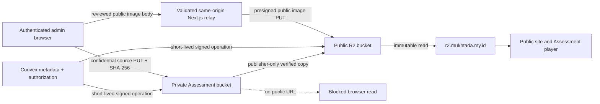

# Cloudflare R2 Setup

Status: public media path verified; private Assessment bucket not configured
Verified: 26 August 2026
Storage class: Cloudflare R2 Standard
Database authority: Convex Cloud

The project has two different storage trust zones. They must not be collapsed into one bucket or one access policy.

## 1. Current evidence

Verified public path:

- The selected Convex Cloud development deployment can reach the public R2 bucket with `HeadBucket`.
- The reviewed generated derivatives below were uploaded with immutable keys and verified with `HeadObject`:
  - `images/conversation-hero-placeholder.avif`
  - `images/conversation-hero-placeholder.webp`
  - `images/member-relay-placeholder.avif`
  - `images/member-relay-placeholder.webp`
  - `images/member-directory-portraits-v1.avif`
  - `images/member-directory-portraits-v1.webp`
- Existing-key overwrite is rejected.
- Presigned URLs were not written to source or logs.
- `https://r2.mukhtada.my.id` is active. DNS, TLS, cache, and representative public object reads passed the recorded development checks.
- A real authenticated Journal upload passed the same-origin relay with HTTP 204, Convex `HeadObject` verification, editor insertion, revision save, edit-route reload, custom-domain rendering, and QA cleanup. The browser made no request to the S3 host.

Not verified:

- The separate private Assessment bucket does not exist in the current application configuration.
- Private Assessment CORS, SHA-256 upload headers, `HeadObject` checksum response, private preview, and public-derivative publication have not had a real Cloudflare round trip.
- Participant documentary media remains blocked where rights or consent are pending.

Do not infer the private path is healthy because the public bucket works.

## 2. Two-bucket architecture



General CMS bytes currently pass through the same-origin Next.js streaming route and then to R2; confidential Assessment bytes are designed for a direct exact-CORS browser PUT once the private bucket exists. Neither path stores file bytes in a Convex database document. Convex records the immutable key, MIME, byte size, review state, rights/access class, dimensions or duration, checksum where applicable, Assessment version, source derivative relation, actor, and timestamps.

## 3. Usage and cost boundary

The R2 Standard free allocation recorded on 25 August 2026 was 10 GB-month storage, 1 million Class A operations, 10 million Class B operations, and free direct R2 egress. It is an included monthly allowance, not a hard spending cap. R2 pricing and billing rounding can change; check [Cloudflare R2 pricing](https://developers.cloudflare.com/r2/pricing/) before production release.

PUT is a Class A operation. GET/HEAD operations are Class B. The private-source → public-derivative copy also creates reads/writes and should be monitored.

## 4. Credentials and endpoints

### Shared account endpoint

```text
R2_ACCOUNT_ID
R2_API
```

`R2_API` must resolve to the exact HTTPS S3 endpoint for `R2_ACCOUNT_ID`, for example `https://<account-id>.r2.cloudflarestorage.com`. Presigned requests use this endpoint. They do not use the custom public domain.

### Public bucket

```text
R2_BUCKET_NAME
R2_ACCESS_KEY_ID
R2_SECRET_ACCESS_KEY
```

Use an Object Read & Write token scoped to this bucket, not account-wide administrative access.

### Private Assessment bucket

```text
R2_ASSESSMENT_BUCKET_NAME
R2_ASSESSMENT_ACCESS_KEY_ID
R2_ASSESSMENT_SECRET_ACCESS_KEY
```

Use a different bucket and a separate least-privilege key pair. The private bucket has no public custom domain and no `r2.dev` public URL. The application rejects confidential reservations when this configuration is absent, so it cannot create an orphan `mediaAssets` row.

### Public application origins

```dotenv
NEXT_PUBLIC_MEDIA_BASE_URL=https://r2.mukhtada.my.id
R2_PUBLIC_DEV=https://r2.mukhtada.my.id
```

`NEXT_PUBLIC_MEDIA_BASE_URL` is the authoritative public browser origin. `R2_PUBLIC_DEV` is a development compatibility fallback, not an upload endpoint and not a secret. `R2_AUTH_TOKEN` is an optional management API token for operators; the application does not use it for S3 uploads.

Store S3 values in the selected Convex deployment. Do not use `NEXT_PUBLIC_` for account IDs, endpoints, bucket names, access keys, secrets, checksums, or signed URLs. Do not paste `convex env list` output into logs or tickets because it contains values.

## 5. Public bucket setup

Cloudflare dashboard:

1. Open R2 and select/create the Standard bucket.
2. Create an Object Read & Write API token scoped to that bucket.
3. Bind `r2.mukhtada.my.id` as its public custom domain and wait for `Active`.
4. Disable the Public Development URL for production once custom-domain reads are confirmed.
5. Set the five public S3 variables in the intended Convex deployment.
6. Apply the exact-origin CORS policy below for authenticated browser uploads.
7. Push functions only through the approved deployment workflow, then run `npm run r2:check`.

Expected connection result:

```json
{ "ok": true }
```

Common failures:

| Error | Check |
| --- | --- |
| `R2 configuration is incomplete` | Account, bucket, key pair, and endpoint exist in the selected deployment |
| `R2_API must use the Cloudflare R2 S3 endpoint` | HTTPS scheme and exact account hostname |
| `AccessDenied` | Bucket scope and Object Read & Write permission |
| `NoSuchBucket` | Bucket name and Cloudflare account |

## 6. Public CMS upload contract

The protected Media workspace is implemented. It is not a future CLI-only path.

Flow:

1. An active administrator with `media:upload` requests an upload for purpose, MIME, exact bytes, original name, and factual alt text.
2. Convex creates a random immutable key under `uploads/<purpose>/...` or `members/profiles/...` and a pending `mediaAssets` row.
3. The browser receives a 300-second presigned PUT URL plus exact size, `Content-Type`, and `Cache-Control` values.
4. The browser sends the body to `/api/admin/media-upload`. The same-origin route validates the configured R2 host and bucket, signed operation, immutable key, size, MIME, cache control, expiry, and signature shape before streaming the request to R2 without following redirects.
5. The action verifies MIME, byte length, and `public, max-age=31536000, immutable` with `HeadObject`.
6. Only the ready record becomes selectable by Journal, Member, or other CMS editors.

General image rules:

- accepted types: AVIF, JPEG, PNG, and WebP for browser CMS upload;
- Member portrait: AVIF or WebP only;
- size: 1 byte through 10 MiB;
- alt text: reviewed plain text;
- replacement: a new immutable key, never overwrite;
- direct browser PUT: optional only after the bucket has an exact-origin CORS policy; never use wildcard upload CORS.
- public URL: custom domain plus the verified object key.

The reviewed operator helper remains available for code-owned derivatives under `brand/`, `images/`, or `members/`:

```bash
npm run r2:upload-reviewed -- \
  <local-reviewed-derivative> \
  images/<versioned-key>.webp \
  image/webp
```

It also uses a 300-second presigned PUT and a post-upload `HeadObject` check. It must not print the URL.

## 7. Public bucket CORS

The browser CMS upload needs exact origins. Use the real production origin when known; never use `*`.

```json
[
  {
    "AllowedOrigins": [
      "http://localhost:3987",
      "http://127.0.0.1:3987",
      "https://YOUR-EXACT-PRODUCTION-ORIGIN"
    ],
    "AllowedMethods": ["GET", "HEAD", "PUT"],
    "AllowedHeaders": ["Content-Type", "Cache-Control"],
    "ExposeHeaders": ["ETag", "Content-Length"],
    "MaxAgeSeconds": 3600
  }
]
```

Origins have no trailing slash or path. The PUT must send the exact headers returned by the action. A different MIME or cache value invalidates the signature or verification.

## 8. Private Assessment bucket setup

Create this bucket only as a private source vault:

1. Create a separate R2 Standard bucket with no custom domain and no Public Development URL.
2. Create a new Object Read & Write token scoped only to that private bucket.
3. Set the three `R2_ASSESSMENT_*` variables in the intended Convex deployment.
4. Apply the private CORS policy below.
5. Confirm the admin configuration status reports:

```ts
{
  privateDraftReady: true,
  publicDerivativeReady: true,
  confidentialUploadsBlocked: false,
}
```

6. Run the real upload/checksum/preview/derivative smoke sequence with a non-sensitive fixture before any confidential content.

The current environment has not completed these steps. Its expected safe status is `privateDraftReady: false` and `confidentialUploadsBlocked: true`.

## 9. Private Assessment CORS

The Assessment PUT signs both the S3 checksum header and metadata headers. Allow all of them exactly:

```json
[
  {
    "AllowedOrigins": [
      "http://localhost:3987",
      "http://127.0.0.1:3987",
      "https://YOUR-EXACT-PRODUCTION-ORIGIN"
    ],
    "AllowedMethods": ["GET", "HEAD", "PUT"],
    "AllowedHeaders": [
      "Content-Type",
      "Cache-Control",
      "x-amz-checksum-sha256",
      "x-amz-meta-checksum-sha256",
      "x-amz-meta-duration-ms"
    ],
    "ExposeHeaders": [
      "ETag",
      "Content-Length",
      "Content-Range"
    ],
    "MaxAgeSeconds": 3600
  }
]
```

Use the exact HTTPS production origin when it exists. Never add a wildcard to work around a failed preflight.

## 10. Confidential Assessment media flow

1. `assessmentMedia.reserveUpload` checks `media:upload` and `assessment:edit`, validates a mutable Assessment version, checks private configuration before insert, and creates a private immutable key.
2. `assessmentMediaNode.createUploadUrl` returns a 300-second URL and these required values:
   - `Content-Type`;
   - `Cache-Control: private, no-store`;
   - base64 `x-amz-checksum-sha256`;
   - lowercase-hex `x-amz-meta-checksum-sha256`;
   - `x-amz-meta-duration-ms` for audio.
3. The browser PUTs the exact bytes and headers to the private bucket.
4. `verifyUpload` runs `HeadObject` with checksum mode and compares MIME, bytes, cache policy, S3 SHA-256, checksum metadata, and optional duration metadata.
5. A ready private asset can receive a 180-second authenticated preview URL. That URL is a bearer credential and is never persisted or logged.
6. A publisher calls `publishDerivative`. The action rechecks private bytes/checksum, writes or confirms an immutable checksum-keyed object in the public bucket, verifies it, and registers a public `mediaAssets` child through `sourceMediaId`.
7. The Assessment stimulus references the public child media ID. The player accepts it only when it is ready, explicit `access: "public"`, correct purpose/content type, and linked to the same published Assessment version.

Limits:

- Assessment image: up to 10 MiB.
- Assessment audio: up to 25 MiB and 15 minutes.
- Per Assessment version: no more than 200 media records across states.
- SHA-256 input: exactly 64 lowercase hexadecimal characters.
- No private source ID is accepted by the public player.

The action currently copies reviewed bytes to the public derivative key; it does not promise transcoding or redaction. Rights, consent, accessibility, and academic review happen before publish.

## 11. Consent and local masters

Raw participant/photo/audio masters are local, consent-gated inputs and are intentionally excluded from Git. A clone does not contain them. Keep them in an approved private working location, not `public/` and not the public R2 bucket.

Before a public derivative:

1. confirm rights and purpose;
2. remove GPS, device serial, artist, and other sensitive metadata;
3. create the minimal required derivative;
4. write factual alt/transcript data;
5. verify separate profile and portrait consent where a Member is identifiable;
6. upload under a new immutable key;
7. link only the reviewed Convex record.

Revocation first removes the object key from every public projection. Physical object deletion follows an approved operational/retention process; never leave the application pointing at an object being removed.

## 12. Read verification

Public object smoke:

```bash
curl -I https://r2.mukhtada.my.id/images/member-relay-placeholder.webp
```

Check HTTP 200, exact `Content-Type`, and immutable cache headers. The custom domain is the production read path; a legacy `pub-...r2.dev` URL is not.

Private media has no equivalent public curl URL. Verify it only through authenticated short-lived preview and server `HeadObject` evidence.

## 13. Release gates

### Public path

- [x] Convex Cloud development deployment selected.
- [x] Public S3 variables present in that development deployment.
- [x] `HeadBucket` succeeds.
- [x] Six generated derivatives pass `HeadObject`.
- [x] Existing-key overwrite is rejected.
- [x] Signed URL is absent from recorded logs.
- [x] `r2.mukhtada.my.id` is active and representative object reads return 200.
- [x] Authenticated CMS upload passes the validated same-origin relay, HEAD verification, save/reload persistence, and custom-domain read.
- [ ] Production deployment receives its own target check.
- [ ] If direct browser PUT is enabled later, the public bucket receives an exact-origin CORS policy and the relay remains the fallback until that path passes.
- [ ] Every real-person derivative has the required rights and consent.

### Private Assessment path

- [ ] Separate private bucket created with no public URL.
- [ ] Separate least-privilege `R2_ASSESSMENT_*` credentials set on the correct deployment.
- [ ] Exact localhost, `127.0.0.1`, and production-origin CORS applied.
- [ ] Browser PUT sends every signed checksum/metadata header.
- [ ] `HeadObject` returns matching S3 SHA-256, MIME, bytes, cache, and metadata.
- [ ] 180-second private preview works and is absent from logs/storage.
- [ ] Publisher-only private-to-public derivative flow passes.
- [ ] Public player rejects private, legacy/no-access, wrong-purpose, wrong-version, unverified, and cross-source media.

Every private Assessment checkbox is open because the bucket is not configured. This is a release gate, not a documentation omission.

## 14. Official references

- [R2 pricing](https://developers.cloudflare.com/r2/pricing/)
- [R2 authentication](https://developers.cloudflare.com/r2/api/tokens/)
- [R2 S3 compatibility](https://developers.cloudflare.com/r2/api/s3/api/)
- [R2 public buckets](https://developers.cloudflare.com/r2/buckets/public-buckets/)
- [R2 CORS](https://developers.cloudflare.com/r2/buckets/cors/)
- [R2 presigned URLs](https://developers.cloudflare.com/r2/api/s3/presigned-urls/)
- [Convex environment variables](https://docs.convex.dev/production/environment-variables)
- [Convex function runtimes](https://docs.convex.dev/functions/runtimes)
