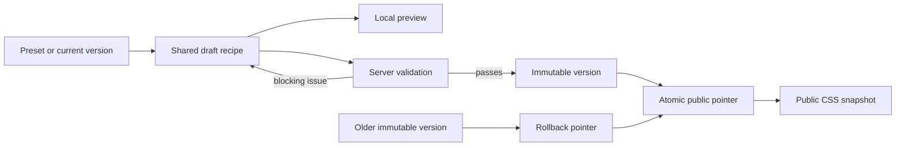

# Admin Theme System Architecture

Status: implementation contract, source code unchanged
Date: 25 August 2026
Owner lane: admin theme architecture
Scope: protected admin theme editor and the published public colour scheme

## 1. Decision

Build the theme feature as a separate, protected admin capability. The admin interface uses its own namespaced visual tokens and a restrained, rounded neobrutalist language. Editors change a small set of public colour anchors; the system derives the full semantic token map, checks both light and dark modes, and publishes an immutable version only when every blocking check passes.

The public site keeps its existing visitor-controlled light/dark toggle. An administrator changes the colours behind those two modes, not the visitor's stored mode. Drafts never affect public pages. Publish and rollback replace one version pointer atomically.

This report does not modify member, journal, layout, or Convex source files. It is intended for the admin implementation owner to integrate after authentication is selected and wired.

## 2. Evidence from the repository

| Evidence | Current behaviour | Consequence |
| --- | --- | --- |
| `src/app/globals.css:1-51` | The public site already maps light and dark modes through semantic CSS variables such as `--page`, `--ink`, `--primary`, and `--signal`. | Preserve the variable contract. Do not add per-component colour settings. |
| `src/app/layout.tsx:17-28` | A synchronous head script reads `localStorage["english-club-theme"]` and applies `data-theme` before paint. | Keep this script. It owns visitor mode selection and prevents a light/dark flash. |
| `src/components/play/theme-toggle.tsx:19-30` | The visitor can change and persist `light` or `dark`. | A published palette must provide both modes and remain compatible with this control. |
| `DESIGN-SYSTEM.md:24-73` | The documented colour contract is semantic and expressed in OKLCH. | Store structured colour data and serialize it to OKLCH; never store arbitrary CSS fragments. |
| `convex/schema.ts:17-104` | Convex currently has content, contact, and member tables only. | Theme tables are additive. There is no existing generic settings row to overload. |
| `convex/posts.ts:49-120` | Public reads use validators, indexes, and bounded results. | Theme history and audit queries must use the same bounded/indexed pattern. |
| `src/lib/journal.ts` and `src/lib/members.ts` | Server-side Convex reads use `fetchQuery`. Convex sets those requests to `cache: "no-store"`. | A published theme read needs an explicit Next cache wrapper or it will run on every request. |
| `package.json:26-51` | There is no auth provider package. | Authentication is an implementation gate, not a detail to fill with a public mutation. |
| missing `convex/auth.config.ts` | `ctx.auth.getUserIdentity()` would return `null`. | Do not expose admin routes or mutations until an OIDC/JWT provider and this file are configured. |
| `tests/e2e/site.spec.ts:310-330` | Theme persistence already has browser coverage. | Extend this contract rather than replacing it. |

The current public tokens are a sound base. The missing pieces are safe persistence, versioning, an authorization boundary, publish-time validation, and a protected editing surface.

## 3. Product boundary

### In scope

- A protected `/admin/theme` workspace.
- Public colour presets and custom colour recipes.
- Paired light and dark public themes.
- Live local preview, saved draft preview, validation, publish, history, and rollback.
- An immutable publication history and actor audit trail.
- A resilient public read path with a static fallback.
- Theme-aware automated accessibility and screenshot checks.

### Out of scope

- Per-page or per-section colour overrides.
- Arbitrary CSS, custom fonts, spacing, radii, shadows, or animation settings entered by an admin.
- Letting a published public palette recolour the admin tool itself.
- Removing the visitor's light/dark choice.
- Scheduled theme publication in the first pass.
- Anonymous preview URLs.
- Building authentication from scratch.

These limits keep the theme system scalable. A new public component consumes semantic roles and automatically supports every published scheme without another admin field.

## 4. Visual direction for the admin

### Scene sentence

A club officer works at a shared campus desk in bright afternoon light, moving between a member record, an article draft, and a publication check without having to decode the interface.

This scene supports a light-first, dense product surface. Dark admin mode may follow the authenticated user's separate preference, but it is not inherited from the public palette.

### Design language: rounded operational neobrutalism

The interface takes the useful parts of neobrutalism—clear boundaries, visible state, decisive controls, and physical press feedback—without turning routine work into a poster.

- Functional panels: 2px solid edge, 10–14px radius.
- Active or draggable surfaces: one short `3px 3px 0` hard shadow, zero blur.
- Buttons: 10px radius, 2px edge, 2px press travel.
- Form controls: 10px radius and a visible label; never a pill.
- Tags and compact statuses may use a full pill.
- No wide soft shadow, gradient text, glass, diagonal stripes, giant outlined headings, or decorative sticker pile.
- One sans family, fixed product type scale, sentence case labels.
- Heroicons supply functional symbols. Unicode or ASCII stand-ins are prohibited.

The signature element is the **publication rail**: a narrow persistent strip showing `Draft`, `Checks`, and `Published vN`. It encodes real state, reveals who published the current version, and keeps rollback nearby. It is not decorative progress theatre.

### Admin semantic tokens

Admin CSS uses namespaced values so a public preview cannot make admin controls unreadable.

```css
.admin-shell {
  --admin-page: oklch(0.965 0.012 265);
  --admin-surface: oklch(1 0 0);
  --admin-surface-quiet: oklch(0.93 0.018 265);
  --admin-ink: oklch(0.18 0.025 265);
  --admin-muted: oklch(0.42 0.025 265);
  --admin-line: oklch(0.25 0.03 265);
  --admin-action: oklch(0.58 0.2 272);
  --admin-on-action: oklch(0.99 0.004 95);
  --admin-warning: oklch(0.78 0.14 80);
  --admin-danger: oklch(0.58 0.19 28);
  --admin-success: oklch(0.51 0.14 150);
  --admin-focus: oklch(0.67 0.19 45);
  --admin-shadow: 3px 3px 0 var(--admin-line);
  --admin-radius-control: 10px;
  --admin-radius-panel: 14px;
}
```

These are design targets, not values editable through the theme feature. Verify their final contrast before implementation.

### Layout

At 1200px and above, the theme workspace has three regions:

1. A 220–248px admin navigation column.
2. A flexible recipe editor with colour anchors and checks.
3. A 380–480px preview/inspector column.

At 768–1199px, navigation collapses and the preview becomes a tab in the main workspace. Below 768px, use one source-ordered column with `Edit`, `Preview`, and `Checks` tabs. The publication rail remains reachable but is no longer sticky when it would cover content. Every target is at least 44px, the page has no horizontal scroll at 320px, and the colour picker is paired with a text value and visible label.

### Motion

- Hover/focus response: 160ms.
- Panel or validation-state replacement: 220ms.
- Button press: translate `2px 2px` and remove the short shadow.
- Preview colour changes: 180ms colour transition after direct user input.
- No route-load choreography and no animated counters.
- Do not animate width, height, grid tracks, or other layout properties.
- `prefers-reduced-motion: reduce` removes transforms and makes state changes near-instant.

## 5. Public theme contract

### Admin-editable anchors

An editor changes seven anchors per mode:

| Anchor | Public meaning |
| --- | --- |
| `canvas` | Page background |
| `surface` | Fields and functional raised surfaces |
| `ink` | Primary text and structural edge |
| `mutedInk` | Secondary text and metadata |
| `line` | Separators and control boundaries |
| `identity` | Links, selected paths, and the club identity colour |
| `response` | Join and explicit response/completion emphasis |

Light and dark recipes are always saved and published together. System danger and success hues stay locked. This prevents an editor from turning errors green or success states red.

### Derived semantic output

The server derives a complete, immutable snapshot:

```ts
type PublicThemeMode = {
  page: Oklch;
  surface: Oklch;
  ink: Oklch;
  muted: Oklch;
  line: Oklch;
  primary: Oklch;
  primaryStrong: Oklch;
  primaryWash: Oklch;
  onPrimary: Oklch;
  signal: Oklch;
  signalInk: Oklch;
  danger: Oklch;
  success: Oklch;
  focus: Oklch;
  focusOffset: Oklch;
  selection: Oklch;
};

type PublicThemeSnapshot = {
  contractVersion: 1;
  light: PublicThemeMode;
  dark: PublicThemeMode;
};
```

`header-bg` remains a CSS `color-mix()` derived from `page`; `image-filter` stays in source because it is media treatment, not a colour choice. Layout, shape, type, and motion tokens stay in source.

### Structured colour value

```ts
type Oklch = {
  l: number; // 0..1
  c: number; // 0..0.4 after gamut mapping
  h: number; // normalized to 0..<360
};
```

Do not store `"oklch(...)"`, hex text, style declarations, or a map of arbitrary CSS variable names. Convex `v.number()` accepts non-finite IEEE-754 values, so every write must also check `Number.isFinite` and the ranges above in the handler.

The implementation converts each colour to sRGB, reduces chroma when needed to keep it in the sRGB gamut, then computes contrast on the mapped sRGB value. Store the mapped structured value in the published snapshot so browser gamut differences cannot change a previously approved version.

### Presets and custom schemes

Presets are versioned code recipes identified by a fixed validator, for example `relay-cobalt-v1`. Choosing a preset copies its recipe into the draft; it does not create a live pointer to source code. The editor may then customise that draft, changing `source` from `preset` to `custom`.

This copy-on-select rule makes rollback exact even if a future deployment changes or removes a preset.

## 6. Validation and contrast guards

Publish runs the same pure validation function used by the editor preview. Client checks improve feedback; the Convex mutation is authoritative.

### Blocking checks in both modes

| Pair or rule | Required result |
| --- | --- |
| Every OKLCH channel | finite and within the defined range |
| Every saved colour | mapped into sRGB gamut |
| `ink` on `page` and `surface` | at least 4.5:1 |
| `muted` on `page` and `surface` | at least 4.5:1 |
| `primaryStrong` on `page` and `surface` | at least 4.5:1 because it carries link text |
| `onPrimary` on `primary` | at least 4.5:1 |
| `signalInk` on `signal` | at least 4.5:1 |
| `line` against an adjacent control surface | at least 3:1 when the line is the only boundary |
| Focus indicator against page, surface, primary, and signal | at least 3:1, using a two-colour outline when one colour cannot satisfy all surfaces |
| Light and dark payloads | both present and token-complete |
| Serialized CSS | generated only from the allowlisted token keys |

Normal text follows WCAG 2.2 minimum 4.5:1; large text may use 3:1, but the theme gate should not depend on type size to rescue a weak body token. The focus target adopts the 2px/3:1 geometry described by WCAG's Focus Appearance guidance even though that criterion is AAA.

### Non-blocking warnings

- `identity` and `response` are too similar to remain easy to distinguish.
- `surface` and `page` have so little separation that grouping is hard to perceive.
- The dark recipe is only a low-lightness copy of the light recipe rather than a complete mapping.
- Chroma mapping changed an entered colour enough to be noticeable.

Warnings must explain the affected interface role. Avoid colour-science jargon in the primary message. `Increase text contrast` may offer a proposed adjustment, but the system never silently changes a saved draft or published version.

### External standards used

- [WCAG 2.2, Contrast (Minimum)](https://www.w3.org/TR/wcag/#contrast-minimum)
- [WCAG 2.2, Focus Appearance explanation](https://www.w3.org/WAI/WCAG22/Understanding/focus-appearance.html)
- [CSS Color Module Level 4, Oklab and OKLCH](https://www.w3.org/TR/css-color-4/#ok-lab)

## 7. Convex data model

All new fields are new-table fields, so this does not tighten any populated table. Keep validators in `convex/validators.ts` and schema definitions in `convex/schema.ts`.

### Shared validators

```ts
const adminRoleValidator = v.union(
  v.literal("owner"),
  v.literal("editor"),
  v.literal("publisher"),
);

const adminStatusValidator = v.union(
  v.literal("active"),
  v.literal("disabled"),
);

const themeSourceValidator = v.union(
  v.literal("preset"),
  v.literal("custom"),
);

const themeEventActionValidator = v.union(
  v.literal("publish"),
  v.literal("rollback"),
);

const oklchValidator = v.object({
  l: v.number(),
  c: v.number(),
  h: v.number(),
});
```

Create object validators for `themeRecipeMode`, `themeRecipe`, `publicThemeMode`, and `publicThemeSnapshot`, then reuse their `.fields` or derived forms. Do not duplicate large token shapes across functions.

### `adminUsers`

```ts
adminUsers: defineTable({
  tokenIdentifier: v.string(),
  displayName: v.string(),
  email: v.optional(v.string()),
  role: adminRoleValidator,
  status: adminStatusValidator,
  createdAt: v.number(),
  updatedAt: v.number(),
  lastSeenAt: v.optional(v.number()),
})
  .index("by_token_identifier", ["tokenIdentifier"])
  .index("by_status_and_updated_at", ["status", "updatedAt"])
```

`tokenIdentifier` comes only from `ctx.auth.getUserIdentity()`. It is never accepted as an authorization argument. The first owner is added through a deployment-operator-only internal bootstrap mutation that refuses to run after any admin record exists.

### `publicThemeDrafts`

One shared draft is sufficient for this site. `revision` provides optimistic concurrency.

```ts
publicThemeDrafts: defineTable({
  siteKey: v.literal("public"),
  name: v.string(),
  source: themeSourceValidator,
  presetKey: v.optional(v.string()),
  recipe: themeRecipeValidator,
  basedOnVersionId: v.optional(v.id("publicThemeVersions")),
  revision: v.number(),
  updatedBy: v.id("adminUsers"),
  createdAt: v.number(),
  updatedAt: v.number(),
})
  .index("by_site_key", ["siteKey"])
```

`saveDraft` requires `expectedRevision`. A stale writer receives a typed conflict result and the UI offers `Reload draft` or `Copy my unsaved values`; it never overwrites silently.

### `publicThemeVersions`

Rows are immutable published snapshots.

```ts
publicThemeVersions: defineTable({
  siteKey: v.literal("public"),
  version: v.number(),
  name: v.string(),
  source: themeSourceValidator,
  presetKey: v.optional(v.string()),
  recipe: themeRecipeValidator,
  snapshot: publicThemeSnapshotValidator,
  contractVersion: v.literal(1),
  publishedBy: v.id("adminUsers"),
  publishedAt: v.number(),
  note: v.optional(v.string()),
})
  .index("by_site_key_and_version", ["siteKey", "version"])
  .index("by_site_key_and_published_at", ["siteKey", "publishedAt"])
```

Do not patch these rows. A later publish inserts another row.

### `publicThemeState`

This is the single public pointer and version counter.

```ts
publicThemeState: defineTable({
  siteKey: v.literal("public"),
  publishedVersionId: v.id("publicThemeVersions"),
  previousVersionId: v.optional(v.id("publicThemeVersions")),
  nextVersion: v.number(),
  publicRevision: v.number(),
  updatedBy: v.id("adminUsers"),
  updatedAt: v.number(),
})
  .index("by_site_key", ["siteKey"])
```

`publicRevision` increments for publish and rollback. The public payload uses it as a cache/debug identity. `nextVersion` avoids scanning or counting history during publication.

### `publicThemeEvents`

```ts
publicThemeEvents: defineTable({
  siteKey: v.literal("public"),
  action: themeEventActionValidator,
  fromVersionId: v.optional(v.id("publicThemeVersions")),
  toVersionId: v.id("publicThemeVersions"),
  actorId: v.id("adminUsers"),
  note: v.optional(v.string()),
  createdAt: v.number(),
})
  .index("by_site_key_and_created_at", ["siteKey", "createdAt"])
  .index("by_actor_id_and_created_at", ["actorId", "createdAt"])
```

The event table supplies the audit trail. It is not returned from the public query.

## 8. Authorization boundary

### Authentication gate

Before any admin implementation is enabled:

1. Select the real OIDC/JWT provider used by club administrators.
2. Add `convex/auth.config.ts` with the provider issuer and audience.
3. Use the provider's authenticated Convex integration (`ConvexProviderWithAuth` for client calls) so JWTs reach Convex.
4. Protect the Next admin layout for navigation/UX.
5. Re-check identity and permission inside every Convex admin query and mutation.

Route protection alone is not authorization. A browser can call a public Convex function directly.

### Server helper

```ts
type AdminPermission =
  | "theme:read"
  | "theme:edit"
  | "theme:publish"
  | "admin:manage";

async function requireAdmin(ctx: QueryCtx | MutationCtx, permission: AdminPermission) {
  const identity = await ctx.auth.getUserIdentity();
  // null -> unauthenticated
  // lookup adminUsers by identity.tokenIdentifier
  // reject disabled records
  // map stored role to allowed permissions
  // return the adminUsers document
}
```

Permission map:

| Role | Read/preview | Edit draft | Publish/rollback | Manage admins |
| --- | ---: | ---: | ---: | ---: |
| `editor` | yes | yes | no | no |
| `publisher` | yes | yes | yes | no |
| `owner` | yes | yes | yes | yes |

The public `getPublished` query is the only unauthenticated theme function. It returns the current snapshot, public revision, and public name only.

## 9. Convex API plan

All registered functions use object syntax and explicit argument and return validators.

### Public read

`api.publicThemes.getPublished`

- Args: `{}`.
- Auth: none.
- Read: `publicThemeState.by_site_key` with `siteKey = "public"`, then `ctx.db.get` for the pointed version.
- Return: `null` when not configured, otherwise `{ name, publicRevision, contractVersion, snapshot }`.
- Never returns actor IDs, recipes, notes, draft IDs, or audit metadata.

### Authenticated queries

| Function | Permission | Read path | Bound |
| --- | --- | --- | --- |
| `api.adminThemes.getWorkspace` | `theme:read` | draft and current state via `by_site_key`, then direct IDs | fixed rows |
| `api.adminThemes.listVersions` | `theme:read` | `by_site_key_and_published_at`, descending | `limit` clamped 1–30 |
| `api.adminThemes.listEvents` | `theme:read` | `by_site_key_and_created_at`, descending | `limit` clamped 1–50 |
| `api.adminThemes.getVersion` | `theme:read` | direct `v.id("publicThemeVersions")` read, verify `siteKey` | one row |

### Authenticated mutations

`api.adminThemes.ensureDraft`

- Permission: `theme:edit`.
- Creates the one shared draft from the current published recipe or the source default when no draft exists.
- Returns the draft ID and revision.

`api.adminThemes.saveDraft`

- Args: `{ draftId, expectedRevision, name, source, presetKey?, recipe }`.
- Permission: `theme:edit`.
- Normalizes every colour, validates shape and ranges, checks revision, and patches the draft.
- Returns a discriminated union: `{ ok: true, revision, validation }` or `{ ok: false, code: "conflict" | "invalid", ... }`.
- Does not publish and does not revalidate public pages.

`api.adminThemes.publishDraft`

- Args: `{ draftId, expectedRevision, expectedPublishedVersionId?, note? }`.
- Permission: `theme:publish`.
- Re-derives the snapshot server-side and rejects any blocking check.
- In one mutation: insert immutable version, update the pointer/counters, insert event, and rebase the draft.
- Returns `{ versionId, version, publicRevision, publishedAt }`.

`api.adminThemes.rollback`

- Args: `{ targetVersionId, expectedPublishedVersionId, note? }`.
- Permission: `theme:publish`.
- Verifies the target belongs to `siteKey = "public"` and its contract version is supported.
- Atomically repoints state, increments `publicRevision`, and inserts a rollback event.
- It does not mutate or clone the target version.

`internal.adminUsers.bootstrapOwner`

- Deployment operator only.
- Accepts the provider's complete `tokenIdentifier`, refuses when any admin row exists, and inserts the first owner.
- Never becomes a browser-callable function.

## 10. Draft, preview, publish, and rollback flow



### Local preview

The theme editor renders a representative public sample from unsaved local values. It reuses public primitives but lives inside a `.public-theme-preview` boundary. CSS variables come from the safe serializer, not a raw `style` string.

The sample must include:

- page and surface,
- body and muted text,
- a text link,
- primary selected state,
- Join/response action,
- form border and focus state,
- success and danger states,
- documentary image treatment,
- light/dark switch.

### Saved full preview

`/admin/theme/preview` is authenticated, `noindex`, and `no-store`. It reads the saved draft and renders the real public shell without admin controls. Do not put colour tokens in the URL. The URL may identify a draft revision, but the server resolves and authorizes it.

The admin editor can open this route in an iframe or a new tab. If an iframe is used, provide a visible `Open full preview` link and a descriptive title. A preview failure must not alter the public pointer.

### Publication

The publish action shows a concise diff: changed anchors, contrast result, current published version, and next version. The confirmation button is `Publish theme`; the success message is `Theme vN published.`

### Rollback

History shows version, name, actor, time, and an accessible colour swatch summary. `Restore vN` opens an inline confirmation with the exact target. Success says `Theme restored to vN.` The event remains a rollback, not a new version; the immutable target stays unchanged.

## 11. Public delivery, cache, and first paint

### CSS injection

`src/app/layout.tsx` fetches the published snapshot on the server and serializes a fixed allowlist into a head style block.

```css
html[data-site-theme="published"] {
  --page: /* safe generated OKLCH */;
  /* complete light mapping */
}

html[data-site-theme="published"][data-theme="dark"] {
  /* complete dark mapping */
}
```

The extra `data-site-theme` selector outranks the existing static fallback regardless of stylesheet order. The head boot script continues to set only `data-theme="light|dark"`. Never interpolate a saved CSS string or admin-provided property name into the style element.

Set `data-site-theme-revision` for diagnostics, but do not expose version notes or actor data.

### Cache strategy for the current Next configuration

> Implementation note, 25 August 2026: the shipped admin mutates Convex directly and does not cross an authenticated Next.js Server Action, so it cannot safely call `updateTag`. The final implementation therefore keeps Convex's explicit `cache: "no-store"` public-theme read. A refresh observes the current published pointer without the 300-second stale window described in the original architecture below. Introduce cross-request caching only together with a tested authenticated invalidation boundary.

`next.config.ts` does not enable Cache Components, so do not introduce that application-wide migration for this feature. The original proposal was to wrap the server `fetchQuery(api.publicThemes.getPublished)` call with `unstable_cache`:

- key prefix: `public-theme`;
- tag: `public-theme`;
- safety revalidation: 300 seconds;
- function fallback: the checked-in default snapshot.

Draft saves do not touch the tag. Publish and rollback run through authenticated Next Server Actions that:

1. pass the provider JWT to the Convex mutation;
2. call `updateTag("public-theme")` after a successful mutation;
3. call `revalidatePath("/", "layout")` because the root layout supplies the palette to every public route.

The broad layout revalidation is intentional only for publish and rollback. If publication is later performed directly from a Convex client, add a secured revalidation webhook or accept the five-minute TTL; otherwise the admin would see a successful publish while Next still serves the previous palette.

### Existing visitors

Do not hot-swap the palette in a visitor's open session. The new version appears on the next navigation that receives a fresh root payload or on reload. The visitor's `english-club-theme` value still selects light or dark inside the new published scheme.

### Fallback order

1. Valid current Convex snapshot.
2. Cached last-known valid snapshot.
3. Checked-in `DEFAULT_PUBLIC_THEME` snapshot.
4. Existing `globals.css` declarations as the no-JavaScript/no-data last resort.

If Convex is unavailable, the public site still renders. Log the operation and fallback revision server-side without leaking environment values. An invalid draft or unsupported version can never replace the pointer because publish validates before the atomic write.

## 12. Admin information architecture

Proposed admin navigation:

- Overview
- Pages
- Journal
- Members
- Media
- Appearance
- Activity log

`Appearance` contains:

1. **Theme recipe** — preset selector and seven colour anchors for the selected mode.
2. **Preview** — representative sample, light/dark control, and full preview link.
3. **Checks** — blocking issues first, warnings second, each linked to the affected field.
4. **Versions** — published history and rollback.

The editor header shows draft save state (`Saving`, `Saved`, or a specific error), not a generic toast for every keystroke. Save after a short idle period and on explicit `Save draft`. Publish remains explicit and is never part of autosave.

Keyboard order follows source order: mode control, anchors, checks, preview link, publish. Swatches are never the only label. Every contrast result includes the numeric ratio and pass/fail text.

## 13. File-level implementation plan

Coordinate these additions with the admin feature owner; do not create a second admin shell.

| File | Responsibility |
| --- | --- |
| `convex/auth.config.ts` | OIDC/JWT provider configuration. |
| `convex/validators.ts` | Admin role, OKLCH, recipe, snapshot, and result validators. |
| `convex/schema.ts` | Add the five isolated admin/theme tables and indexes. |
| `convex/adminAuth.ts` | `requireAdmin` permission helper and internal owner bootstrap. |
| `convex/publicThemes.ts` | Minimal unauthenticated published snapshot query. |
| `convex/adminThemes.ts` | Authenticated workspace reads, draft writes, publish, history, and rollback. |
| `src/theme/theme-contract.ts` | Shared token keys, TypeScript types, normalization, derivation, validation, and safe serializer. |
| `src/theme/default-public-theme.ts` | Checked-in fallback recipe and derived snapshot. |
| `src/lib/public-theme.ts` | Cached server read with bounded fallback. |
| `src/app/layout.tsx` | Inject published token style and revision attribute while preserving the mode boot script. |
| `src/app/admin/layout.tsx` | Protected, noindex admin shell supplied by the admin feature owner. |
| `src/app/admin/(protected)/appearance/page.tsx` | Server workspace entry. Adapt grouping to the team's chosen route convention. |
| `src/app/admin/(protected)/appearance/preview/page.tsx` | Authenticated, no-store full public preview. |
| `src/components/admin/theme/*` | Editor, checks, preview, publication rail, and version history. |
| `src/components/admin/admin-theme.module.css` | Namespaced rounded-neobrutalist admin tokens and responsive rules. |
| `src/actions/admin-theme.ts` | Authenticated publish/rollback Server Actions and Next cache invalidation. |

Do not put Convex functions outside `convex/`. Do not use R2 for theme values. R2 remains media storage only.

## 14. Test plan

### Pure unit tests

`tests/unit/theme-contract.test.ts`

- Accept finite, in-range OKLCH values and reject `NaN`, infinities, negative chroma, lightness outside 0–1, and malformed objects.
- Normalize hue and map high-chroma colours into sRGB.
- Generate only the allowlisted CSS variables.
- Escape no values because the serializer accepts no strings.
- Assert the checked-in fallback produces the current public token contract.
- Check every required contrast pair for both modes.
- Verify a failed recipe reports the field and exact pair.
- Verify preset copy does not retain a live source reference.

### Convex tests

`tests/convex/admin-themes.test.ts`

- Unauthenticated and non-admin identities cannot read drafts or call mutations.
- Disabled admins are rejected.
- Editor can save but cannot publish or rollback.
- Publisher can publish; owner can manage all theme operations.
- Stale `expectedRevision` returns conflict without changing the draft.
- Invalid and low-contrast recipes cannot publish.
- Publish inserts one immutable version, changes one pointer, increments both counters correctly, rebases the draft, and inserts one event in the same transaction.
- Concurrent publish attempts allow one expected-pointer winner and reject the other.
- Rollback accepts only a version for `siteKey="public"`, changes the pointer, leaves versions unchanged, and inserts an audit event.
- `getPublished` returns only snapshot, name, contract version, and public revision.
- History is index-backed, descending, and bounded.
- Bootstrap owner works only before an admin row exists.

Use mocked Convex identities; never pass a user ID as a function argument to simulate authorization.

### Component tests

- Colour fields have visible labels, error descriptions, and keyboard-operable controls.
- Light/dark preview preserves unsaved values.
- Autosave status reflects saving, saved, conflict, and error states.
- A blocking check disables publish but not draft saving.
- Conflict UI keeps the user's unsaved local copy available.
- Reduced motion removes press/replacement transforms.

### Playwright and Axe

- Unauthenticated `/admin` redirects to the real sign-in flow and cannot expose page data in HTML.
- Editor and publisher permissions produce the correct visible actions, while Convex tests prove the real boundary.
- Theme editor works at 320×800, Pixel 7, 768×1024, 1024×768, and 1440×1000 with no horizontal overflow.
- Keyboard-only edit, save, preview, publish, and rollback paths work.
- Focus remains visible on page, surface, selected, and signal backgrounds.
- Axe reports no A/AA violations in editor, preview, validation-error, history, and confirmation states.
- Publish updates a fresh public page without a light/dark flash.
- Visitor mode persistence survives a palette publication and reload.
- Public routes fall back cleanly when the theme query fails.
- Capture and inspect light admin, dark admin, invalid recipe, mobile editor, public light, public dark, and rollback evidence screenshots.

### Security tests

- Direct calls to every admin function without a JWT fail.
- An authenticated identity absent from `adminUsers` fails.
- A client cannot choose `actorId`, role, public revision, version, or CSS variable name.
- Saved values cannot close a style declaration, add a URL, or inject a selector because the contract stores numeric channels only.
- Preview responses are authenticated, `noindex`, and `no-store`.
- Audit records do not cross the public query.

### Deployment gates

1. `npm run typecheck`.
2. `npm run test:unit`.
3. `npm run test:backend`.
4. `npm run lint`.
5. Push Convex cloud schema/functions and resolve every validator error.
6. `npm run build`.
7. Run browser/Axe tests without stopping the existing process on port 3987; use the already-running server or an isolated approved test port.
8. Inspect all required screenshots in both public modes.

## 15. Migration sequence

1. Choose and configure the real auth provider; add the first owner through the one-time internal bootstrap.
2. Add pure theme contract code and default snapshot tests.
3. Add new Convex tables, validators, authorization helper, and tests.
4. Seed a draft and first immutable version from the current Relay Cobalt tokens; point `publicThemeState` at it.
5. Add the cached public query adapter and safe head serializer. Confirm there is no first-paint regression.
6. Integrate the Appearance route into the admin shell created by the admin feature team.
7. Add publish/rollback Server Actions and cache invalidation.
8. Run authorization, conflict, contrast, responsive, reduced-motion, Axe, and screenshot gates.

The first seeded version must be visually identical to the checked-in palette. The feature should ship with no public design change until an authorized publisher intentionally creates version 2.

## 16. Failure modes and controls

| Failure | Control |
| --- | --- |
| Public mutation is callable without real auth | No admin API ships before `auth.config.ts`; every function runs `requireAdmin`. |
| An editor publishes unreadable text | Server-side sRGB contrast gate blocks the mutation in both modes. |
| Raw CSS injection | Store numeric channels and serialize an allowlist only. |
| Two admins overwrite each other | Draft revision and expected published pointer enforce optimistic concurrency. |
| Rollback destroys history | Versions are immutable; rollback changes only the pointer and writes an event. |
| Public theme recolours the editor | Admin tokens are namespaced and independent. |
| Convex outage blanks the site | Cached last-known version and checked-in fallback remain available. |
| Publish succeeds but Next serves stale colours | Publish/rollback go through Server Actions that invalidate the theme tag and root layout. |
| Preset changes alter old versions | Presets copy into a recipe; published snapshots never point to mutable code. |
| Dark mode becomes an afterthought | Both modes are required in every draft, validation run, version, and test. |

## 17. Acceptance checklist

- [ ] The admin shell reads as a focused work tool with rounded 2px edges and short hard shadows, not a poster or generic SaaS card grid.
- [ ] Public and admin theme tokens are separate.
- [ ] An administrator edits semantic anchors, never component colours or CSS.
- [ ] Light and dark public mappings publish together.
- [ ] Every blocking contrast pair passes before publication.
- [ ] Authentication and role checks run inside Convex for every protected operation.
- [ ] Draft save, publish, and rollback have distinct permissions and copy.
- [ ] Versions are immutable and rollback is pointer-based.
- [ ] Public output contains no admin or audit fields.
- [ ] The head serializer accepts only structured numeric tokens and causes no theme flash.
- [ ] The existing visitor light/dark preference continues to work after a palette change.
- [ ] Convex failure falls back to a complete checked-in theme.
- [ ] 320px, Pixel 7, keyboard, reduced motion, both public modes, admin mode, Axe, and screenshot evidence pass.

## 18. Handoff note

The safe integration boundary is narrow: the admin team owns the protected shell and auth provider; this feature adds one `Appearance` workspace, isolated Convex theme tables, a public snapshot query, and a root-layout token style. It does not require changes to the member filter, journal pagination, rich-text editor, or R2 media flow.
