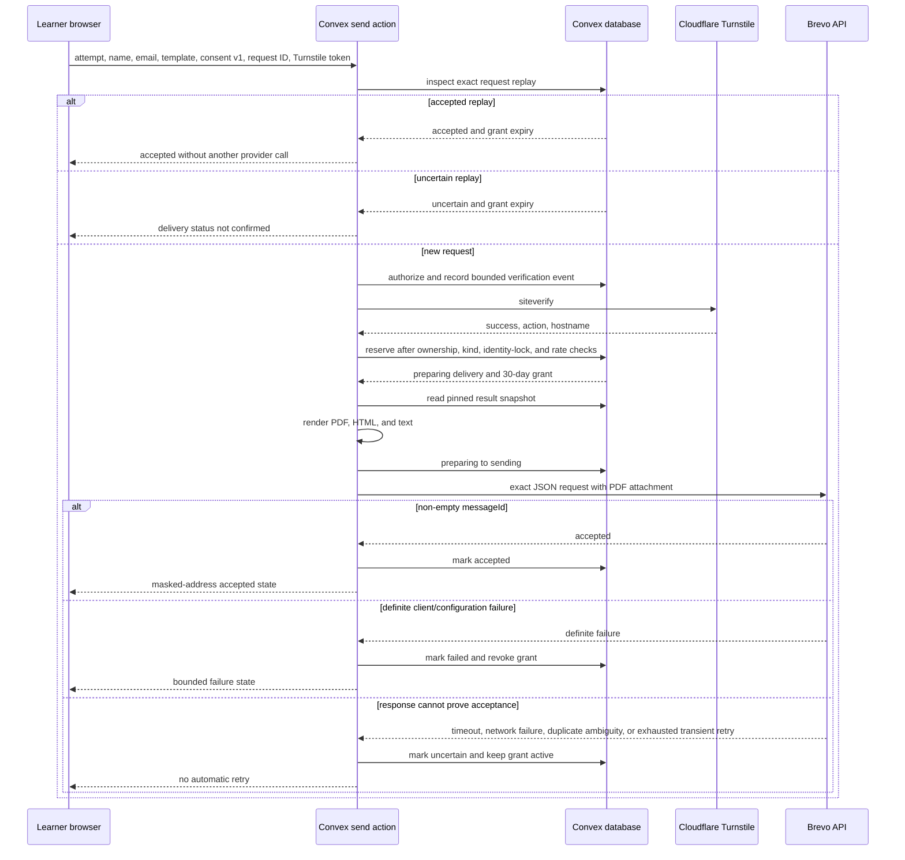
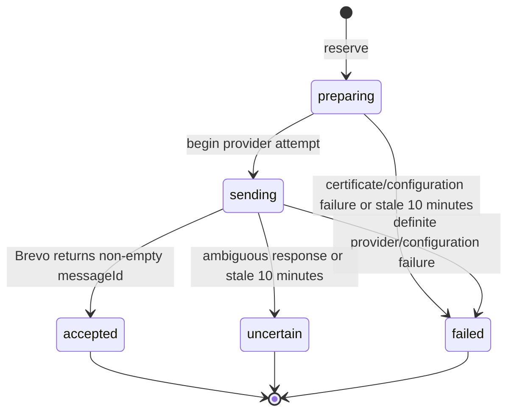

# Full Practice result delivery with Brevo

Status: implemented security contract; production provider smoke test pending
Scope: submitted Full Practice results only
Provider: Brevo transactional email REST API
Runtime: Convex Node action plus Convex database functions

## 1. Delivery decision

English Club sends one requested transactional message through Brevo's `POST /v3/smtp/email` endpoint. The feature does not use SMTP settings and does not add the learner to a contact list.

The message contains:

- a statement that the learner completed English Club Full Practice;
- the score summary and per-section detail;
- one attached PDF practice-completion record; and
- one private link to the full answer review.

Quick Practice does not expose this action. Convex reads result values from the owned, submitted result. The browser cannot submit a score, completion date, review URL, sender, certificate bytes, or email HTML.

Brevo acceptance means that Brevo accepted the API request. It does not prove inbox delivery. This release does not consume Brevo delivery webhooks.

## 2. Files that own the contract

| Concern                                                | File                                                |
| ------------------------------------------------------ | --------------------------------------------------- |
| Public send and review-link revocation actions         | `convex/assessmentResultEmail.ts`                   |
| Delivery state, grants, sessions, rate limits, cleanup | `convex/assessmentResultDelivery.ts`                |
| Tables and indexes                                     | `convex/schema.ts`                                  |
| Status, failure, and template validators               | `convex/assessmentValidators.ts`                    |
| Certificate PDF renderer                               | `convex/lib/fullPracticeCertificate.ts`             |
| Email copy and Brevo request builder                   | `convex/lib/fullPracticeEmail.ts`                   |
| Token, digest, request-ID helpers                      | `convex/lib/resultDeliverySecurity.ts`              |
| Public result form and Turnstile widget                | `src/components/practice/result-email-delivery.tsx` |
| Result adapter and private-review redemption client    | `src/components/practice/result-view.tsx`           |
| Private review route                                   | `src/app/(site)/practice/review/page.tsx`           |
| Daily cleanup                                          | `convex/crons.ts`                                   |

## 3. Required configuration

### Convex deployment: server only

```text
BREVO_API_KEY=
BREVO_SENDER_EMAIL=
BREVO_SENDER_NAME=English Club
RESULT_DELIVERY_PUBLIC_ORIGIN=https://englishclubjambi.my.id
RESULT_DELIVERY_RECIPIENT_HASH_KEY=
TURNSTILE_SECRET_KEY=
```

Optional:

```text
BREVO_REPLY_TO_EMAIL=
```

### Next.js or Vercel: public widget key

```text
NEXT_PUBLIC_TURNSTILE_SITE_KEY=
```

Rules:

- `RESULT_DELIVERY_RECIPIENT_HASH_KEY` must be an independent random secret of at least 32 characters. Do not reuse a Brevo, Auth, R2, or JWT secret.
- `RESULT_DELIVERY_PUBLIC_ORIGIN` must be one exact HTTPS origin with no path, credentials, query, or fragment.
- `TURNSTILE_SECRET_KEY` and `BREVO_API_KEY` belong only in the selected Convex deployment.
- The public Turnstile site key belongs in the matching Next.js deployment. It is not a secret.
- Use separate Turnstile widgets for development and production, each restricted to its intended hostname.
- A missing or malformed required value disables delivery. The browser receives a bounded configuration-unavailable state, not a secret or provider response.

### What `BREVO_REPLY_TO_EMAIL` does

The learner-entered address is the recipient in `to`. It answers where the result should be delivered.

`BREVO_REPLY_TO_EMAIL` answers a different question: where should a learner's email client send a reply after they press Reply? Set it to a monitored English Club mailbox. Omit it when replies should return to the verified sender inbox. Never copy the learner's address into `From` or `Reply-To`.

The SMTP variable names in some Brevo examples are not read by this implementation. If another service uses them, spell them `BREVO_SMTP_PORT`, `BREVO_SMTP_LOGIN`, and `BREVO_SMTP_PASSWORD`; they still do nothing for this REST path.

## 4. Request flow



The action checks an existing request before it calls Turnstile. This is the accepted-replay fast path: the same owned request, same recipient digest, same certificate-name digest, same template, and same consent version can return its stored accepted or uncertain state without spending another Turnstile token or calling Brevo.

All new sends pass the verification-event limiter and Turnstile before Convex creates a delivery row. A failed check creates no delivery row and makes no Brevo request.

## 5. Turnstile contract

The result form renders Turnstile explicitly with:

```text
action: full-practice-result-email
theme: auto
size: flexible
```

The primary action stays disabled until the widget supplies a token. The Convex action sends that token to Cloudflare's Siteverify endpoint and requires all of these facts:

- `success` is `true`;
- `action` equals `full-practice-result-email`; and
- `hostname` equals the hostname parsed from `RESULT_DELIVERY_PUBLIC_ORIGIN`.

Before calling Siteverify, `authorizeVerification` confirms that the attempt belongs to the current identity, remains submitted, and belongs to Full Practice. It then checks two indexed ten-minute windows:

| Siteverify admission limit | Bound                   |
| -------------------------- | ----------------------- |
| One owner                  | 6 verification events   |
| Whole service              | 500 verification events |

An allowed call inserts `attemptId`, `ownerTokenIdentifier`, and `createdAt` into `assessmentResultVerificationEvents`. It stores no Turnstile token, recipient, certificate name, address digest, IP address, or provider response. The daily result-delivery cleanup deletes these events after 24 hours in batches of at most 50.

The verification call then uses a fresh Siteverify `idempotency_key` and a ten-second timeout. Missing, expired, malformed, wrong-action, wrong-hostname, and unavailable checks fail closed.

Turnstile sits beside the database limits; it does not replace them:

| Limit                            |             Bound |
| -------------------------------- | ----------------: |
| One attempt in 24 hours          |   3 delivery rows |
| One recipient digest in 24 hours |   3 delivery rows |
| One attempt over its lifetime    |   6 delivery rows |
| Whole service in 24 hours        | 250 delivery rows |

## 6. Two idempotency layers

### Application request ID

The client generates a UUID request ID and keeps it for one submission. Convex indexes `(ownerTokenIdentifier, requestId)` as one row. Reusing that ID with another attempt, template, recipient digest, certificate-name digest, or consent version is rejected.

### Brevo provider UUID

Every new delivery receives one random UUIDv4 `providerAttemptId`. The exact UUID is placed inside the Brevo JSON body:

```json
{
  "headers": {
    "idempotencyKey": "00000000-0000-4000-8000-000000000000",
    "X-Ec-Delivery": "EC-00000000000000000000000000000000"
  }
}
```

`idempotencyKey` is a JSON message header supported by Brevo. The HTTP request does not contain an `Idempotency-Key` header.

Brevo documents a 30-minute lifetime for this provider key. Convex keeps the separate request row after that window, so an accepted or uncertain application request still does not trigger a late automatic resend.

The Node action may retry once after the first network error, `429`, or `5xx`. It waits 700 ms and sends the same endpoint, headers, and serialized body. That means the provider UUID, recipient, content, attachment, and certificate ID stay unchanged.

The second ambiguous response becomes `uncertain`; the server does not send again. The UI can offer `Prepare a separate copy`, which creates a new explicit request and new provider UUID.

## 7. Delivery state machine



| State       | Meaning                                                          | Review grant                            |
| ----------- | ---------------------------------------------------------------- | --------------------------------------- |
| `preparing` | Reserved; PDF and message are being built                        | Active while preparation continues      |
| `sending`   | The exact provider request may have left the server              | Active                                  |
| `accepted`  | Brevo returned a non-empty message ID                            | Active until expiry or owner revocation |
| `uncertain` | The server cannot prove whether Brevo accepted the exact request | Active; no automatic resend             |
| `failed`    | A definite local, configuration, or provider failure occurred    | Revoked                                 |

The stored failure codes are allowlisted: `certificate_unavailable`, `provider_unavailable`, `provider_uncertain`, and `configuration_unavailable`. Provider response bodies and stack traces do not enter the database or browser copy.

## 8. Brevo payload

The request uses `https://api.brevo.com/v3/smtp/email` with server-only HTTP headers:

```text
accept: application/json
api-key: <server secret>
content-type: application/json
```

The JSON body includes:

- verified sender name and address;
- learner name and recipient address;
- optional monitored reply-to address;
- HTML and plain-text bodies;
- one base64 PDF attachment, capped at 2 MiB;
- `headers.idempotencyKey` with the provider UUID;
- `headers.X-Ec-Delivery` with the public certificate ID;
- the tag `full-practice-result`; and
- `contactPixelTrackingConsent: false` on the recipient.

The email has one primary link. It does not need a marketing footer, remote hero image, social strip, or newsletter tracking.

`contactPixelTrackingConsent: false` is a request value, not proof of a Brevo account setting. Brevo states that the field controls a recipient only after per-contact pixel-tracking consent is enabled for the account; otherwise Brevo ignores it. Production must therefore prove at least one account-level path:

- enable anonymous email tracking for Transactional Emails, which anonymizes future open and click events; or
- enable per-contact pixel-tracking consent for transactional API sends and verify that this payload's `false` value prevents identifiable open and click tracking.

Brevo tracking configuration cannot be set or checked by this repository. Keep dashboard evidence with the release record.

No webhook route exists in this release. `accepted` records API acceptance only. Provider delivery, bounce, complaint, and inbox placement do not update Convex.

## 9. Certificate boundary

The attachment records practice completion, not identity, proficiency, passing status, or university qualification.

It contains:

- `Practice record prepared for` above the learner-entered name;
- `Name supplied by participant; identity not verified.`;
- completion date and practice modes;
- raw result and the bounded English Club estimate when that stored result has one;
- per-section facts;
- a random `EC-` certificate ID; and
- the full practice limitation.

The PDF does not contain the private review URL, a QR code, a URL annotation, the recipient email, an attempt ID, result ID, Auth identity, or private media key. `FullPracticeCertificateInput` has no `reviewUrl`; only the email input includes it.

The attachment filename uses the non-enumerable public ID:

```text
english-club-full-practice-EC-<32 uppercase hex>.pdf
```

## 10. Private review access

### Email link

The action generates 32 random bytes and places the base64url token only in this form:

```text
https://englishclubjambi.my.id/practice/review#access=<43-character-token>
```

The access token is not in the route path or query string. URL fragments do not reach the HTTP server or referrer. The private review route also sets `noindex`, `nofollow`, `nocache`, and `no-referrer`, and `robots.txt` disallows `/practice/review`.

### Redemption

The browser performs these steps in order:

1. Read `#access=` from `window.location.hash`.
2. Replace the visible URL with `/practice/review` before the Convex call.
3. Call `assessmentResultDelivery.redeem` with the access token.
4. Receive a new random session token.
5. Store only that session token in `sessionStorage`.
6. Call review actions with the session token; those actions hash it before database lookup.

Convex stores only the SHA-256 digest of the access token and session token. It returns the session token once to the redeeming browser. The grant increments `redemptionCount` for every successful exchange and refuses a sixth redemption.

### Lifetimes and revocation

| Capability             | Lifetime                                         | Storage                                                 |
| ---------------------- | ------------------------------------------------ | ------------------------------------------------------- |
| Email access grant     | 30 days unless owner revokes it                  | SHA-256 token digest in Convex                          |
| Browser review session | At most 30 minutes and never beyond grant expiry | Raw token in `sessionStorage`; SHA-256 digest in Convex |

One grant permits at most five successful redemptions in total. After the fifth exchange, the email access token fails closed even if the 30-day expiry has not arrived. Revoking the review link changes the grant and its active sessions to `revoked`. Attempt deletion also removes the delivery-linked review records within existing bounds.

The bearer access token can be redeemed again until the grant expires, the owner revokes it, or five redemptions succeed. The 30-minute session reduces the lifetime of a token stored by the review page; it does not make the email link single-use.

The unavailable page does not reveal whether a token was malformed, missing, revoked, expired, attached to a deleted attempt, or attached to a replaced result.

## 11. Stored data

### `assessmentResultVerificationEvents`

The pre-Siteverify limiter stores only the owned attempt ID, owner token identifier, and creation time. Owner/creation and creation-only indexes support the six-per-owner and 500-global ten-minute bounds. Events expire from application storage after 24 hours.

### `assessmentResultDeliveries`

| Field                                           | Purpose                                                         |
| ----------------------------------------------- | --------------------------------------------------------------- |
| `attemptId`, `resultId`, `ownerTokenIdentifier` | Owned, pinned submitted result                                  |
| `requestId`                                     | Application idempotency key                                     |
| `providerAttemptId`                             | Stable Brevo UUIDv4                                             |
| `publicCertificateId`                           | Random `EC-` identifier used in the PDF and attachment name     |
| `certificateTemplate`                           | Allowlisted design key                                          |
| `recipientHash`                                 | HMAC-SHA256 normalized email digest                             |
| `certificateNameHash`                           | HMAC-SHA256 normalized name digest for certificate-name locking |
| `consentVersion`                                | Accepted delivery-consent contract; currently `1`               |
| `humanVerifiedAt`                               | Server time after Turnstile succeeds                            |
| `status`, `failureCode`                         | Bounded delivery state                                          |
| `providerMessageId`                             | Optional Brevo acceptance reference                             |
| `requestedAt`, `updatedAt`, `acceptedAt`        | Operational timestamps                                          |

### `assessmentResultReviewGrants`

The grant keeps delivery, attempt, and pinned result IDs; SHA-256 access-token digest; `active | revoked`; optional migration-safe redemption count; creation time; and 30-day expiry.

### `assessmentResultReviewSessions`

The session keeps its grant ID, SHA-256 session-token digest, `active | revoked`, creation time, and expiry capped at 30 minutes.

None of these tables stores the learner-entered name, plain email, plain token, PDF, email body, or Brevo API key.

## 12. Cleanup and retention

`convex/crons.ts` runs `assessmentResultDelivery.purgeExpired` every 24 hours. Each pass is bounded to 50 rows per category and schedules another immediate pass when a category reaches the bound.

The cleanup:

- deletes verification events older than 24 hours;
- deletes expired review sessions;
- deletes expired grants and their remaining sessions;
- changes `sending` older than ten minutes to `uncertain`;
- changes `preparing` older than ten minutes to `failed` and revokes its grant; and
- deletes delivery metadata whose `updatedAt` is at least 180 days old, along with its grant and sessions.

The 24-hour verification-event, 30-day access-grant, and 180-day delivery-metadata limits are application policies. Brevo's logs and previews follow provider-account settings and need separate operator evidence. Brevo says logs and previews are stored indefinitely by default; custom log retention ranges from one through 24 months, while `Never store previews` applies only to messages sent after the setting is saved. The private bearer fragment sits inside the email body, so production must use `Never store previews` and remove any earlier smoke-test preview. Sending an email cannot be undone; revocation stops the private review link, not the message or downloaded attachment.

## 13. Production setup

1. Verify the sender and authenticate the sending domain in Brevo.
2. Create a production Turnstile widget restricted to the canonical public hostname.
3. Set the six required server values in the approved Convex deployment. Set `BREVO_REPLY_TO_EMAIL` only when a monitored mailbox exists.
4. Set `NEXT_PUBLIC_TURNSTILE_SITE_KEY` in the matching Vercel environment.
5. Confirm `RESULT_DELIVERY_PUBLIC_ORIGIN` equals the deployed canonical HTTPS origin exactly.
6. In Brevo, enable anonymous tracking for Transactional Emails or enable per-contact consent for transactional API sends and prove that `contactPixelTrackingConsent: false` is honored. Source code cannot enforce this account setting.
7. Set an approved transactional-log retention period and select `Never store previews`. Because preview changes are not retroactive, delete any private test preview created before the setting took effect.
8. Run one operator-owned mailbox test and capture non-sensitive evidence: pre-Siteverify rate bounds, visible Turnstile, accepted UI, message receipt, text and HTML content, PDF attachment, certificate limitation, fragment URL, scrubbed review route, 30-minute session expiry, owner revocation, and no secret in application logs.
9. Record that no delivery webhook exists and that an uncertain send is never retried automatically.

Do not place a real API key, Turnstile secret, recipient address, provider message ID, access token, or session token in screenshots, fixtures, commits, shell history, or issue text.

## 14. Verification matrix

| ID  | Check                                              | Expected result                                                                 |
| --- | -------------------------------------------------- | ------------------------------------------------------------------------------- |
| C01 | Missing required server value                      | Configuration unavailable; no provider request                                  |
| C02 | Missing public Turnstile site key                  | Form states verification unavailable; submit stays disabled                     |
| T01 | Valid token, action, and hostname                  | Reservation may proceed                                                         |
| T02 | Wrong action or hostname                           | No delivery row and no Brevo request                                            |
| T03 | Seventh owner verification inside ten minutes      | Rate-limited before Siteverify                                                  |
| T04 | 501st service-wide verification inside ten minutes | Rate-limited before Siteverify                                                  |
| T05 | Verification event after 24 hours                  | Deleted by bounded cleanup                                                      |
| I01 | Same accepted request ID and payload               | Stored acceptance returned; no new Turnstile/Brevo call                         |
| I02 | Same request ID with changed input                 | Request-ID reuse rejected                                                       |
| I03 | First transient provider response, second accepted | Same serialized body used twice; one accepted row                               |
| I04 | Provider outcome remains ambiguous                 | `uncertain`; no automatic retry                                                 |
| P01 | Brevo returns non-empty `messageId`                | `accepted` with optional provider reference                                     |
| P02 | Definite provider/configuration failure            | `failed`; grant revoked                                                         |
| A01 | Generated PDF scan                                 | No review URL, email, attempt/result/Auth ID, or URL annotation                 |
| A02 | Oversized PDF above 2 MiB                          | Request builder fails before provider call                                      |
| G01 | Email link opens                                   | Fragment scrubbed before redemption; session token enters `sessionStorage`      |
| G02 | Raw access token used for a review read            | Unavailable; reads require a session token                                      |
| G03 | Session after 30 minutes                           | Unavailable                                                                     |
| G04 | Grant after 30 days or owner revocation            | Unavailable                                                                     |
| G05 | Six redemption attempts                            | First five may issue sessions; sixth is unavailable and no sixth session exists |
| D01 | Cleanup after 180 days                             | Delivery, grant, and sessions deleted within bounded passes                     |
| B01 | Brevo tracking account review                      | Anonymous tracking or active per-contact handling for `false` proven externally |
| B02 | Brevo retention account review                     | Approved log rule and `Never store previews` proven; earlier preview removed    |

Automated provider tests must stub Cloudflare and Brevo. A live Brevo send is an explicit operator smoke test only.

## 15. Provider references

- [Brevo getting started](https://developers.brevo.com/docs/getting-started)
- [Brevo transactional email endpoint](https://developers.brevo.com/reference/send-transac-email)
- [Brevo idempotency in message headers](https://developers.brevo.com/docs/heterogenous-versions-batch-emails)
- [Brevo domain authentication](https://help.brevo.com/hc/en-us/articles/12163873383186-Authenticate-your-domain-with-Brevo-Brevo-code-DKIM-DMARC)
- [Brevo transactional log and preview retention](https://help.brevo.com/hc/en-us/articles/4415743225746-Configure-a-custom-retention-period-for-your-transactional-logs-and-email-previews)
- [Brevo anonymous email tracking](https://help.brevo.com/hc/en-us/articles/11643306229906-Can-I-anonymize-the-tracking-of-opens-and-clicks-for-my-emails)
- [Brevo per-contact pixel-tracking consent for API sends](https://help.brevo.com/hc/en-us/articles/37113920427922-About-email-tracking-pixels-and-the-CNIL-recommendation-in-Brevo)
- [Brevo clarification for `contactPixelTrackingConsent`](https://developers.brevo.com/changelog/2026/7/21)
- [Cloudflare Turnstile server-side validation](https://developers.cloudflare.com/turnstile/get-started/server-side-validation/)
