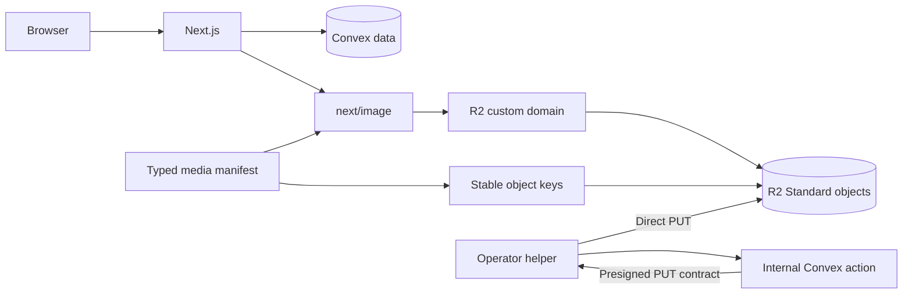

# Cloudflare R2 Research Ledger

Verified: 25 August 2026
Source rule: official Cloudflare documentation only
Decision: Cloudflare R2 Standard stores public derivatives; Convex remains the database

## Evidence table

| Question | Verified evidence | Project decision | Source |
| --- | --- | --- | --- |
| What is free? | Standard includes 10 GB-month storage, 1 million Class A operations, 10 million Class B operations each month; direct R2 egress is free | Treat this as included usage, not a spending cap | [Pricing](https://developers.cloudflare.com/r2/pricing/) |
| Which storage class? | Free tier does not apply to Infrequent Access | Use Standard only | [Pricing](https://developers.cloudflare.com/r2/pricing/) |
| Is R2 activation required? | R2 must be purchased or enabled before an R2 API token can be created | Document the activation step and do not promise a zero-billing-account setup | [Authentication](https://developers.cloudflare.com/r2/api/tokens/) |
| How is production media exposed? | Buckets are private by default; custom domains provide public access and Cloudflare Cache | Use `media.<domain>` after consent clears | [Public buckets](https://developers.cloudflare.com/r2/buckets/public-buckets/) |
| Is `r2.dev` suitable for production? | The development URL is rate-limited and lacks cache, WAF, and bot-management features | Development only; disable it in production | [Public buckets](https://developers.cloudflare.com/r2/buckets/public-buckets/) |
| How are operator uploads authenticated? | S3 tools use a scoped Access Key ID and Secret Access Key | Keep bucket-scoped S3 credentials in the Convex Cloud environment; the repository helper receives only a short-lived operation URL | [S3 setup](https://developers.cloudflare.com/r2/get-started/s3/) |
| What is the S3 endpoint? | Default endpoint is `https://<ACCOUNT_ID>.r2.cloudflarestorage.com`; SDK region is `auto` | Keep endpoint and credentials server-only | [S3 setup](https://developers.cloudflare.com/r2/get-started/s3/) |
| When is CORS required? | Browser access to presigned URLs fails without a matching bucket CORS policy | The implemented Node operator helper does not need CORS; add an exact-origin PUT rule only if a browser editor later exists | [CORS](https://developers.cloudflare.com/r2/buckets/cors/) |
| How do presigned URLs behave? | They grant one named S3 operation on one object for 1 second to 7 days; supported operations are GET, HEAD, PUT, DELETE; POST is unsupported; custom domains cannot sign them | The internal Convex action issues a 300-second PUT URL for one validated immutable key, then verifies the result with `HeadObject` | [Presigned URLs](https://developers.cloudflare.com/r2/api/s3/presigned-urls/) |

## Architecture result

The public site reads immutable derivatives and never receives S3 credentials. A private CLI operator path exists for reviewed uploads: credentials live in the selected Convex Cloud environment, the Node action validates the endpoint and key, and the helper sends bytes directly to R2 using a 300-second presigned PUT URL. The custom domain and `NEXT_PUBLIC_MEDIA_BASE_URL` are still sufficient for public reads. Local `/public/images` remains a consent-gated QA fallback, not the production storage authority.

## Rejected patterns

- Convex File Storage for media: superseded by the user's R2 decision.
- Infrequent Access: excluded because this site reads images frequently and the free tier does not apply.
- `r2.dev` in production: excluded because Cloudflare labels it development-only and rate-limited.
- Public S3 credentials: excluded because the public read path does not need them.
- Wildcard upload CORS: excluded because the current Node helper needs no CORS and any future browser origin can be exact.
- Presigned URLs through the custom domain: unsupported by Cloudflare; signing uses the S3 API domain.
- Uploading masters: excluded by privacy and consent gates; only stripped AVIF/WebP derivatives may enter R2.

## Verified implementation state

- The existing Convex Cloud development deployment is selected and the functions are pushed.
- Bucket connectivity passes from the Convex Node runtime.
- Four cleared generated AVIF/WebP derivatives are present and verified by `HeadObject`.
- Existing object keys are rejected before a signed URL is issued.
- Public Member results are intentionally empty until real records and consent exist.

## Open production inputs

- Production domain and desired media subdomain.
- Confirmation that the domain zone and R2 bucket share a Cloudflare account.
- Per-image public consent for documentary media.
- Final `NEXT_PUBLIC_MEDIA_BASE_URL`.

These are release inputs, not missing code decisions. Setup and the verified command path remain in `R2-SETUP.md`.
