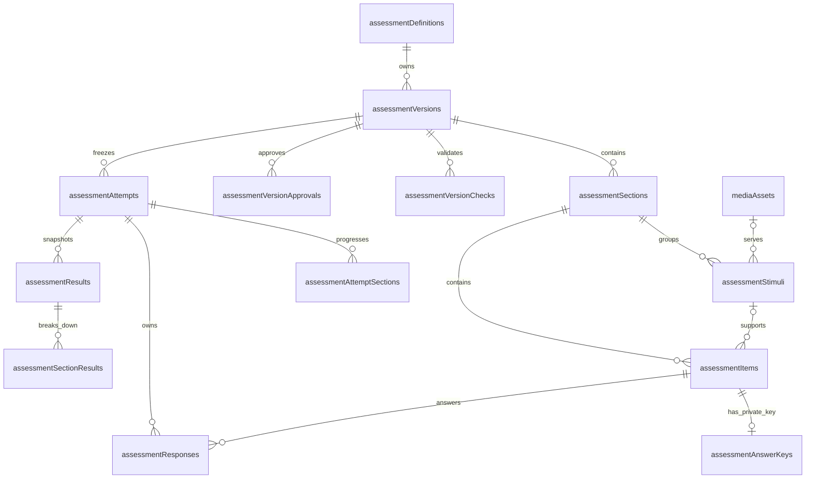
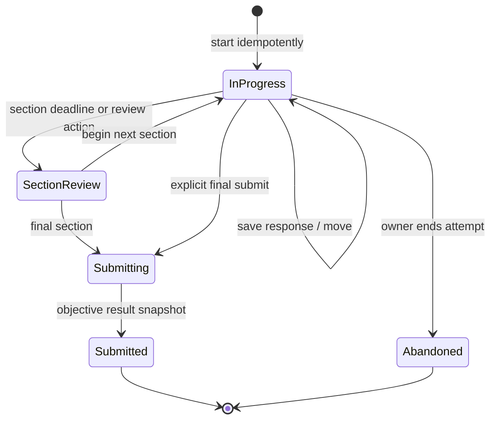
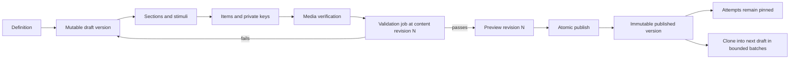

# Assessment Lab and Club Quiz Technical Architecture

> Historical baseline (25 August 2026): its three-section profile remains the legacy raw-objective path. The additive four-skill profile, fixed-form estimate model, and current route contract are documented in [`PRACTICE-IBT-IMPLEMENTATION.md`](PRACTICE-IBT-IMPLEMENTATION.md). All security, rights, trademark, calibration, accessibility, and release gates below remain applicable.

Status: implementation plan; no application source changed
Date: 25 August 2026
Target stack: Next.js 16.3.2, React 19, Convex cloud, Cloudflare R2
Runtime constraint: the existing server on port `3987` must not be stopped, restarted, or killed

## 1. Outcome

Add a public English Club practice area with:

- one complete, original ITP Level 1-aligned practice assessment;
- short Listening, Structure & Written Expression, and Reading quizzes;
- one short, untimed quiz about verified English Club programs on Home;
- resumable attempts, immutable assessment versions, bounded data access, accessible audio, and an admin authoring/review workflow;
- raw practice results that never claim official TOEFL, CEFR, admission, or placement equivalence without a validated and licensed scoring study.

The first release is **English Club Assessment Lab**, not a copy of an ETS test. The public navigation may use `TOEFL® test preparation` only after trademark review. Until that gate passes, use `Assessment Lab`. The canonical route is `/practice`; no route slug, product name, logo, or social handle contains an ETS trademark.

## 2. Evidence, ambiguity, and product gates

### 2.1 What the official sources establish

- The TOEFL iBT format effective 21 January 2026 covers Reading, Listening, Writing, and Speaking; it is adaptive and reports four section scores plus an overall score on a 1–6 scale. The requested three-skill product therefore cannot be represented as a complete current TOEFL iBT test. Source: [ETS TOEFL iBT test content and structure](https://www.ets.org/content/ets-org/language-master/in/home/toefl/institutions/ibt/about/content-structure.html).
- TOEFL ITP Level 1 and Level 2 use Listening Comprehension, Structure and Written Expression, and Reading Comprehension. `Written Expression` is multiple-choice grammar recognition, not an authored essay task. Source: [ETS TOEFL ITP test content](https://www.ets.org/toefl/itp/test-content.html).
- ETS converts correct-answer counts to its own scaled scores. That conversion is not derivable from a locally authored quiz. Source: [ETS TOEFL ITP scoring](https://www.ets.org/toefl/itp/scoring.html).
- ETS states that TOEFL materials are copyright protected, third-party web posting is not licensed by default, TOEFL names are registered trademarks, ETS logos may not be reproduced, and product references require its informational-use rules. Source: [ETS TOEFL licensing policy](https://www.ets.org/legal/permissions/licensing.html).
- Cloudflare R2 presigned URLs work on the S3 API domain, not an R2 custom domain. They are bearer credentials and must be short-lived. Browser use requires exact CORS configuration. Sources: [R2 presigned URLs](https://developers.cloudflare.com/r2/api/s3/presigned-urls/) and [R2 CORS](https://developers.cloudflare.com/r2/buckets/cors/).
- WCAG requires keyboard access, an equivalent for prerecorded audio-only content, and adjustable timing unless an exception applies. WCAG requires a stop, pause, or volume control when audio starts automatically and continues for more than three seconds. This project chooses the stronger and simpler product rule that audio never starts automatically. Sources: [WCAG 2.2](https://www.w3.org/TR/WCAG22/), [prerecorded audio-only guidance](https://www.w3.org/WAI/WCAG22/Understanding/audio-only-and-video-only-prerecorded), and [timing guidance](https://www.w3.org/WAI/WCAG22/Understanding/timing-adjustable.html).
- Convex cursor pagination is the correct scalable list primitive. Component calls remain within the caller transaction, but authentication must be performed in the application before calling a component. Sources: [Convex paginated queries](https://docs.convex.dev/database/pagination) and [Convex components](https://docs.convex.dev/components/using).

### 2.2 Assumptions used by this plan

| ID | Assumption | Recommended safe default | Consequence if changed |
| --- | --- | --- | --- |
| A-01 | The club wants practice and self-evaluation, not an official ETS administration. | Use original EC-authored content and `Practice result` wording. | A licensed official administration needs a different legal, proctoring, scoring, and data contract. |
| A-02 | The requested `Writing` slot means the objective ITP-aligned section. | Publicly label it `Structure & Written Expression`; productive writing is post-MVP and never part of this result. | Adding authored writing later requires its own construct, privacy, review, and result contract. |
| A-03 | Home and short quizzes do not require a named account. | Home stays local; a stored language attempt obtains an invisible Convex Auth Anonymous identity only when Start is pressed. | If anonymous auth is rejected, short quizzes stay local and a stored full attempt requires an account. Do not invent a fingerprint. |
| A-04 | Full practice attempts should resume across refreshes on the same browser. | Use the existing Convex Auth stack with the Anonymous provider and server-derived `tokenIdentifier`; offer account linking only after a deletion flow exists. | Cross-device history requires public accounts and an account-linking policy. |
| A-05 | Admins already use Convex Auth and `adminUsers`. | Extend the existing permission map with assessment permissions. | A second admin identity system is prohibited. |
| A-06 | Unpublished assessment media must remain private; published practice media is public content. | Keep drafts and source masters in a private R2 bucket. Copy only reviewed immutable delivery derivatives to `r2.mukhtada.my.id` at publication. | If no private bucket exists, block confidential draft upload; do not treat random public keys as access control. |
| A-07 | The Home programme quiz must be factually grounded. | Publish only when reviewed CMS facts support 4–6 honest questions. | Until then, show a normal link to Activities; do not fill the quiz with invented programmes. |
| A-08 | No proctoring, webcam, microphone, or anti-cheat surveillance is requested. | Do not collect them. | Adding any of them requires a separate privacy, consent, accessibility, and threat-model project. |

### 2.3 Unresolved product choices

These do not change the MVP construct, but they block public content or operations:

1. Which named people approve academic quality, rights, accessibility, and publication?
2. Does the owner approve 7-day abandoned-attempt and 90-day completed-attempt retention?
3. Is a tested anonymous Convex Auth account/session cleanup path available, or will orphan anonymous auth rows be retained without personal data?
4. May the public product use `TOEFL® test preparation` under ETS informational-use rules, and what notice has legal approval?
5. What verified English Club programme facts may be used in the Home quiz?
6. Is a private R2 draft bucket and least-privilege credential available?

Safe defaults are specified throughout this document so implementation can proceed without fabricating answers.

## 3. Information architecture and routes

### 3.1 Public navigation

Add one top-level `Assessment Lab` item between `Activities` and `Members`. After trademark approval, its informational label may become `TOEFL® test preparation`. One reusable menu model feeds desktop and mobile navigation.

```text
Home
About
Activities
Assessment Lab
  Overview
  Full practice assessment
  Quick Listening quiz
  Quick Structure & Written Expression quiz
  Quick Reading quiz
Members
Journal
Join
```

The desktop control is a button-backed disclosure or Radix Navigation Menu, not a hover-only menu and not a native `<select>`. The phone dialog renders `TOEFL` as an expandable group. Its button has `aria-expanded`, `aria-controls`, a Heroicon chevron, and a 44px minimum target. Escape closes the group before closing the parent navigation dialog. Every child remains an ordinary Next `Link`.

### 3.2 Public route map

| Route | Purpose | Rendering | Indexing |
| --- | --- | --- | --- |
| `/practice` | Clear description of the practice offer, format disclosure, short-quiz links, complete-assessment link | Server Component with one small interactive progress/history island | index, canonical |
| `/practice/full` | Requirements, section summary, timing, privacy, accessibility modes, start/resume | Server shell + Client start control | index, canonical |
| `/practice/quick/listening` | Short Listening quiz entry and player | Server metadata + Client player | index, canonical |
| `/practice/quick/structure` | Short Structure & Written Expression entry and player | Server metadata + Client player | index, canonical |
| `/practice/quick/reading` | Short Reading quiz entry and player | Server metadata + Client player | index, canonical |
| `/practice/attempt/[attemptId]` | Owned full or short attempt player | Auth-aware Server boundary + Client player | `noindex, nofollow`, no canonical attempt URL |
| `/practice/result/[attemptId]` | Owned result, review, and next action | Auth-aware Server boundary + selective Client review controls | `noindex, nofollow` |
| `/practice/history` | Optional account history; anonymous users see only the current browser identity's retained attempts | Server shell + cursor-paginated Client list | `noindex, nofollow` |
| `/` | Existing Home plus the EC programme quiz module | Existing Server page + isolated Client quiz | canonical remains `/` |

Unknown, forbidden, expired, or other-user attempt IDs all render the same `Attempt unavailable` response. Do not expose whether an ID exists.

### 3.3 Admin route map

| Route | Permission | Purpose |
| --- | --- | --- |
| `/admin/assessments` | `assessment:read` | Cursor-paginated catalog with status filters |
| `/admin/assessments/new` | `assessment:read` | Compatibility redirect to the fixed-format catalogue; no creation workflow |
| `/admin/assessments/[assessmentId]` | `assessment:read` | Fixed format, current working revision, Question Bank eligibility, aggregate flags, published pointer, validation rail |
| `/admin/assessments/[assessmentId]/sections/[sectionId]` | `assessment:edit` | Section/stimulus/item authoring |
| `/admin/assessments/[assessmentId]/versions/[versionId]` | `assessment:read` | Read-only immutable version or mutable draft when authorized |
| `/admin/assessments/[assessmentId]/preview` | `assessment:read` | Authenticated `no-store`, `noindex` player preview |
| `/admin/assessment-media` | `media:read` | Paginated image/audio media library |
| `/admin/assessment-analytics` | `assessment:read` | Aggregate day/assessment metrics only |

Admin design inherits the established rounded, operational neobrutalist system. The player remains part of the public brand system and must not inherit admin tokens.

## 4. Server and Client Component boundaries

Next 16 pages and layouts remain Server Components by default. `'use client'` begins at the smallest component needing state, event handlers, Web Audio/media APIs, timers, local storage, or Convex React hooks.

### 4.1 Boundary map

| Unit | Boundary | Responsibility |
| --- | --- | --- |
| `src/app/(site)/practice/layout.tsx` | Server | Metadata shell and static explanation inside the existing public route group; no secrets |
| `src/app/(site)/practice/page.tsx` | Server | Fetch published catalog summaries through server-only adapter; render complete HTML links |
| `src/app/(site)/practice/full/page.tsx` | Server | Resolve published definition summary and safe fallback; pass serializable start DTO |
| `src/app/(site)/practice/quick/[skill]/page.tsx` | Server | Validate route skill, fetch the published short quiz, render start shell |
| `src/app/(site)/practice/attempt/[attemptId]/page.tsx` | Server | Validate param, render generic error boundary, pass ID only to owned Client query; never fetch R2 credentials |
| `AssessmentStartPanel` | Client | Anonymous sign-in readiness, mode choice, start/resume mutation, conflict and rate-limit feedback |
| `AssessmentPlayer` | Client | Current item state, navigation, autosave, timer display, retry state, keyboard shortcuts that do not capture typing |
| `AssessmentTimer` | Client | Derive visual remaining time from the current section's server-issued deadline; never authorize submission |
| `ListeningStimulus` | Client | Render reviewed immutable public audio after intentional Play, show load recovery and transcript policy |
| `ReadingStimulus` | Server-compatible presentational child | Semantic article/passage markup from the owned Player DTO |
| `ChoiceQuestion`, `ClozeQuestion`, `SentenceBuildQuestion` | Client | Controlled input and accessible validation; no scoring key |
| `AttemptResult` | Server shell + small Client islands | Owned result DTO, expandable explanations, retry link |
| `HomeProgramQuiz` | Client | Five-item maximum, untimed, no persistent response record |
| admin pages/layout | Server | Auth/navigation gate and static shell; not the security authority |
| admin editors | Client | Convex mutations, optimistic revision, media upload, unsaved-change warning |
| `src/lib/assessment-server.ts` | server-only module | Server fetch adapters and DTO mapping; import `server-only` |

### 4.2 Hydration and resilience rules

- Server HTML always states the assessment purpose, skill, approximate duration policy, privacy policy, and a route back to `/practice`.
- A player skeleton has fixed geometry. It does not show a fake question before ownership resolves.
- No content is hidden until an entrance animation completes.
- Network loss keeps the current response in local memory and a same-attempt local backup. It never marks the response saved until the mutation returns.
- Local storage may contain an attempt ID, response draft, and client mutation ID. It must not contain answer keys, R2 signed URLs, admin JWTs, official-score claims, or email addresses.
- `use client` must not be placed on the TOEFL layout or whole route tree; that would send authored catalog content and unnecessary JS to every page.

## 5. Assessment domain model

### 5.1 Core invariants

1. An `assessmentDefinition` is a stable identity and slug.
2. An `assessmentVersion` is a draft until published. A published version and every child item are immutable.
3. An attempt always points to one version. Publishing a later version cannot change an in-progress or completed attempt.
4. Answer keys are stored separately and never returned by a public query.
5. Every public list is paginated or has a documented hard maximum.
6. Every child write increments `assessmentVersions.contentRevision` in the same transaction.
7. Validation records the exact `contentRevision`. Publish succeeds only when `validatedRevision === contentRevision` and all blocking checks passed.
8. Media object keys are immutable. Replacing audio creates a new R2 key and media row.
9. A browser never supplies an owner ID, reviewer ID, score, deadline, or publication actor for authority. Those values come from `ctx.auth`, server time, answer keys, or the authorized admin record.
10. Productive writing, speaking, adaptive routing, and automatic proficiency scoring are outside the MVP schema.

### 5.2 Assessment profiles

The MVP supports two profiles. Other TOEFL families are research notes, not selectable runtime values:

| Profile | Skills | Timing/scoring default | Public wording |
| --- | --- | --- | --- |
| `ec-itp-level-1-aligned-v1` | Listening, Structure/Written Expression, Reading | 50 + 40 + 50 objective items; 35 + 25 + 55 minutes; raw results only | `Full practice assessment` |
| `club-program-v1` | club knowledge/wayfinding | untimed, feedback only, no ranking | `Find your way into English Club` |

Current iBT-inspired, ITP Level 2-aligned, productive Writing, and Speaking profiles require later construct and legal decisions. They must not be added as dormant public options in the MVP.

## 6. Convex validator catalog

Define these once in `convex/assessmentValidators.ts` and derive DTO validators with `.pick`, `.omit`, `.extend`, or `.partial` where supported.

```ts
assessmentKind = "full-practice" | "skill-quiz" | "club-program-quiz"
assessmentProfile =
  | "ec-itp-level-1-aligned-v1"
  | "club-program-v1"
assessmentVisibility = "draft" | "published" | "retired"
assessmentVersionStatus =
  | "draft"
  | "cloning"
  | "validating"
  | "ready"
  | "published"
  | "retired"
  | "clone-failed"
assessmentSkill = "listening" | "structure" | "reading"
timePolicy = "untimed" | "whole-assessment" | "per-section"
reviewPolicy = "none" | "after-section" | "after-submit"
scorePolicy = "feedback-only" | "raw-objective"
audioReplayPolicy = "unlimited" | "once" | "twice"
stimulusKind = "reading" | "audio" | "image"
itemType =
  | "single-choice"
  | "multiple-select"
  | "cloze-select"
  | "sentence-build"
attemptOwnerKind = "anonymous" | "account"
timingMode = "standard" | "extended" | "untimed"
listeningMode = "audio-primary" | "transcript-supported"
attemptStatus =
  | "in-progress"
  | "section-review"
  | "submitting"
  | "submitted"
  | "abandoned"
responseKind = "choice" | "multi-choice" | "cloze" | "token-order"
resultStatus = "final" | "adjusted"
mediaAccess = "public" | "assessment-private"
versionCheckStatus = "pending" | "running" | "passed" | "failed"
```

Handler-level bounds are mandatory because Convex array and string validators do not express these product maxima:

| Value | Bound |
| --- | ---: |
| sections per version | 1–8 |
| items per version | 1–200 |
| items per short quiz | 3–12 |
| items per Home programme quiz | 4–6 |
| options per choice item | 2–8 |
| selected choices | 0–8 |
| cloze gaps per item | 1–12 |
| options per cloze gap | 2–8 |
| sentence tokens | 2–30 |
| stimulus body | 50,000 characters |
| item prompt | 4,000 characters |
| explanation/feedback | 4,000 characters |
| section instructions | 4,000 characters |
| whole-assessment time limit | 60–10,800 seconds |
| per-section time limit | 60–7,200 seconds |
| private draft assessment audio | at most 25 MiB and 15 minutes |
| catalog page | exactly 12 |
| admin definition page | exactly 20 |
| attempt history page | exactly 10 |
| review queue page | exactly 20 |
| analytics day range | 1–93 days |

Reject non-finite numbers, negative time limits, duplicate order values, duplicate option keys, invalid foreign-version relationships, and control characters in slugs/keys in handlers.

## 7. Full Convex schema

All functions use object form with explicit `args` and `returns` validators. All IDs use `v.id(tableName)`. New fields on currently populated tables are optional for the first deployment.

### 7.1 Stable definitions and immutable versions

#### `assessmentDefinitions`

| Field | Validator | Notes |
| --- | --- | --- |
| `slug` | `v.string()` | lowercase kebab-case, unique, 3–96 chars |
| `kind` | `assessmentKindValidator` | stable product family |
| `profile` | `assessmentProfileValidator` | prevents accidental format mixing |
| `adminTitle` | `v.string()` | 5–180 chars |
| `publishedVersionId` | `v.optional(v.id("assessmentVersions"))` | public pointer |
| `draftVersionId` | `v.optional(v.id("assessmentVersions"))` | one active draft |
| `nextVersion` | `v.number()` | integer counter; no history count scan |
| `visibility` | `assessmentVisibilityValidator` | route visibility |
| `createdBy`, `updatedBy` | `v.id("adminUsers")` | server-derived actor |
| `createdAt`, `updatedAt` | `v.number()` | mutation time |

Indexes:

- `by_slug` on `slug`;
- `by_kind_and_visibility_and_updated_at` on `kind, visibility, updatedAt`;
- `by_visibility_and_updated_at` on `visibility, updatedAt`.

#### `assessmentVersions`

| Field | Validator | Notes |
| --- | --- | --- |
| `definitionId` | `v.id("assessmentDefinitions")` | parent |
| `version` | `v.optional(v.number())` | assigned on publish |
| `status` | `assessmentVersionStatusValidator` | immutable after published/retired |
| `title`, `summary`, `instructions` | `v.string()` | learner-facing authored copy |
| `locale` | `v.string()` | start with `en`; supporting Indonesian copy belongs in separate content entries later |
| `timePolicy` | `timePolicyValidator` | timed mode |
| `totalTimeLimitSeconds` | `v.optional(v.number())` | only whole-assessment |
| `allowResume` | `v.boolean()` | resume never pauses server deadline |
| `reviewPolicy` | `reviewPolicyValidator` | when explanations appear |
| `scorePolicy` | `scorePolicyValidator` | no arbitrary formula string |
| `defaultTimingMode` | `timingModeValidator` | standard, extended, or untimed |
| `defaultListeningMode` | `listeningModeValidator` | audio-primary or transcript-supported |
| `maxAttemptsPerDay` | `v.number()` | integer 1–20, enforced by rate limiter |
| `contentRevision` | `v.number()` | increments on each child change |
| `validatedRevision` | `v.optional(v.number())` | must equal contentRevision to publish |
| `contentChecksum` | `v.optional(v.string())` | server-generated validation digest |
| `createdBy` | `v.id("adminUsers")` | actor |
| `publishedBy` | `v.optional(v.id("adminUsers"))` | actor |
| `createdAt`, `updatedAt` | `v.number()` | mutation time |
| `publishedAt` | `v.optional(v.number())` | publication time |

Indexes:

- `by_definition_id_and_version` on `definitionId, version`;
- `by_definition_id_and_status_and_updated_at` on `definitionId, status, updatedAt`;
- `by_status_and_published_at` on `status, publishedAt`.

#### `assessmentVersionChecks`

| Field | Validator | Notes |
| --- | --- | --- |
| `versionId` | `v.id("assessmentVersions")` | one current check per revision |
| `contentRevision` | `v.number()` | stale check cannot publish |
| `status` | `versionCheckStatusValidator` | job state |
| `blockingCount`, `warningCount` | `v.number()` | bounded integers |
| `reportJson` | `v.string()` | normalized server report, max 100KB; admin-only |
| `startedBy` | `v.id("adminUsers")` | actor |
| `startedAt` | `v.number()` | job start |
| `finishedAt` | `v.optional(v.number())` | terminal job time |

Indexes:

- `by_version_id_and_content_revision` on `versionId, contentRevision`;
- `by_status_and_started_at` on `status, startedAt`.

Automated validation does not replace human approval.

#### `assessmentVersionApprovals`

| Field | Validator | Notes |
| --- | --- | --- |
| `versionId` | `v.id("assessmentVersions")` | reviewed version |
| `contentRevision` | `v.number()` | stale approval cannot publish |
| `reviewType` | `assessmentReviewTypeValidator` | academic, rights, accessibility, or bias |
| `decision` | `assessmentReviewDecisionValidator` | approved, changes-requested, or rejected |
| `reviewerId` | `v.id("adminUsers")` | server-derived actor |
| `note` | `v.string()` | bounded reviewer rationale |
| `createdAt` | `v.number()` | immutable decision time |

Indexes:

- `by_version_id_and_content_revision_and_review_type_and_created_at` on `versionId, contentRevision, reviewType, createdAt`;
- `by_reviewer_id_and_created_at` on `reviewerId, createdAt` for the reviewer's paginated queue/history.

Publication reads the newest decision for each review type at the exact current
`contentRevision` and requires all four to be approved. The academic approver
must differ from every item author in that version. A child edit increments the
revision, making every earlier approval stale. This is the auditable rights
boundary missing from an automated report alone.

### 7.2 Sections, stimuli, items, and private keys

#### `assessmentSections`

| Field | Validator | Notes |
| --- | --- | --- |
| `versionId` | `v.id("assessmentVersions")` | immutable parent after publish |
| `sectionKey` | `v.string()` | stable within version |
| `skill` | `assessmentSkillValidator` | exact skill |
| `order` | `v.number()` | integer 0–7, unique within version |
| `title`, `instructions` | `v.string()` | public content |
| `timeLimitSeconds` | `v.optional(v.number())` | required only for per-section timing |
| `audioReplayPolicy` | `v.optional(audioReplayPolicyValidator)` | listening only |
| `itemCount` | `v.number()` | denormalized, updated with item writes |

Indexes:

- `by_version_id_and_order` on `versionId, order`;
- `by_version_id_and_section_key` on `versionId, sectionKey`.

#### `assessmentStimuli`

| Field | Validator | Notes |
| --- | --- | --- |
| `versionId` | `v.id("assessmentVersions")` | relationship check on every item link |
| `sectionId` | `v.id("assessmentSections")` | same version required |
| `stimulusKey` | `v.string()` | unique within version |
| `kind` | `stimulusKindValidator` | reading/audio/image |
| `order` | `v.number()` | deterministic authoring order |
| `title` | `v.optional(v.string())` | optional learner title |
| `body` | `v.optional(v.string())` | reading content, not arbitrary HTML |
| `mediaId` | `v.optional(v.id("mediaAssets"))` | ready asset with matching kind/access |
| `transcript` | `v.optional(v.string())` | returned only by transcript policy |
| `alt` | `v.optional(v.string())` | required for meaningful image |
| `provenanceJson` | `v.string()` | bounded source-of-facts and rights ledger; admin only |
| `authoredBy` | `v.id("adminUsers")` | server-derived author |
| `createdAt`, `updatedAt` | `v.number()` | mutation time |

Indexes:

- `by_section_id_and_order` on `sectionId, order`;
- `by_version_id_and_stimulus_key` on `versionId, stimulusKey`.

#### `assessmentItems`

`assessmentItems` is a discriminated union derived from a shared base:

```ts
base = {
  versionId: v.id("assessmentVersions"),
  sectionId: v.id("assessmentSections"),
  stimulusId: v.optional(v.id("assessmentStimuli")),
  sourceContentVersionId: v.optional(v.id("siteContentVersions")),
  itemKey: v.string(),
  order: v.number(),
  prompt: v.string(),
  required: v.boolean(),
  explanation: v.optional(v.string()),
  provenanceJson: v.string(),
  authoredBy: v.id("adminUsers"),
  createdAt: v.number(),
  updatedAt: v.number(),
}
```

`sourceContentVersionId` is required for every `club-program-v1` item and
forbidden for the assessment profiles that do not quiz club facts. It pins the
question to immutable reviewed CMS copy instead of a mutable label.

Branches:

| Type | Extra fields | Handler bounds |
| --- | --- | --- |
| `single-choice` | `options: [{ key, label }]` | 2–8 unique keys; one key in private answer row |
| `multiple-select` | `options: [{ key, label }]`, `selectionMin`, `selectionMax` | 2–8 options; min/max valid |
| `cloze-select` | `stemParts: string[]`, `gaps: [{ key, options }]` | 1–12 gaps; 2–8 options each; arrays remain bounded |
| `sentence-build` | `tokens: [{ key, label }]` | 2–30 unique tokens; no drag-only interaction |

Indexes:

- `by_section_id_and_order` on `sectionId, order`;
- `by_version_id_and_item_key` on `versionId, itemKey`;
- `by_version_id_and_order` on `versionId, order` for validation batches.

The bounded option/token arrays are intentional. They cannot grow independently, are rewritten only while a draft is edited, and remain far below Convex document/array limits. Attempt responses remain separate high-churn rows. Every MVP item is worth one question; weighted points are forbidden so `correct / total` always means questions, not hidden weights.

#### `assessmentAnswerKeys`

Admin/internal only. One row per objective item.

| Field | Validator | Notes |
| --- | --- | --- |
| `versionId` | `v.id("assessmentVersions")` | duplicated for bounded validation |
| `itemId` | `v.id("assessmentItems")` | unique |
| `kind` | union of `choice`, `multi-choice`, `cloze`, `token-order` | must match item type |
| `correctChoiceKeys` | optional bounded string array | choice/multi-choice |
| `correctGapAnswers` | optional bounded object array | cloze |
| `acceptedTokenOrders` | optional array of bounded arrays | at most 5 accepted orders |
| `scoringMode` | `exact` or `all-or-nothing` | partial credit is a later, explicit policy |

Indexes:

- `by_item_id` on `itemId` with `.unique()` reads;
- `by_version_id_and_item_id` on `versionId, itemId` for validation batches.

### 7.3 Attempts and responses

#### `assessmentAttempts`

| Field | Validator | Notes |
| --- | --- | --- |
| `versionId`, `definitionId` | corresponding IDs | immutable version ownership |
| `ownerTokenIdentifier` | `v.string()` | from `ctx.auth`; never returned publicly |
| `ownerKind` | `attemptOwnerKindValidator` | derived from auth user `isAnonymous` profile |
| `startRequestId` | `v.string()` | idempotent start key generated client-side |
| `timingMode` | `timingModeValidator` | standard, extended, or untimed |
| `timeMultiplier` | `v.number()` | finite approved value; 1 for standard/untimed |
| `listeningMode` | `listeningModeValidator` | independent from timing choice |
| `status` | `attemptStatusValidator` | lifecycle |
| `revision` | `v.number()` | optimistic attempt state |
| `startedAt`, `lastActivityAt` | `v.number()` | server mutation time |
| `submittedAt` | optional number | lifecycle |
| `currentSectionOrder`, `currentItemOrder` | numbers | bounded progress |
| `submitRequestId` | `v.optional(v.string())` | idempotent submit |
| `currentResultId` | `v.optional(v.id("assessmentResults"))` | latest immutable snapshot |
| `resultRevision` | `v.number()` | snapshot counter |

Indexes:

- `by_owner_token_identifier_and_started_at` on `ownerTokenIdentifier, startedAt`;
- `by_owner_token_identifier_and_status_and_started_at` on `ownerTokenIdentifier, status, startedAt` for resumable lookup;
- `by_owner_token_identifier_and_start_request_id` on `ownerTokenIdentifier, startRequestId`;
- `by_version_id_and_started_at` on `versionId, startedAt` for bounded aggregate jobs only;
- `by_status_and_last_activity_at` on `status, lastActivityAt` for scheduled cleanup.

Do not index email, IP address, user agent, screen size, or device fingerprint because none are stored.

#### `assessmentAttemptSections`

| Field | Validator | Notes |
| --- | --- | --- |
| `attemptId`, `sectionId` | IDs | owned relationship |
| `order` | `v.number()` | section order |
| `status` | `not-started`, `in-progress`, `review`, `completed` | materialized state |
| `startedAt`, `deadlineAt`, `completedAt` | optional numbers | server-derived |
| `elapsedSeconds` | `v.number()` | server-derived and frozen on completion |
| `answeredCount`, `flaggedCount` | numbers | transactionally maintained counters |

Indexes: `by_attempt_id_and_order`; `by_attempt_id_and_section_id`.

#### `assessmentResponses`

High-churn data is separated from attempt metadata. This table is a discriminated union by `kind`.

Common fields:

- `attemptId`, `versionId`, `sectionId`, `itemId` as typed IDs;
- `kind` from `responseKindValidator`;
- `clientRevision` and `lastMutationId` for optimistic concurrency/idempotency;
- `flagged`, `createdAt`, and `updatedAt`;

Payload branches:

- choice: `selectedChoiceKey: v.optional(v.string())`;
- multi-choice: `selectedChoiceKeys: v.array(v.string())`, maximum 8;
- cloze: `gapAnswers: [{ gapKey, choiceKey }]`, maximum 12;
- token-order: `tokenOrder: v.array(v.string())`, maximum 30;

Indexes:

- `by_attempt_id_and_item_id` on `attemptId, itemId`, read with `.unique()`;
- `by_attempt_id_and_section_id_and_item_id` on `attemptId, sectionId, itemId`;
- `by_attempt_id_and_updated_at` on `attemptId, updatedAt` for bounded recovery/debug reads.

### 7.4 Immutable results

#### `assessmentResults`

Each row is an immutable result snapshot. A later item invalidation inserts an adjusted snapshot rather than rewriting history.

| Field | Validator | Notes |
| --- | --- | --- |
| `attemptId`, `versionId` | IDs | relationship |
| `revision` | `v.number()` | starts at 1 |
| `status` | `resultStatusValidator` | final or adjusted |
| `correct`, `possible`, `omitted` | `v.number()` | raw question counts only |
| `supersedesResultId` | `v.optional(v.id("assessmentResults"))` | prior snapshot for an adjustment |
| `adjustmentReason` | `v.optional(v.string())` | bounded admin-reviewed reason |
| `completedAt` | `v.number()` | snapshot time |
| `claimContract` | `v.literal(1)` | result wording contract version |

Indexes: `by_attempt_id_and_revision`; `by_version_id_and_completed_at` for internal aggregate jobs.

#### `assessmentSectionResults`

| Field | Validator | Notes |
| --- | --- | --- |
| `resultId`, `sectionId` | IDs | immutable snapshot child |
| `skill` | `assessmentSkillValidator` | display grouping |
| `correct`, `possible`, `omitted` | numbers | raw question counts |
| `answeredCount`, `itemCount` | numbers | completion context |
| `elapsedSeconds` | number | copied from frozen section state |

Indexes: `by_result_id_and_section_id`; `by_result_id`.

### 7.5 Aggregate analytics

#### `assessmentDailyMetrics`

| Field | Validator | Notes |
| --- | --- | --- |
| `dateUtc` | `v.string()` | `YYYY-MM-DD` |
| `definitionId`, `versionId` | IDs | aggregate scope |
| `started`, `submitted` | numbers | counters |
| `extendedStarted`, `untimedStarted`, `transcriptSupportedStarted` | `v.number()` | aggregate mode use, no person link |
| `audioStartFailures` | `v.number()` | operational signal |
| `saveFailures`, `expiredAttempts` | numbers | reliability signals |

Indexes: `by_definition_id_and_version_id_and_date_utc` for the exact counter row; `by_definition_id_and_date_utc` for admin ranges; `by_version_id_and_date_utc`; `by_date_utc`.

This table is post-MVP. A single daily row is a write-contention point, so do not add it until traffic evidence justifies analytics. When added, use a sharded counter or another contention-safe component and update it in the same transition as its source. Do not emit one event row per click, play, pause, option hover, scroll, or keystroke.

### 7.6 Existing tables and validators to extend

`mediaAssets` is populated, so add only optional fields in the first deployment:

- add media purposes `assessment-audio` and `assessment-image`;
- add content types `audio/mpeg`, `audio/mp4`, `audio/ogg`, and `audio/webm` only after browser support testing;
- add `access: v.optional(mediaAccessValidator)` and treat old rows as `public`;
- add `durationMs`, `checksumSha256`, and `assessmentVersionId` as optional;
- add index `by_access_and_status_and_updated_at`;
- add index `by_assessment_version_id_and_status_and_updated_at` after the optional field deploy; stage it if the table is already large.

Extend existing admin contracts:

- permissions: `assessment:read`, `assessment:edit`, `assessment:publish`, `assessment:review`;
- CMS area: `assessment`;
- audit actions: `validate`, `clone`, `retire`, `claim`, `review`, `submit` where appropriate.

Audit summaries contain stable labels and IDs, never learner response text or signed URLs.

## 8. Relationship map



## 9. Query, mutation, and action contracts

### 9.1 Public and attempt queries

| Function | Auth | Read path and bound | Return |
| --- | --- | --- | --- |
| `assessments.listPublished` | none | definitions `by_visibility_and_updated_at` with `visibility = published`; `.paginate()` exactly 12 | public catalog cards only |
| `assessments.getPublishedBySlug` | none | definition `by_slug.unique`, then direct published version | public entry summary, no children/keys |
| `assessmentAttempts.resumeCandidate` | auth identity | attempts `by_owner_token_identifier_and_status_and_started_at`; `.take(1)` for each resumable status | latest resumable summary or null |
| `assessmentAttempts.getPlayer` | auth identity | direct attempt; assert owner; direct current section; item `by_section_id_and_order` with equality on both fields and `.unique()` | one current Player DTO, saved response, no keys/credit |
| `assessmentAttempts.getResult` | auth identity | direct attempt; assert owner; direct result; section results `by_result_id.take(9)` | result DTO with claim-safe wording |
| `assessmentAttempts.listMine` | auth identity | `by_owner_token_identifier_and_started_at.paginate()` exactly 10 | history cards |
| `assessmentReviews.getItemReview` | auth identity | owned attempt/item/response, only after policy permits | prompt, response, explanation, correct answer for objective items |

No query reads `Date.now()`. Player queries return the stored current-section deadline; the client computes its display. Mutations and scheduled functions enforce section closure.

### 9.2 Attempt mutations

#### `assessmentAttempts.start`

- Args: `{ definitionId, versionId, timingMode, timeMultiplier, listeningMode, startRequestId }`.
- Identity: require Convex Auth identity; anonymous provider is allowed.
- Rate limit: use `@convex-dev/rate-limiter`, keyed by `identity.tokenIdentifier`, plus a global ceiling.
- Validate the definition's current published pointer equals `versionId` unless resuming an older valid in-progress attempt.
- Reuse the attempt found by `by_owner_token_identifier_and_start_request_id` for retries.
- Compute `startedAt` on the server. Do not start the first section clock on the briefing page.
- Insert section-progress rows; section count is capped at 8.
- Return `{ attemptId, status, firstSectionOrder }`.

`assessmentAttempts.beginSection` computes that section's deadline from the
published duration, selected timing mode, and approved multiplier. It schedules
`internal.assessmentAttempts.finalizeSection` with the exact expected deadline.
The job completes only that section. It opens the next section intro, or submits
the attempt when the last section ends.

#### `assessmentResponses.save`

- Args: `{ attemptId, itemId, response, expectedClientRevision, mutationId, flagged }`.
- Assert server identity owns attempt, version matches item, attempt/section are open, and server time has not passed the current section deadline.
- If the deadline has passed, run the same section finalizer and return a typed `section_closed` result instead of accepting the response.
- Normalize and bound the discriminated response.
- Same `mutationId` plus same normalized payload returns the existing response. Reusing it with a different payload is rejected.
- A stale `expectedClientRevision` returns a typed conflict; it does not overwrite.
- Update response and section counters in one transaction.
- Return saved revision and server timestamp. Do not read a key or compute correctness in the hot save path.

#### `assessmentAttempts.move`

- Args: `{ attemptId, sectionOrder, itemOrder, expectedRevision }`.
- Assert ownership and valid order; update only bounded progress metadata.
- Reject backward section movement when the published review policy forbids it.
- Return new revision.

#### `assessmentAttempts.submit`

- Args: `{ attemptId, submitRequestId, expectedRevision }`.
- Same submit request on an already closed attempt returns the existing result pointer.
- Assert ownership; transition `in-progress -> submitting` and finalize objective result without client scores.
- Read responses by `attemptId` with `.take(201)`; version max is 200. A 201st row is a data-integrity failure.
- Read private keys internally and compute each one-question credit during finalisation. Reject any key/item relationship mismatch.
- Insert an immutable result and section-result rows.
- Set attempt to `submitted` and return the existing result for any later retry.
- Analytics counters are deferred until a contention-safe implementation is approved.

#### `internal.assessmentAttempts.finalizeSection`

- Args: `{ attemptId, sectionId, expectedDeadlineAt }`.
- No-op if the attempt/section is closed or the deadline changed.
- Mark the current section complete. Open the next section intro, or call the same pure finalizer as Submit after the final section.
- A queued response received after the server deadline is not counted merely because it carries an earlier client timestamp. Client clocks never grant authority.

### 9.3 Home programme quiz contract

`clubQuiz.getPublished` returns one version with 4–6 items, verified programme facts, feedback, and next links. It may include correct-answer information because it is a no-stakes wayfinding interaction. The MVP evaluates locally so it stores no answer, visitor ID, or per-question event.

If aggregate product analytics are added later, separate idempotent start and
completion mutations accept a random per-visit event ID, retain no answer, and
expire their deduplication rows. They are not part of the assessment result.

Content conditions:

- every question links to an immutable, published `siteContentVersion` for a confirmed programme fact;
- an entry becoming unpublished makes the next version fail validation;
- wrong-answer feedback teaches the real programme, never mocks the visitor;
- completion offers one relevant next action, not a score, streak, rank, or badge;
- the module is absent until enough reviewed facts support 4–6 honest questions.

### 9.4 R2 actions

#### Admin upload sequence

1. `assessmentMedia.reserveUpload` mutation requires `media:upload`, validates filename/MIME/size/purpose, creates a `pending` media row and immutable random versioned key.
2. `assessmentMedia.createUploadUrl` Node action requires authenticated admin identity through `ctx.auth`, calls an internal admin lookup, and produces a 300-second presigned PUT on the R2 S3 endpoint.
3. Browser uploads directly with exact signed `Content-Type` and checksum metadata.
4. `assessmentMedia.verifyUpload` Node action rechecks admin auth, performs `HeadObject`, compares length/type/checksum, and calls an internal mutation to mark ready.
5. Audio metadata extraction/validation records duration and rejects files over the initial engineering bound of 25 MiB or 15 minutes. Change that bound only with a documented media/performance review.

Do not adapt the current operator-only `r2.createReviewedImageUploadUrl` into an unauthenticated public action. Add a protected assessment module and preserve the current reviewed-image path.

#### Participant playback

Published practice audio uses an immutable public derivative on
`https://r2.mukhtada.my.id`. The player receives only that allowlisted URL after
Start and fetches it on intentional Play. Draft/source audio remains in the
private bucket and uses a short signed GET only in an authorised admin preview.
Replay policy is an attempt rule, not R2 access control. This removes signed-URL
expiry and CORS renewal failures from the learner path without pretending that
published low-stakes practice items are secret.

### 9.5 Admin authoring contracts

| Function | Permission | Bound/behavior |
| --- | --- | --- |
| `adminAssessments.listPage` | read | status/profile indexed cursor page, exactly 20 |
| `adminAssessments.getWorkspace` | read | direct definition/draft/published IDs; no unbounded children |
| `adminAssessments.create` | edit | stable definition + empty draft, audited |
| `adminAssessments.updateMetadata` | edit | draft only, expected revision |
| `adminAssessmentSections.list` | read | `by_version_id_and_order.take(9)` |
| `adminAssessmentSections.save` | edit | draft only; validates timing and unique order; bumps content revision |
| `adminAssessmentStimuli.list` | read | per section `.take(51)` |
| `adminAssessmentStimuli.save` | edit | draft only; ready media and same-version checks |
| `adminAssessmentItems.listPage` | read | section indexed cursor page, exactly 25 |
| `adminAssessmentItems.save` | edit | discriminated validation; answer key stored through separate protected mutation in same transaction when objective |
| `adminAssessments.clonePublished` | edit | starts bounded Workpool/workflow batches; never clones 200 items in one mutation |
| `adminAssessments.validate` | edit | action/job validates frozen content revision in batches and writes report |
| `adminAssessments.recordApproval` | review | current revision only; server-derived reviewer; audited |
| `adminAssessments.publish` | publish | atomic pointer change only if latest check and four current human approvals pass exact revision |
| `adminAssessments.retire` | publish | removes public pointer safely; existing attempts remain readable |
| `adminAssessmentAnalytics.getRange` | read | max 93 indexed daily rows per definition |

## 10. Anonymous and authenticated identity model

### 10.1 Recommended model

Add the Convex Auth `Anonymous` provider beside the existing Password provider. The browser obtains a JWT-backed identity only when it starts a stored language attempt. Convex functions derive `identity.tokenIdentifier`; no public function accepts `userId`, email, or owner key for authorization. Determine `ownerKind` through the server-side Convex Auth user record (`getAuthUserId(ctx)` plus its `authUsers.isAnonymous` field), not from a client flag or an assumed custom JWT claim.

Convex Auth is beta in the installed stack. Before public launch, test the exact Next.js storage/session path and document deletion or retention of anonymous auth rows. Do not promise account deletion until the auth session/account/user cleanup path is verified against the installed version.

The existing `adminUsers` allowlist remains the only source of admin privilege. An anonymous or password account without an active admin row receives no admin permission.

### 10.2 Privacy rules

- Attempt rows store `tokenIdentifier`, not name or email.
- Do not copy auth email into attempts/results.
- Do not store IP addresses, user agents, canvas hashes, device IDs, microphone/camera data, typing cadence, exact click streams, or scroll position.
- Store only answers needed for result/resume and aggregate operational counters.
- Default retention recommendation: anonymous abandoned attempts 7 days, completed attempts/responses 90 days, and account-linked result summaries 12 months. These are assumptions pending owner approval, not active policy.
- A scheduled deletion process operates in indexed batches and removes responses, section rows, and result snapshots before the parent. It must be rehearsed and documented before activation.
- Provide `Delete this attempt` for the owner. Account history needs `Delete my practice history` as a batched job.
- Public analytics show aggregate counts only. Suppress a day/version cell below a minimum cohort threshold selected by the owner; safe default is 10.

### 10.3 Authorization negative cases

Every test suite must prove:

- anonymous A cannot read, save, submit, or delete anonymous B's attempt;
- authenticated public users cannot call admin functions;
- editors cannot publish or review unless the permission map allows it;
- reviewers cannot change questions or answer keys;
- disabled admins immediately lose query/action/mutation access;
- a direct Convex call cannot get answer keys, unpublished content, transcripts outside policy, or R2 upload URLs.

## 11. Timer, resume, and idempotency lifecycle



- The server stores one deadline per started section. A client timer is presentation only.
- Closing the tab does not pause a standard timed attempt.
- Resume displays the remaining interval from the current section row. If time elapsed, it invokes/follows the idempotent section finalizer and opens the next section intro or result.
- Short quizzes and Home quiz are untimed by default.
- Extended or untimed mode is selected before start; the result identifies it and is never compared to standard attempts. Listening mode remains a separate choice.
- Autosave objective responses immediately and retain a bounded local unsaved queue without auth tokens or answer keys.
- One response row per attempt/item prevents duplicate answers.
- `startRequestId`, response `mutationId`, revision checks, and `submitRequestId` make retries safe under flaky mobile networks.

## 12. Scoring and review contract

### 12.1 Objective items

The backend may compute:

- raw correct questions;
- raw possible questions;
- answered and omitted counts;
- percentage as a UI convenience derived from the raw pair;
- the same raw values per skill/section.

Do not emit an official TOEFL scaled score, TOEFL band, CEFR level, pass/fail, admission recommendation, or “predicted official score” without a documented validation study and approved conversion table. A percentage is not a TOEFL score.

### 12.2 Structure and Written Expression boundary

The MVP section is objective grammar and standard-written-English recognition.
It is not an essay or authored Writing score. `sentence-build` may appear only
as an English Club quick-practice interaction and is reported as one local
question. Productive Writing, human rubric review, and AI feedback remain a
separate post-MVP product with no shared total.

### 12.3 Result states and copy

- `Practice result` — objective raw result available.
- `Extended-time practice result`, `Untimed practice result`, or `Transcript-supported practice result` when those modes were used.

Never use `official`, `certified`, `equivalent`, `guaranteed`, `accurate prediction`, or `valid for admission` in the result UI.

## 13. Audio, transcript, and R2 strategy

### 13.1 Storage boundary

The existing `https://r2.mukhtada.my.id` custom domain serves public brand, journal, and published practice derivatives. It is not a draft or source-master store.

Recommended R2 layout:

```text
public bucket (existing custom domain)
  brand/
  images/
  members/
  journal/
  assessments/<definition-slug>/<version>/<stimulus-key>/<checksum>.mp3
  assessments/<definition-slug>/<version>/<stimulus-key>/<checksum>.webp

private assessment bucket (no public custom domain)
  assessment-drafts/<definition-id>/<draft-id>/<asset-id>/source.wav
  assessment-drafts/<definition-id>/<draft-id>/<asset-id>/review.mp3
```

Both remain Cloudflare R2 and share account-level usage. Publication creates a reviewed immutable delivery object in the public bucket. If a second private bucket is unavailable, block confidential draft/source uploads and accept only already-reviewed delivery files into the public upload flow. Opaque filenames on a public custom domain are not authorization.

Use a bucket-scoped credential for the private bucket rather than widening the
current public-media token. Store these only in Convex cloud:

```text
R2_ACCOUNT_ID
R2_API
R2_ASSESSMENT_BUCKET_NAME
R2_ASSESSMENT_ACCESS_KEY_ID
R2_ASSESSMENT_SECRET_ACCESS_KEY
```

The public `R2_BUCKET_NAME`, access key, and secret remain unchanged. The
browser receives neither credential set. `R2_PUBLIC_DEV` and
`NEXT_PUBLIC_MEDIA_BASE_URL` continue to identify public media, including
published practice derivatives.

### 13.2 CORS for browser PUT and GET

Private draft bucket example:

```json
[
  {
    "AllowedOrigins": [
      "http://localhost:3987",
      "https://english-club.example"
    ],
    "AllowedMethods": ["GET", "HEAD", "PUT"],
    "AllowedHeaders": ["Content-Type", "Content-MD5", "Range"],
    "ExposeHeaders": ["ETag", "Accept-Ranges", "Content-Length", "Content-Range"],
    "MaxAgeSeconds": 3600
  }
]
```

Replace the production origin with the actual exact origin; never use `*` with protected editor/preview flows. The public bucket needs exact-origin GET/HEAD/Range behavior verified on `r2.mukhtada.my.id`. An expired draft preview URL may return a 403 without readable CORS detail, so the admin UI requests one fresh ticket.

### 13.3 Playback UX and accessibility

- No autoplay.
- Use native `<audio controls preload="metadata">` or an equally accessible wrapper; do not build a visual-only waveform.
- Play/pause, seek, current time, duration, and replay limit must be keyboard/touch operable.
- Do not hide native controls until the replacement passes screen-reader, keyboard, Android Chrome, and iOS Safari tests.
- One player may sound at a time; starting another pauses the first.
- A transcript exists for every listening stimulus before publish.
- A visible `Open transcript` action is available during the question. It atomically changes `listeningMode` to `transcript-supported` before revealing the text. The result records this mode without treating it as failure.
- Transcript text is never used as image alt text and is not shipped in the initial standard-mode DTO.
- Audio failure exposes a retry and transcript path; it never traps the user on a blank question.

## 14. Admin authoring, validation, publish, and rollback

### 14.1 Workflow



### 14.2 Draft rules

- Autosave never silently resolves a revision conflict. Offer `Reload current draft` and `Copy my unsaved values`.
- A section cannot link media or items from another assessment version.
- Deleting a stimulus with linked items is blocked until links are removed.
- Reordering uses buttons as well as drag and drop. Dragging is never the only interaction.
- The admin preview calls the same public DTO projector with an explicit authorized draft context; it does not expose private keys.
- Answer key controls are visually distinct from learner preview and excluded from screenshots/analytics.

### 14.3 Blocking publish checks

1. Assessment profile and public claim/disclaimer approved.
2. Section count, item counts, timing policy, and skill profile are internally consistent.
3. Every item has a unique key/order and valid same-version relationship.
4. Every objective item has exactly one compatible private answer row.
5. Every listening stimulus has a reviewed immutable public delivery derivative, verified MIME/size/checksum/duration, and a transcript; source/draft objects remain private.
6. Every image has useful alt text or is explicitly decorative.
7. No raw HTML, script URLs, remote embeds, or unreviewed map/embed content.
8. No ETS logo, copied official item, copied rubric, or unapproved score-equivalence text.
9. Content revision still equals the validated revision.
10. Academic, rights, accessibility, and bias approvals target that exact revision; the academic approver is not an item author for the version.
11. Preview succeeds at 320px, Pixel 7, desktop, dark, reduced motion, and keyboard-only.
12. All learner strings are complete; no QA/placeholder wording is present.

### 14.4 Publish and rollback

- Publish assigns `version = definition.nextVersion`, marks the draft immutable, advances `publishedVersionId`, increments `nextVersion`, and writes one audit event in one mutation.
- Existing attempts retain the old version.
- Rollback means repointing to a previously published version that still passes the supported schema contract. It does not modify that version.
- Creating the next draft clones published content in bounded background batches. UI shows `Preparing editable copy` and remains read-only until complete.

## 15. Player UX and responsive behavior

### 15.1 Composition

The assessment player is a focused work surface, not a dashboard of equal cards.

- Top: plain route/title, save state, and visible timer when timed.
- Main: one stimulus and one active item.
- Wide screens: reading/listening stimulus and response may use a 5/7 split with independent, labelled scroll regions only when both need long content.
- Phone: source order is title, timer/status, stimulus, item, actions. No two-column compression.
- Bottom action row: `Previous`, `Flag for review`, `Save and next`; sticky only when it does not cover content or the mobile browser safe area.
- Section overview is a normal disclosure/dialog with textual item states. Color is never the only state signal.

### 15.2 Mobile requirements

- No horizontal overflow at 320px or 200% text zoom.
- Minimum 44×44px touch targets; primary controls target 48px.
- Sticky controls include `padding-bottom: env(safe-area-inset-bottom)` and are tested against the browser address bar.
- Long option text wraps; the radio/checkbox stays aligned to the first line.
- Sentence build supports tap-to-add, tap-to-remove, Move left, and Move right buttons. Dragging is optional enhancement.
- Reading text stays within 65–75ch and never uses fixed pixel height on phones.
- Timer warnings are text plus icon, never color alone and never animated flashing.
- Route/dialog overlays use the established semantic z-index scale and `elementFromPoint` touch tests.

### 15.3 Motion

- Item replacement: at most 180–220ms opacity/short translate with exponential ease-out.
- Save feedback: icon/text state, no celebratory particles.
- Timer does not pulse every second.
- `prefers-reduced-motion` removes spatial motion and smooth scrolling.
- Content is visible before motion JS initializes.

## 16. DTO contracts

### `AssessmentCatalogCardDTO`

```ts
{
  slug: string;
  kind: "full-practice" | "skill-quiz";
  title: string;
  summary: string;
  skills: Array<"listening" | "structure" | "reading">; // max 3
  timePolicy: "untimed" | "whole-assessment" | "per-section";
  approximateMinutes: number | null;
  resultLabel: "Practice result" | "Feedback only";
}
```

### `AttemptPlayerDTO`

```ts
{
  attemptId: Id<"assessmentAttempts">;
  status: AttemptStatus;
  timingMode: TimingMode;
  listeningMode: ListeningMode;
  sectionDeadlineAt: number | null;
  saveStateVersion: number;
  section: {
    id: Id<"assessmentSections">;
    title: string;
    skill: AssessmentSkill;
    order: number;
    totalSections: number;
    instructions: string;
  };
  item: PublicAssessmentItemDTO; // discriminated, never has key/explanation before review
  stimulus: PublicStimulusDTO | null; // no standard-mode transcript
  response: PublicResponseDTO | null;
  navigation: {
    itemOrder: number;
    itemCount: number;
    canGoBack: boolean;
    canGoNext: boolean;
  };
}
```

### `AttemptResultDTO`

```ts
{
  status: "final" | "adjusted";
  timingMode: TimingMode;
  listeningMode: ListeningMode;
  label:
    | "Practice result"
    | "Extended-time practice result"
    | "Untimed practice result"
    | "Transcript-supported practice result";
  objective: { correct: number; possible: number; omitted: number };
  sections: Array<{
    skill: AssessmentSkill;
    title: string;
    correct: number;
    possible: number;
    answered: number;
    items: number;
  }>; // max 8
  disclaimer: string;
}
```

Public stimulus DTOs may include only an allowlisted immutable URL under
`https://r2.mukhtada.my.id/assessments/`. Short-lived signed draft preview URLs
remain admin-only and are never part of a learner DTO.

## 17. Analytics without surveillance

Measure whether the feature works, not how an individual behaves.

Allowed aggregate events:

- assessment/quiz start;
- submit;
- completion;
- extended-time, untimed, or transcript-supported start;
- audio load failure;
- save failure;
- deadline expiry.

Do not collect:

- selected answer event streams;
- typing speed or pause timing;
- exact audio seek/play/pause sequences;
- scroll depth, pointer movement, focus heatmaps;
- IP/user-agent/device fingerprints;
- per-person rankings or public leaderboards.

Admin analytics read pre-aggregated daily rows for at most 93 days. Low cohort counts are hidden from charts/exports. Product decisions use completion and error rates, not individual surveillance.

## 18. Abuse, integrity, and security controls

- Install and mount `@convex-dev/rate-limiter`; do not implement a window counter table by hand.
- Install and mount `@convex-dev/workpool` for bounded validation and version-clone jobs. Do not run a 200-item clone as one mutation or an unbounded parallel action fan-out.
- Suggested initial limit, pending load testing: start at most 5 stored attempts per identity per day. This is a configuration default, not a policy claim.
- Global ceilings protect accidental scripts; clients receive `retryAfter` and a calm retry message.
- Validate every string length, array length, enum, ID relationship, finite number, and state transition server-side.
- Do not accept score, owner, reviewer, actor, deadline, publication state, media status, or object key prefix from a browser without deriving/validating it.
- Public DTOs are explicit allowlists. Never return `Doc<"assessmentItems">` or `Doc<"assessmentAttempts">` directly.
- Answer keys and review comments are protected queries; direct IDs do not grant access.
- R2 credentials remain Convex environment secrets. No `NEXT_PUBLIC_` variable contains S3 credentials.
- Presigned URLs are redacted at the error/logger boundary.
- Question content renders as text/structured React, never `dangerouslySetInnerHTML`.
- Admin rich text must use the existing editor allowlist; assessment prompts need a narrower plain-text/structured model.
- Protect against enumeration with generic missing/forbidden attempt responses.
- Password-authenticated public accounts do not become admins without a separate active `adminUsers` record.
- Run `convex-authz` and `convex-reviewer` after implementation, plus negative multi-user `convex-test` cases.

## 19. Pagination and scale contracts

| Surface | Index | Page/bound |
| --- | --- | ---: |
| public catalog | definition kind/visibility/updated | cursor 12 |
| admin assessment list | visibility/updated | cursor 20 |
| section item editor | section/order | cursor 25 |
| attempt history | owner/started | cursor 10 |
| media library | purpose/status/updated | cursor 24 |
| analytics, post-MVP | definition/date | take max 93 |
| player section list | version/order | take max 9 to detect invalid 9th |
| finalizer items in one version | version/order | take max 201; reject the invalid 201st |
| current player item | section/order with both equality predicates | unique row |

Pass `paginationOpts` unchanged into `.paginate()`. Validate exact client page size. Use `paginationResultValidator` for returns. Never use `.collect()`, `.collect().length`, table `.filter()` as a WHERE substitute, or offset pagination.

## 20. Migration and data rollout

### Phase M0 — Legal/content decision

- Record the fixed ITP Level 1-aligned profile and approved public label.
- Record content ownership source for every item, audio, transcript, and explanation.
- Approve disclaimer and retention policy.
- Confirm private R2 bucket.

### Phase M1 — Additive schema

- Add all new assessment tables.
- Extend validators/unions for permissions, CMS area/actions, media types/purposes.
- Add optional media fields only.
- Deploy to Convex development cloud after target announcement.
- Run existing backend tests to prove current member/journal/admin behavior remains intact.

### Phase M2 — Auth and components

- Add Convex Auth anonymous provider.
- Mount the rate-limiter and Workpool components.
- Generate Convex types.
- Verify anonymous identity cannot become admin and admin password flow still works.

### Phase M3 — R2 draft and published media

- Create scoped private assessment bucket/token.
- Add Convex cloud secrets using interactive commands.
- Configure exact dev/prod CORS.
- Verify private PUT/HEAD/signed preview expiry and public derivative GET/HEAD/Range behavior on `r2.mukhtada.my.id`.
- Do not move current public image keys.

### Phase M4 — Original seed content

- Import only EC-owned/licensed prompts, recordings, transcripts, images, answer keys, and explanations.
- Record source/rights in the assessment authoring ledger.
- Run validation; publish nothing automatically.

### Phase M5 — Backfill/cleanup jobs

- No existing table backfill is required for v1 because new media fields are optional.
- If media `access` later becomes required, backfill existing rows to `public` in bounded mutation batches, rehearse on a preview deployment, then tighten the schema.
- Retention cleanup begins only after a dry-run report and restore/backup plan.

## 21. Exact file map

### Next routes

```text
src/app/(site)/practice/layout.tsx
src/app/(site)/practice/page.tsx
src/app/(site)/practice/loading.tsx
src/app/(site)/practice/error.tsx
src/app/(site)/practice/full/page.tsx
src/app/(site)/practice/quick/[skill]/page.tsx
src/app/(site)/practice/attempt/[attemptId]/page.tsx
src/app/(site)/practice/result/[attemptId]/page.tsx
src/app/(site)/practice/history/page.tsx
src/app/(admin)/admin/assessments/page.tsx
src/app/(admin)/admin/assessments/new/page.tsx # compatibility redirect only
src/app/(admin)/admin/assessments/[assessmentId]/page.tsx
src/app/(admin)/admin/assessments/[assessmentId]/sections/[sectionId]/page.tsx
src/app/(admin)/admin/assessments/[assessmentId]/versions/[versionId]/page.tsx
src/app/(admin)/admin/assessments/[assessmentId]/preview/page.tsx
src/app/(admin)/admin/assessment-media/page.tsx
src/app/(admin)/admin/assessment-analytics/page.tsx
```

### Components and adapters

```text
src/components/navigation/navigation-model.ts
src/components/navigation/practice-menu.tsx
src/components/assessment/assessment-start-panel.tsx
src/components/assessment/assessment-player.tsx
src/components/assessment/assessment-player.module.css
src/components/assessment/assessment-timer.tsx
src/components/assessment/listening-stimulus.tsx
src/components/assessment/reading-stimulus.tsx
src/components/assessment/choice-question.tsx
src/components/assessment/cloze-question.tsx
src/components/assessment/sentence-build-question.tsx
src/components/assessment/attempt-overview.tsx
src/components/assessment/attempt-result.tsx
src/components/assessment/home-programme-quiz.tsx
src/components/assessment/home-programme-quiz.module.css
src/components/admin/assessment/assessment-workspace.tsx
src/components/admin/assessment/section-editor.tsx
src/components/admin/assessment/item-editor.tsx
src/components/admin/assessment/media-picker.tsx
src/components/admin/assessment/validation-rail.tsx
src/lib/assessment-server.ts
src/lib/assessment-dtos.ts
src/lib/assessment-timer.ts
src/lib/assessment-response.ts
src/lib/assessment-result-copy.ts
```

Refactor `src/components/mobile-nav.tsx` to consume `navigation-model.ts`; do not hardcode a second desktop/mobile practice link tree.

### Convex

```text
convex/assessmentValidators.ts
convex/assessments.ts
convex/assessmentAttempts.ts
convex/assessmentResponses.ts
convex/assessmentResults.ts
convex/assessmentMedia.ts
convex/assessmentMediaNode.ts        # "use node" actions only
convex/clubQuiz.ts
convex/adminAssessments.ts
convex/adminAssessmentItems.ts
convex/adminAssessmentMedia.ts
convex/assessmentAnalytics.ts       # post-MVP only
convex/assessmentMaintenance.ts
convex/lib/assessmentAuth.ts
convex/lib/assessmentScoring.ts
convex/lib/assessmentValidation.ts
convex/lib/assessmentDtos.ts
convex/convex.config.ts               # rate-limiter and Workpool mounts
```

Do not put queries/mutations in a `"use node"` file. R2 SDK code stays in action-only `assessmentMediaNode.ts`.

### Tests and evidence

```text
tests/unit/assessment-timer.test.ts
tests/unit/assessment-response.test.ts
tests/unit/assessment-scoring.test.ts
tests/unit/assessment-result-copy.test.ts
tests/unit/home-program-quiz.test.tsx
tests/convex/assessment-backend.test.ts
tests/convex/assessment-authz.test.ts
tests/convex/assessment-admin.test.ts
tests/e2e/practice-catalog.spec.ts
tests/e2e/practice-attempt.spec.ts
tests/e2e/practice-audio.spec.ts
tests/e2e/practice-mobile.spec.ts
tests/e2e/practice-accessibility.spec.ts
tests/e2e/home-programme-quiz.spec.ts
docs/TOEFL-CONTENT-RIGHTS-LEDGER.md
docs/TOEFL-QA-REPORT.md
docs/evidence/practice-*.png
```

## 22. Detailed implementation backlog and dependencies

### Workstream 0 — Decisions and content rights

| Task | Depends on | Deliverable | Acceptance |
| --- | --- | --- | --- |
| T0.1 Name accountable reviewers | none | named academic, rights, accessibility, and bias reviewers | publication has accountable people |
| T0.2 Trademark/disclaimer review | fixed profile | approved menu/result copy | no ETS logo; no affiliation claim |
| T0.3 Content ledger | fixed profile | rights row for every stimulus/item/audio/explanation | no copied official material without license |
| T0.4 Retention decision | none | approved days and deletion UX | policy appears before stored attempt starts |
| T0.5 Anonymous auth retention | installed Convex Auth version | tested cleanup or disclosed non-PII orphan-row policy | deletion copy is accurate |

### Workstream 1 — Schema, validators, components

1. Add validator catalog and pure normalization helpers.
2. Add new tables and indexes; extend existing enums/optional media fields.
3. Mount rate limiter and Workpool for bounded clone/validation jobs.
4. Extend permissions and audit areas.
5. Generate types and run typecheck/Convex tests.
6. Push to announced Convex development deployment only.

Exit gate: schema deploys without tightening populated tables; no unbounded read exists; old backend suite passes.

### Workstream 2 — Identity and authorization

1. Add Anonymous Convex Auth provider.
2. Add `requireAssessmentIdentity`, `requireOwnedAttempt`, and admin permission helpers.
3. Implement negative auth tests before player UI.
4. Add retention/delete contracts but leave cleanup scheduling disabled until policy approval.

Exit gate: two mocked anonymous identities cannot cross-read/write; public identity cannot call any admin/media authoring function.

### Workstream 3 — Authoring core

1. Definition/version CRUD with optimistic revisions.
2. Section/stimulus/item/key CRUD with same-version checks.
3. Version validation job, human approval records, and report DTO.
4. Atomic publish/retire/rollback.
5. Bounded version clone.
6. Rounded neo-brutal admin UI with reusable controls and validation rail.

Exit gate: published rows reject edits, stale validation cannot publish, and clone of 200 items completes in bounded batches.

### Workstream 4 — R2 media

1. Private assessment bucket and least-privilege token.
2. Media reservation, signed upload, HEAD verification, checksum/duration metadata.
3. Publication copy to immutable public delivery keys plus admin-only signed draft preview.
4. Audio player load, Range, keyboard, transcript, and reduced-motion tests.

Exit gate: drafts cannot be fetched from `r2.mukhtada.my.id`; only reviewed immutable derivatives can; admin signed URLs never enter logs/screenshots.

### Workstream 5 — Attempt engine

1. Published catalog/entry DTOs.
2. Idempotent start and section materialization.
3. Player query and response normalization.
4. Optimistic/idempotent autosave.
5. Server deadline and scheduled idempotent finalizer.
6. Objective raw scoring and immutable result snapshots.
7. Resume, local unsaved backup, network/conflict UI.

Exit gate: refresh/offline/retry never duplicates attempts or responses; client clock tampering cannot extend time or change score.

### Workstream 6 — Public surfaces

1. Shared navigation model and accessible Assessment Lab disclosure.
2. `/practice` hub and full/quick entries.
3. Player/result/history responsive UI.
4. Home programme quiz using reviewed CMS facts.
5. SEO metadata, sitemap catalog routes only, noindex attempt/admin/history.

Exit gate: all public copy is factual; 320px, Pixel 7, desktop, dark, keyboard, and reduced-motion evidence passes.

### Workstream 7 — Retention and later analytics

1. Cleanup dry-run, backup/restore rehearsal, then scheduled batched deletion.
2. Verify anonymous auth session/account/user retention against the installed beta library.
3. Add contention-safe daily counters only after a real analytics decision.
4. Add a 93-day bounded dashboard and low-count suppression only with those counters.
5. Log/alert action failures, scheduler backlog, validation job failures, and abnormal save-error rate without response content.

Exit gate: no raw answer appears in analytics/logs; deletion is recoverable during rehearsal.

### Critical dependency path

```text
T0 profile/rights
  -> schema + authz
  -> authoring + private drafts/public delivery
  -> published original assessment
  -> attempt engine
  -> player/result
  -> review/analytics
  -> release audit
```

Home quiz may proceed after verified programme facts and the public question renderer, but it must not invent facts while waiting for the full assessment.

## 23. Test matrix

### 23.1 Unit

- every item/response discriminator accepts valid and rejects malformed payloads;
- array/string/number bounds and duplicate keys;
- exact objective scoring and omitted answers;
- sentence-order accepted alternatives;
- timer formatting, clock skew display, per-section deadline crossing;
- idempotency comparison and revision conflicts;
- claim-safe result copy contains no official equivalence words;
- Home quiz feedback/next-link behavior;
- admin signed URL redaction helper.

### 23.2 Convex tests

- anonymous start/resume/submit/delete;
- A cannot access B;
- start retry produces one attempt;
- save retry produces one response;
- stale save returns conflict;
- deadline rejects late save even with client clock rollback;
- scheduled section finalisation and manual section finish converge on one state; final submit remains idempotent;
- published version immutability;
- stale validation revision cannot publish;
- wrong-version section/stimulus/item/media relationship rejected;
- answer keys never present in public DTO;
- item list/finalizer rejects invalid 201st row;
- admin role permission matrix;
- disabled admin action/query denial;
- all four human approvals target the current revision and the academic approver differs from item authors;
- cleanup processes bounded batches and preserves unrelated users.

### 23.3 E2E desktop/mobile

Projects: current 1440 desktop, Pixel 7, and 320×800 touch project. Add WebKit/iPhone and Firefox before public release if CI capacity permits.

- navigation menu mouse, keyboard, real touchscreen tap, Escape, focus return;
- Home quiz one question at a time, no horizontal overflow, truthful next links;
- start anonymous attempt, answer each type, flag, move, reload, resume;
- submit double-tap/idempotency;
- attempt URL access from a second browser identity gives generic unavailable state;
- result raw values, mode labels, and disclaimer;
- 200% text zoom, landscape phone, and safe-area bottom bar;
- `elementFromPoint` proves no overlay blocks all controls;
- no target below 44×44px;
- dark mode is readable and does not alter assessment semantics.

### 23.4 Accessibility/Axe/manual

- Axe WCAG A/AA on hub, entry, each question type, result, Home quiz, admin editor, review editor;
- semantic `fieldset/legend` for choice groups;
- status announcements are polite; timer minute warnings do not announce every second;
- focus moves to the new question heading after explicit Next, not after autosave;
- no keyboard trap in menus/overview dialogs;
- sentence build fully operable without drag;
- audio does not autoplay and exposes native/complete controls;
- transcript route/mode is reachable without pointer precision;
- errors identify the field and recovery action;
- reduced motion eliminates spatial transitions;
- color is not the sole state signal.

### 23.5 R2/audio/security

- exact CORS origins and PUT/GET/HEAD/Range headers;
- MIME/extension/checksum/size/duration mismatch rejection;
- expired admin-preview signed GET renewal and bounded retry;
- no access from the public custom domain to private draft/source media;
- only published reviewed media appears under the public assessment prefix;
- no URL query string in logs, error reports, screenshots, or analytics;
- direct Convex calls for keys, drafts, and admin media URLs fail;
- XSS strings render as text in prompt, feedback, and transcript;
- rate limit returns retry information and does not partially insert.

### 23.6 Visual evidence

Capture and inspect, at minimum:

- Assessment Lab hub desktop light/dark and 320 light;
- desktop and Pixel listening player with audio controls;
- 320 reading with long passage/option;
- Pixel Structure & Written Expression item with long options;
- sentence build at 320 with non-drag controls;
- timer warning and save-conflict state;
- final and adjusted raw result;
- Home quiz first/feedback/complete;
- admin definition list, item editor, validation failure, approval state, and publish confirmation.

Screenshots must use authored, rights-cleared content and must not expose signed URLs, answer keys, or admin tokens.

## 24. Failure modes and recovery

| Failure | User behavior | Server behavior | Operator signal |
| --- | --- | --- | --- |
| Convex unavailable before start | show unavailable/retry; no fake attempt | no write | error rate |
| Convex unavailable during objective save | keep local unsaved state; retry | idempotency prevents duplicates | save failure aggregate |
| Deadline passes offline | show the section closed on reconnect | finalizer closes the section with server-saved responses; late queued answers are not backdated | expiry count |
| Scheduler delayed | client submit can invoke same finalizer | status/idempotency prevents duplicate result | scheduler backlog |
| R2 upload expires | request a new URL, keep selected file | pending media remains unusable | upload action error |
| Public audio unavailable | retry or open transcript-supported mode | no incorrect answer generated | media alert |
| Validation job crashes | draft remains draft; rerun | never publishes stale/partial report | failed job queue |
| Published version later retired | active attempts remain pinned; new starts blocked | pointer changes only | audit event |
| Content copyright concern | immediately unpublish definition | old attempts remain private; public start blocked | incident/audit note |
| Retention cleanup partial failure | no public effect | next bounded batch resumes idempotently | maintenance alert |

## 25. Rollout and observability

### Stage 0 — Internal authoring

- Routes are admin-only.
- Load original sample content.
- Validate R2 and scoring.
- No public menu link.

### Stage 1 — Home programme quiz

- Release only after verified programme facts exist.
- Feedback-only, untimed, no stored responses.
- Observe aggregate starts/completions and Axe/mobile evidence.

### Stage 2 — Short quizzes

- Publish one small quiz per skill.
- Anonymous identity and resume optional; no official score.
- Confirm audio error rate and autosave reliability.

### Stage 3 — Full practice assessment

- Release to a small club cohort behind an unlisted link.
- Review error/completion data and learner feedback; do not derive an official conversion.

### Stage 4 — Public TOEFL menu label

- Only after trademark, disclaimer, assessment profile, content rights, and result wording are approved.
- Re-run full security/authz, accessibility, performance, and visual suites.

Operational logs may contain function name, coarse error code, assessment/version ID, and request correlation ID. They must not contain token identifiers, answers, transcripts, signed URLs, R2 credentials, or email.

Recommended alerts:

- assessment save error ratio above an agreed threshold for 15 minutes;
- public audio load and draft media action failures;
- scheduled finalizer backlog;
- validation/clone job failed;
- daily attempts unusually high relative to the global limit;

## 26. Self-audit

### Query bounds

- [x] Every growing list has cursor pagination or a hard maximum with an overflow sentinel.
- [x] No proposed `.collect()` or `.collect().length`.
- [x] Every WHERE/order path has a named index.
- [x] High-churn responses are separate from stable attempt/version documents.

### Authorization/privacy

- [x] Attempt ownership comes from server auth identity, never an argument.
- [x] Admin route protection is not treated as backend authorization.
- [x] Answer keys, drafts, review comments, and admin preview URLs have allowlisted projections.
- [x] No surveillance/fingerprint fields are proposed.
- [x] R2 private/public boundary is explicit; custom-domain public access is not mistaken for signed access.

### Scoring/claims

- [x] Objective raw scoring is separated from official scaled scoring.
- [x] Productive Writing and Speaking are absent from the MVP runtime contract.
- [x] Current iBT and the ITP Level 1-aligned practice construct are not conflated.
- [x] No official score equivalence, CEFR mapping, pass/fail, or admission claim is invented.

### Copyright/trademark

- [x] Original/licensed item ledger is a release gate.
- [x] ETS materials, rubrics, logos, and score tables are not copied into the proposed app.
- [x] The public `TOEFL® test preparation` label is held behind informational-use review and notice approval.

### Mobile/accessibility

- [x] 320px, touch target, safe area, zoom, long text, overlay hit-testing, audio control, transcript, keyboard, and reduced-motion cases are specified.
- [x] Timer authority stays on the server; accessibility mode is explicit.
- [x] Drag, hover, color, animation, and audio are never the only way to understand or operate an item.

## 27. Definition of done

The feature is done only when:

1. the fixed assessment profile, rights ledger, disclaimer, retention, and reviewer ownership are approved;
2. schema/functions pass TypeScript and Convex deployment validation on the announced development deployment;
3. multi-user authz and idempotency tests pass;
4. private draft upload/preview plus public delivery/Range/CORS/log-redaction evidence passes;
5. published versions are immutable and stale validation cannot publish;
6. no result claims official TOEFL equivalence;
7. Home quiz contains verified programme facts and no test/placeholder copy;
8. desktop, Pixel 7, 320px, keyboard, Axe, dark, reduced-motion, audio, and offline/resume tests pass;
9. every sub-workstream receives an independent bug review and any defect is returned to its implementation owner for repair;
10. `PLAN.md`, `DESIGN.md`, `DESIGN-SYSTEM.md`, `BLUEPRINT.md`, `PRD.md`, `DATABASE.md`, `SETUP.md`, `R2-SETUP.md`, worklog, and QA evidence are updated to the implemented—not merely planned—state.

## 28. Sources

- [ETS: TOEFL iBT test content and structure](https://www.ets.org/content/ets-org/language-master/in/home/toefl/institutions/ibt/about/content-structure.html)
- [ETS: TOEFL iBT score breakdown after January 2026](https://www.ets.org/toefl/test-takers/ibt/scores/understand-scores.html)
- [ETS: TOEFL ITP test content](https://www.ets.org/toefl/itp/test-content.html)
- [ETS: TOEFL ITP scoring](https://www.ets.org/toefl/itp/scoring.html)
- [ETS: TOEFL licensing policy](https://www.ets.org/legal/permissions/licensing.html)
- [Cloudflare: R2 presigned URLs](https://developers.cloudflare.com/r2/api/s3/presigned-urls/)
- [Cloudflare: R2 CORS](https://developers.cloudflare.com/r2/buckets/cors/)
- [Cloudflare: public buckets and custom domains](https://developers.cloudflare.com/r2/buckets/public-buckets/)
- [Convex: paginated queries](https://docs.convex.dev/database/pagination)
- [Convex: using components](https://docs.convex.dev/components/using)
- [ETS: trademark guidelines](https://www.ets.org/legal/trademarks.html)
- [WCAG 2.2](https://www.w3.org/TR/WCAG22/)
- [W3C WAI: prerecorded audio-only guidance](https://www.w3.org/WAI/WCAG22/Understanding/audio-only-and-video-only-prerecorded)
- [W3C WAI: timing guidance](https://www.w3.org/WAI/WCAG22/Understanding/timing-adjustable.html)
